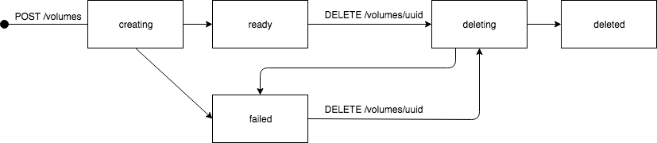

<!--
    This Source Code Form is subject to the terms of the Mozilla Public
    License, v. 2.0. If a copy of the MPL was not distributed with this
    file, You can obtain one at http://mozilla.org/MPL/2.0/.
-->

<!--
    Copyright 2019, Joyent, Inc.
-->


# Joyent CloudAPI

CloudAPI is one of the public APIs for a Triton cloud: it allows end users of
the cloud to manage their accounts, instances, networks, images, and to
inquire about other relevant details.  CloudAPI provides a single view of
docker containers, infrastructure containers and hardware virtual machines
owned by the user.

This is the reference documentation for the CloudAPI that is part of Joyent's
Triton stack.  This guide provides descriptions of the APIs available, as well
as supporting information -- such as how to use the software developer kits
(SDK), command line interface (CLI), and where to find more information.

Triton also provides a Docker API, which Docker clients can use, but this
documentation does not cover. For more information about Triton visit
[Joyent Triton](https://www.joyent.com/private-cloud).


## Conventions

Any content formatted as follows is a command-line example that you can run from
a shell:

    $ sdc-listmachines

All other examples and information are formatted like so:

    GET /my/machines HTTP/1.1


# Introduction to CloudAPI

## What is CloudAPI?

CloudAPI is one of the two public APIs you can use to interact with Triton.
Using CloudAPI, you can:

* Create and manage containers and hardware virtual machines (collectively known as instances)
* Manage your account credentials
* Create custom analytics for monitoring your infrastructure
* Create and modify virtual private networks for your instances
* Manage snapshots of instances
* Manage sub-users and their permissions using RBAC
* And more! Oh yes!

While CloudAPI provides visibility into Docker containers, the regular
[Docker CLI](https://docs.docker.com/installation/#installation) should be used
for provisioning and managing Docker containers; Triton provides an endpoint
that represents the entire datacenter as a single `DOCKER_HOST`, which Docker
clients can communicate with.  Refer to Joyent's
[Docker documentation](https://apidocs.joyent.com/docker) for more information.


## How do I access CloudAPI?

CloudAPI is available as a REST API, and you can access it using:

* Triton Customer Portal
* [node-triton CLI](https://github.com/joyent/node-triton)
* [node-smartdc CLI](https://github.com/joyent/node-smartdc)
* [node.js SDK](https://github.com/joyent/node-smartdc)
* REST API

If you don't want to write any code, use one of the two CLIs. The CLIs let you
use command-line tools to perform every action available in the SDK and REST
API.

There are two CLIs available for calling CloudAPI: node-triton and node-smartdc.
node-triton is newer and easier to use, while node-smartdc is more stable and
complete, but both CLIs are supported. These docs will provide examples for
both, although node-triton will be omitted where it does not yet support that
functionality.


# Getting Started

If you choose to use node-triton or node-smartdc, be aware that they both
require Node.js.

You can get Node.js from [nodejs.org](http://nodejs.org) as source code, and as
precompiled packages for Windows, Macintosh, Linux and Illumos distributions.
Alternatively, when using a *nix, you can usually install Node.js using a
package manager as well (e.g. pkgsrc, brew, apt-get, yum).  The version of
Node.js should be at least v0.10, so npm (Node.js's package manager) should come
with it as well.

Once you've installed Node.js, to install node-triton invoke:

    $ npm install -g triton

or, to install node-smartdc:

    $ npm install -g smartdc

You will probably want to install [json](https://www.npmjs.org/package/json) as
well. It is a tool that makes it easier to work with JSON-formatted output.  You
can install it like this:

    $ npm install -g json

In all cases above, the `-g` switch installs the tools globally, usually in
`/usr/local/bin`, so that you can use them easily from the command line.  Omit
this switch if you'd rather the tools be installed in your home hierarchy, but
you'll need to set your PATH appropriately.


## Generate an SSH key

Both CLIs require an SSH key to communicate with CloudAPI, as well as logging-in
to many instances.

If you haven't already generated an SSH key (required to use both SSH and HTTP
Signing), run the following command:

    $ ssh-keygen -b 2048 -t rsa

This will prompt you with a place to save the key.  You should probably just
accept the defaults, as many programs (SSH and CloudAPI CLIs) will first look
for a file called ~/.ssh/id_rsa. Before running the above command, ensure that
~/.ssh/id_rsa does not already exist; overwriting it may have unintended
consequences.


## Set Up your CLI

You need to set the following environment variables information in order to
interact with CloudAPI using either node-triton or node-smartdc:

* `SDC_URL`: The URL of the CloudAPI endpoint.
* `SDC_KEY_ID`: Fingerprint for the key you uploaded to Triton.
* `SDC_ACCOUNT`: Your username; the login you use for Triton.
* `SDC_USER`: If authenticating as a subuser, the username of the subuser.
  See [Role Based Access Control](#rbac-users-roles-policies).
* `SDC_TESTING`: If using a self-signed SSL certificate, set this to 1.

An example for `SDC_URL` is `https://us-west-1.api.joyent.com`.  Each
datacenter in a cloud has its own CloudAPI endpoint; a different cloud that uses
Triton would have a different URL.

In this document, we'll use `api.example.com` as the `SDC_URL` endpoint; please
replace it with the URL of your datacenter(s).  Note that CloudAPI always uses
SSL/TLS, which means that the endpoint URL must begin with `https`.

You can quickly get your key fingerprint for `SDC_KEY_ID` by running:

    $ ssh-keygen -l -f ~/.ssh/id_rsa.pub | awk '{print $2}' | tr -d '\n'

where you replace `~/.ssh/id_rsa.pub` with the path to the public key you want
to use for signing requests.


## Working with the CLI

For a complete list of CloudAPI CLI commands available, please see
[Appendix D: CloudAPI CLI Commands](#appendix-d-cloudapi-cli-commands).

To get help on a command, use the `--help` flag.  For example:

    $ triton datacenters --help
    Show datacenters in this cloud.
    A "cloud" is a set of related datacenters that share account
    information.

    Usage:
         triton datacenters

    Options:
        -h, --help                Show this help.

      Output options:
        -H                        Omit table header row.
        -o field1,...             Specify fields (columns) to output.
        -s field1,...             Sort on the given fields. Default is "name".
        -j, --json                JSON output.

or

    $ sdc-listdatacenters --help
    sdc-listdatacenters [--account string] [--api-version string] [--debug boolean] [--help boolean] [--keyId string] [--url url] [--version boolean] [--verbose boolean] [--user string] [--role string]

You can set environment variables for the following flags so that you don't have
to type them for each request (e.g. in your .bash_profile).  All the examples in
this document assume that these variables have been set:

**CLI Flags**    | **Description**              | **Environment Variable**
---------------- | ---------------------------- | ------------------------
--account<br/>-a | Login name (account)         | SDC_ACCOUNT
--user           | Subuser name when using [Role Based Access Control](#rbac-users-roles-policies) | SDC_USER
--keyId<br/>-k   | Fingerprint of key to use for signing | SDC_KEY_ID
--url<br/>-u     | URL of the CloudAPI endpoint | SDC_URL


## Provision a new instance

To provision a new instance, you first need to get the `id`s for the image and
package you want to use as the base for your instance.

An image is a snapshot of a filesystem and its software (for some types of
container), or a disk image (for hardware virtual machines).  You can get the
list of available images using the `triton image list` or `sdc-listimages`
commands; see the [ListImages](#ListImages) section below for a detailed
explanation of these commands.

A package is a set of dimensions for the new instance, such as RAM and disk
size.  You can get the list of available packages using the
`triton package list` or `sdc-listpackages` commands; see the
[ListPackages](#ListPackages) section below for a detailed explanation of these
commands.

Once you have the package and image ids, to provision a new instance:

    $ triton instance create $image $package

or

    $ sdc-createmachine --image=$image --package=$package

For example:

    $ triton instance create 2b683a82-a066-11e3-97ab-2faa44701c5a 64e23114-d502-c171-967f-b0e0cfb2009a
    Creating instance 61dc8be (9205af5b-f2c0-ef07-e1f3-94bf1ff8fb93, base@13.4.0, test_128)

You can use the `--name` flag to name your instance; if you do not specify a
name,  Triton will generate one for you.  `--image` is the `id` of the image
you'd like to use as the new instance's base.  `--package` is the `id` of the
package to use to set instance dimensions. For the `triton` command, you can
also pass the name of the image or the package instead of their id.

Retrieve the status of your new instance by:

    $ triton instance get $instance_id

or

    $ sdc-getmachine $instance_id

For example:

    $ triton instance get 9205af5b-f2c0-ef07-e1f3-94bf1ff8fb93
    {
        "id": "9205af5b-f2c0-ef07-e1f3-94bf1ff8fb93",
        "name": "61dc8be",
        "type": "smartmachine",
        "brand": "joyent",
        "state": "running",
        "image": "2b683a82-a066-11e3-97ab-2faa44701c5a",
        "ips": [
            "10.88.88.56",
            "192.168.128.5"
        ],
        "memory": 128,
        "disk": 12288,
        "metadata": {
            "root_authorized_keys": "<...>"
        },
        "tags": {},
        "created": "2015-12-06T04:31:17.053Z",
        "updated": "2015-12-06T04:31:26.000Z",
        "networks": [
            "67f1232c-5b40-4693-8b55-560245984233",
            "05dcc9e2-8ae6-48d9-8222-25f64465693f"
        ],
        "primaryIp": "10.88.88.56",
        "firewall_enabled": false,
        "compute_node": "564d0b8e-6099-7648-351e-877faf6c56f6",
        "package": "test_128"
    }

When you provision a new instance, the instance will take time to be initialized
and booted; the `state` attribute will reflect this.  Once the `state` attribute
"running", you can login to your new instance (assuming it's a Unix-based
instance), with the following:

    $ ssh-add ~/.ssh/<key file>
    $ ssh -A root@<new instance IP address>

These two commands set up your SSH agent (which has some magical properties,
so you need to handle your SSH keys less often), and logs you in as the `admin`
user on an instance.  Note that the `admin` user has password-less sudo
capabilities, so you may want to set up some less privileged users.  The SSH
keys on your account will allow you to login as `root` or `admin` on your new
instance.

An alternative of using SSH directly is:

    $ triton ssh <name of instance>

Now that we've done some basics with an instance, let's introduce a few
concepts:


<a name="image-description"></a>
### Images

By default, SmartOS images should be available to your for use.  Your Triton
cloud may have other images available as well, such as Linux or Windows images.
The list of available images can be obtained with:

    $ triton image list

or

    $ sdc-listimages

For example:

    $ triton image list
    SHORTID   NAME            VERSION  FLAGS  OS       TYPE          PUBDATE
    e1faace4  minimal-64-lts  15.4.1   P      smartos  zone-dataset  2016-03-03


<a name="packages-description"></a>
### Packages

You can list packages available in your cloud with:

    $ triton package list

or

    $ sdc-listpackages

For example:

    $  ./triton package list
    SHORTID   NAME      DEFAULT  MEMORY  SWAP  DISK  VCPUS
    64e23114  test_128  false      128M  256M   12G      1

Packages are the Triton name for the dimensions of an instance (how much CPU will
be available, how much RAM, disk and swap, and so forth).  Packages are provided
so that you do not need to select individual settings, such as RAM or disk size.


## Managing SSH keys

For instances which don't have a `brand` of `kvm` or `bhyve` (see
`triton instance list -o id,brand` or `sdc-listmachines`), you can manage the
SSH keys that allow logging into the instance via CloudAPI.  For example, to
rotate keys:

    $ triton key add --name=my-other-rsa-key ~/.ssh/my_other_rsa_key.pub

or

    $ sdc-createkey --name=my-other-rsa-key ~/.ssh/my_other_rsa_key.pub

The `--name` option sets the name of the key.  If you don't provide one,
CloudAPI sets it to the name of the file; in this case `my_other_rsa_key.pub`.

To use the new key, you will need to update the environment variables:

    $ export SDC_KEY_ID=`ssh-keygen -l -f ~/.ssh/my_other_rsa_key.pub | awk '{print $2}' | tr -d '\n'`

At this point you could delete your other key from the system; see
[Cleaning Up](#cleaning-up) for a quick example.

You cannot manage the SSH keys of instances with a `brand` of `kvm` or `bhyve`.
Hardware virtual machines are static, and whatever keys were in your account at
instance creation time are used, provided the OS inside KVM is a *nix.


## Creating Analytics

Now that you have a container up and running, and you logged in and did
whatever it is you thought was awesome, let's create an instrumentation to
monitor performance.  Analytics are one of the more powerful features of
Triton, so for more information, be sure to read
[Appendix B: Cloud Analytics](#appendix-b-cloud-analytics).

To get started, let's create an instrumentation on our network bytes:

    $  sdc-createinstrumentation --module=nic --stat=vnic_bytes
    {
      "module": "nic",
      "stat": "vnic_bytes",
      "predicate": {},
      "decomposition": [],
      "value-dimension": 1,
      "value-arity": "scalar",
      "enabled": true,
      "retention-time": 600,
      "idle-max": 3600,
      "transformations": {},
      "nsources": 0,
      "granularity": 1,
      "persist-data": false,
      "crtime": 1449379321811,
      "value-scope": "interval",
      "id": "1",
      "uris": [
        {
          "uri": "/marsell/analytics/instrumentations/1/value/raw",
          "name": "value_raw"
        }
      ]
    }

Great, now ssh back into your instance, and do something silly like:

    $ wget joyent.com
    $ ping -I 1 joyent.com

Back on your CLI, go ahead and run:

    $ sdc-getinstrumentation 1
    {
      "module": "nic",
      "stat": "vnic_bytes",
      "predicate": {},
      "decomposition": [],
      "value-dimension": 1,
      "value-arity": "scalar",
      "enabled": true,
      "retention-time": 600,
      "idle-max": 3600,
      "transformations": {},
      "nsources": 1,
      "granularity": 1,
      "persist-data": false,
      "crtime": 1449379321811,
      "value-scope": "interval",
      "id": "1",
      "uris": [
        {
          "uri": "/marsell/analytics/instrumentations/1/value/raw",
          "name": "value_raw"
        }
      ]
    }

Where `1` is the `id` you got back from `sdc-createinstrumentation`.  You should
be able to run this a few times and see the changes.  This is just a starting
point, for a full discussion of analytics, be sure to read
[Appendix B: Cloud Analytics](#appendix-b-cloud-analytics).


## Cleaning up

After going through this `Getting Started` section, you should now have at least
one SSH key, one instance and one instrumentation.  The rest of the commands
assume you have [json](https://www.npmjs.org/package/json) installed.

### Deleting Instrumentations

Before cleaning up your instances, let's get rid of the instrumentation we
created:

    $ sdc-deleteinstrumentation 1

### Deleting Machines

To clean up an instance, you can use either:

    $ triton instance delete $instance_id

or

    $ sdc-deletemachine $instance_id

For example:

    $ triton instance delete 9205af5b
    Delete (async) instance 9205af5b (9205af5b-f2c0-ef07-e1f3-94bf1ff8fb93)

### Deleting keys

Finally, you probably have one or two SSH keys uploaded to Triton after going
through the guide, so to delete the one we setup:

    $ triton key delete id_rsa

or

    $ sdc-deletekey id_rsa


# RBAC: Users, Roles & Policies

Starting at version 7.2.0, CloudAPI supports Role Based Access Control (RBAC),
which means that [accounts](#account) can have multiple users and roles
associated with them.

While the behaviour of the [main account](#GetAccount) remains the same,
including the [SSH keys](#keys) associated with it, it's now possible to have
multiple [Users](#users) subordinate to the main account.  Each of these
users have a different set of [SSH Keys](#sshKeys).  Both the users and their
associated SSH keys have the same format as the main account object (and the
keys associated with it).

It's worth mentioning that the `login` for an account's users must be different
only between the users of that account, not globally.  We could have an account
with login *"mark"*, another account "exampleOne" with a user with login "mark",
another account "exampleTwo" with another user with login "mark", and so
forth.

These account users can additionally be organized using [Roles](#roles):

    {
      "id": "ff578c1f-bad5-4d3c-8880-2f76745f2511",
      "name": "devs",
      "members": [
        {
          "type": "subuser",
          "id": "985e0ed4-9994-4303-8c43-6c92b7988167",
          "login": "bob",
          "default": true
        },
        {
          "type": "subuser",
          "id": "0cc38461-787a-4c05-a3f3-352a4d55541f",
          "login": "fred",
          "default": false
        }
      ],
      "policies": [
        {
          "id": "2104c53f-2e33-4393-9320-a6521d5ef2dc",
          "name": "createMachine"
        },
        {
          "id": "e8bdd555-eef0-4c1c-83be-93c443b59e3e",
          "name": "restart instances"
        }
      ]
    }

Each role can have an arbitrary set of [Policies](#policies):

    {
      "name": "restart instances",
      "id": "e8bdd555-eef0-4c1c-83be-93c443b59e3e",
      "rules": [
        "CAN rebootmachine if requesttime::time > 07:30:00 and requesttime::time < 18:30:00 and requesttime::day in (Mon, Tue, Wed, THu, Fri)",
        "CAN stopmachine",
        "CAN startmachine"
      ],
      "description": "This is completely optional"
    }

The `rules` in policies are used for the access control of an account's users.
These rules use [Aperture](https://github.com/joyent/node-aperture) as the
policy language, and are described in detail in the next section.

Our recommendation is to limit each policy's set of rules to a very scoped
collection, and then add one or more of these policies to each group.  This aids
easily reusing existing policies for one or more roles, allowing fine-grained
definition of each role's abilities.


## Rules definition for access control

As mentioned earlier, the policies' rules use
[Aperture Policy Language](https://github.com/joyent/node-aperture#policy-language),
with the following *basic format*:

`<principals> CAN <actions> <resources> WHEN <conditions>`.

You should refer to the
[Aperture documentation](https://github.com/joyent/node-aperture) for the
complete details about the different possibilities when defining new rules.
This section will only cover a limited set strictly related to CloudAPI's usage.

In the case of CloudAPI, `<principal>` will be always the user performing the
HTTP request. Likewise, `<resource>` will always be the URL of such request,
for example `/:account/machines/:instance_id`.

We add one or more roles to a resource to explicitly define the active roles a
user trying to access a given resource must have. Therefore, we don't need to
specify `<principal>` in our rules, since it'll always be defined by the
role-tags of the resource the user is trying to get access to. For the same
reason, we don't need to specify `<resource>` in our rules.

Therefore, CloudAPI's Aperture rules have the format:

        CAN <actions> WHEN <conditions>

By default, the access policy will `DENY` any attempt made by any account user
to access a given resource, unless:

* that resource is tagged with a role
* that role is active
* that role has a policy
* that policy contains a rule which explicity `GRANTS` access to that resource

For example, a user with an active role `read`, which includes a policy rule
like `CAN listmachines and getmachines` will not get access to resources like
`/:account/machines` or `/:account/machines/:instance_id` unless these resources
are *role-tagged* with the role `read` too.

Additionally, given that the `<actions>` included in the policy rule are just
`listmachines` and `getmachine`, the user will be able to retrieve an instance's
details provided by the [GetMachine](#GetMachine) action, but will not be able
to perform any other instance actions (like [StopMachine](#StopMachine)).
However, if the role has a rule including that `<action>` (like StopMachine), or
the user has an additional role which includes that rule, then the user can
invoke that action too.

As an aside, the active roles of a user are set by the `default_members`
attribute in a role. If three different roles contain the "john" user (amongst
others) in their default-members list, then the "john" user will have those
three roles as active roles by default. This can be overridden by passing in
`?as-role=<comma-separated list of role names>` as part of the URL, or adding a
--role flag when using a node-smartdc command; provided that each role contains
that user in their `members` list, then those roles are set as the
currently-active roles for a request instead.

For more details on how Access Control works for both CloudAPI and Manta,
please refer to [Role Based Access Control](https://docs.joyent.com/jpc/rbac/)
documentation.

### An important note about RBAC and certain reads after writes

CloudAPI uses replication and caching behind the scenes for user, role and
policy data. This implies that API reads after a write on these particular
objects can be up to several seconds out of date.

For example, when a user is created, CloudAPI returns both a user object
(which is up to date), and a location header indicating where that new user
object actually lives. Following that location header may result in a 404 for
a short period.

As another example, if a policy is updated, the API call will return a policy
object (which is up to date), but GETing that URL again may temporarily return
a outdated object with old object details.

For the time being, please keep in mind that user, role and policy
creation/updates/deletion may potentially take several seconds to settle. They
have eventual consistency, not read-after-write.


# API Introduction

CloudAPI exposes a REST API over HTTPS.  You can work with the REST API by
either calling it directly via tooling you already know about (such as curl, et
al), or by using the CloudAPI CLIs and SDKs from Joyent.  The node-triton
CloudAPI SDK & CLI is available as an npm module, which you can install with:

    $ npm install triton

Alternatively, there is the more stable and feature-complete node-smartdc:

    $ npm install smartdc

Although node-triton has fewer features -- for now -- it will continue to
receive the most development effort and future support. node-smartdc is in
maintenance.

The rest of this document will show all APIs in terms of both the raw HTTP
specification, the CLI commands, and sometimes the node-smartdc SDK.


## Issuing Requests

All HTTP calls to CloudAPI must be made over TLS, and requests must carry at
least two headers (in addition to standard HTTP headers): `Authorization` and
`Api-Version`.  The details are explained below.  In addition to these headers,
any requests requiring content must be sent in an acceptable scheme to
CloudAPI.  Details are also below.

### Content-Type

For requests requiring content, you can send parameters encoded with
`application/json`, `application/x-www-form-urlencoded` or
`multipart/form-data`.  Joyent recommends `application/json`.  The value of the
`Accept` header determines the encoding of content returned in responses.
CloudAPI supports `application/json` response encodings only.

For example, all of the following are valid calls:

Query String (on the uri):

    POST /my/keys?name=rsa&key=... HTTP/1.1
    Host: joyent.com
    Authorization: ...
    Content-Length: 0

Form encoded in the body:

    POST /my/keys HTTP/1.1
    Host: joyent.com
    Authorization: ...
    Content-Type: application/x-www-form-urlencoded
    Content-Length: 123

    name=rsa&key=...

JSON in the body:

    POST /my/keys HTTP/1.1
    Host: joyent.com
    Authorization: ...
    Content-Type: application/json
    Content-Length: 123

    {"name":"rsa","key":"..."}

### Authorization

All API calls to CloudAPI require an Authorization header, which supports
multiple ["schemes"](http://tools.ietf.org/html/rfc2617).  Currently CloudAPI
supports only one Authentication mechanism due to PCI compliance restrictions:

* HTTP Signature Authentication Scheme.  This Scheme is outlined in
[Appendix C](#Appendix-C).

In order to leverage HTTP Signature Authentication, only RSA signing mechanisms
are supported, and your keyId must be equal to the path returned from a
[ListKeys](#ListKeys) API call.  For example, if your Triton login is `demo`,
and you've uploaded an RSA SSH key with the name `foo`, an Authorization
header would look like:

    Authorization: Signature keyId=/demo/keys/foo,algorithm="rsa-sha256" ${Base64(sign($Date))}

The default value to sign for CloudAPI requests is simply the value of the HTTP
`Date` header.  For more information on the Date header value, see
[RFC 2616](http://tools.ietf.org/html/rfc2616#section-14.18).  All requests to
CloudAPI using the Signature authentication scheme *must* send a Date header.
Note that clock skew will be enforced to within 300 seconds (positive or
negative) from the value sent.

Full support for the HTTP Signature Authentication scheme is provided in both
CloudAPI SDKs; an additional reference implementation for Node.js is available
in the npm `http-signature` module, which you can install with:

    npm install http-signature

### Using cURL with CloudAPI

Since [cURL](http://curl.haxx.se/) is commonly used to script requests to web
services, here's a simple Bash function you can use to wrap cURL when
communicating with CloudAPI:

    $ function cloudapi() {
        local now=$(date -u '+%a, %d %h %Y %H:%M:%S GMT')
        local signature=$(echo -n "$now" | openssl dgst -sha256 -sign ~/.ssh/id_rsa | openssl enc -e -a | tr -d '\n')
        local url="$SDC_URL$1"
        shift

        curl -s -k -i \
            -H 'Accept: application/json' \
            -H "accept-version: ~8" \
            -H "Date: $now" \
            -H "Authorization: Signature keyId=\"/$SDC_ACCOUNT/keys/id_rsa\",algorithm=\"rsa-sha256\" $signature" \
            "$@" "$url"
        echo
    }

You may need to alter the path to your SSH key in the above function, as well as
the path its public-key is saved under in Triton.

With that function, you could just do:

    $ cloudapi /my/machines


## CloudAPI HTTP Responses

CloudAPI returns all response objects as `application/json` encoded HTTP bodies.
In addition to the JSON body, all responses have the following headers:

**Header**    | **Description**
------------- | ---------------
Date          | When the response was sent (RFC 1123 format)
Api-Version   | The exact version of the CloudAPI server you spoke with
Request-Id    | A unique id for this request; you should log this
Response-Time | How long the server took to process your request (ms)

If there is content, you can expect:

**Header**     | **Description**
-------------- | ---------------
Content-Length | How much content, in bytes
Content-Type   | Formatting of the response (almost always application/json)
Content-MD5    | An MD5 checksum of the response; you should check this

### HTTP Status Codes

Your client should check for each of the following status codes from any API
request:

**Code** | **Description** | **Details**
-------- | --------------- | -----------
400      | Bad Request     | Invalid HTTP Request
401      | Unauthorized    | Either no Authorization header was sent, or invalid credentials were used
403      | Forbidden       | No permissions to the specified resource
404      | Not Found       | Resource was not found
405      | Method Not Allowed | Method not supported for the given resource
406      | Not Acceptable  | Try sending a different Accept header
409      | Conflict        | Most likely invalid or missing parameters
413      | Request Entity Too Large | You sent too much data
415      | Unsupported Media Type   | Request was encoded in a format CloudAPI does not understand
420      | Slow Down       | You're sending too many requests too quickly
449      | Retry With      | Invalid Version header; try with a different Api-Version string
500      | Internal Error  | An unexpected error occurred; see returned message for more details.
503      | Service Unavailable      | Either there's no capacity in this datacenter, or it's in a maintenance window

### Error Responses

In the event of an error, CloudAPI will return a standard JSON error response
object in the body with the scheme:

    {
      "code": "CODE",
      "message": "human readable string"
    }

Where the code element is one of:

**Code**           | **Description**
------------------ | ---------------
BadRequest         | You sent bad HTTP
InternalError      | Something went wrong in Triton
InUseError         | The object is in use and cannot be operated on
InvalidArgument    | You sent bad arguments or a bad value for an argument
InvalidCredentials | Authentication failed
InvalidHeader      | You sent a bad HTTP header
InvalidVersion     | You sent a bad Api-Version string
MissingParameter   | You didn't send a required parameter
NotAuthorized      | You don't have access to the requested resource
RequestThrottled   | You were throttled
RequestTooLarge    | You sent too much request data
RequestMoved       | HTTP Redirect
ResourceNotFound   | What you asked for wasn't found
UnknownError       | Something completely unexpected happened!

Clients are expected to check HTTP status code first, and if it's in the 4xx
range, they can leverage the codes above.


# API Versions

A CloudAPI endpoint has two relevant version values: the code version and the
"API version". The former includes the full `major.minor.patch` version value
of the deployed server and, as of CloudAPI v8.3.0, is available in the "Server"
header of all responses:

    Server: cloudapi/8.3.1

The *API* version is only changed for major versions, e.g. API version "8.0.0"
is used for all 8.x code versions. (Older CloudAPI v7 would bump the API version
at the minor version level.)

All requests to CloudAPI must specify an acceptable API [version
range](https://github.com/npm/node-semver#ranges) via the 'Accept-Version' (or
for backward compatibility the 'Api-Version') header. For example:

    Accept-Version: ~8              // accept any 8.x version
    Accept-Version: 7.0.0           // require exactly this version
    Accept-Version: ~8||~7          // accept 8.x or 7.x
    Accept-Version: *               // the latest version (wild west)

For new applications using CloudAPI SDKs, it is recommended that one explicitly
accept a particular major version, e.g. `Accept-Version: ~8`, so that
future CloudAPI backward incompatible changes (always done with a *major*
version bump) don't break your application.

The [`triton` tool](https://github.com/joyent/node-triton) uses
`Accept-Version: ~9||~8` by default. Users can restrict the API version via the
`triton --accept-version=RANGE ...` option. The older `sdc-*` tools from
node-smartdc use `~8||~7` by default, and users can restrict the API
version via the `SDC_API_VERSION=RANGE` environment variable or the
`--api-version=RANGE` option to each command.

# Ping

The set of supported *API versions* is given in the ping endpoint:

    GET /--ping
    accept: application/json
    accept-version: ~8
    ...

    HTTPS/1.1 200 OK
    server: cloudapi/9.2.0
    content-type: application/json
    ...
    api-version: 8.0.0
    Triton-Datacenter-Name: us-west-1

    {
        "ping": "pong",
        "cloudapi": {
            "versions": [
                "7.0.0",
                "7.1.0",
                "7.2.0",
                "7.3.0",
                "8.0.0"
            ]
        }
    }

Note that a `Triton-Datacenter-Name` response header was added in 9.2.0.

# Versions

The section describes API changes in CloudAPI versions.

## 9.4.0
- [CreateMachine](#CreateMachine) may pass disk quantity and size for bhyve
  instances. [GetMachine](#GetMachine) and [ListMachines](#ListMachcines)
  returns information about these disks. [GetMachineSnapshot](#GetMachineSnapshot)
  and [ListMachineSnapshots](#ListMachineSnapshots) includes snapshot size.

## 9.2.0

- Added new ImportImageFromDatacenter API method to allow an image to be copied
  to another datacenter in the same cloud.
- Added a `Triton-Datacenter-Name` response header to [Ping](#Ping) and
  [ListDatacenters](#ListDatacenters) responses.

## 9.1.0

- Added [Clone Image](#CloneImage). This can be used to create a your own copy
  of an image owned by another account that has been shared with you (via
  `triton image share`).

- [Backward incompatible] Shared images will no longer be provisioned by default
  when an `Accept-Version` of `~9` or higher is used. You will need to
  explicitly add the `allow_shared_images` param to CreateMachine (which is what
  `triton create --allow-shared-images` does). Older versions of the
  CreateMachine interface will allow the provisioning of shared images.

## 9.0.0

- New object-based format for Roles: the "members" and "policies" properties
  are now arrays of objects describing their values, rather than arrays of
  strings as they were before. The "default_members" array is replaced by the
  "default" boolean property on the objects. You can still elect to use the old
  interface by using a lower `Accept-Version` than `9.0.0`.

## 8.11.0

- Added a new API method to the plugin interface: modifyProvisionNetworks. This
  can be used to modify network arguments sent in the vmapi provision call.

## 8.10.0

- GetImage now includes information about the brand requirements in the
  `requirements.brand` member of the returned JSON.

## 8.9.0

- The plugin interface has changed. preProvision/postProvision hooks have been
  replaced with allowProvision/postProvision and an expanded API. This is a
  change invisible to CloudAPI REST consumers.

## 8.8.0

- CreateMachine now takes brand from the package's `brand` parameter if brand is
  not specified by the image, and ensures that package and image brand
  requirements do not conflict.
- Fixed some bugs in the `brand` handling for packages.

## 8.7.0

- CreateMachine no longer accepts the `brand` field for specifying the brand
  of the instance to create.

## 8.6.0

- CreateMachine now accepts the `brand` field for specifying the brand of the
  instance to create. This is currently only useful when provisioning a
  virtualmachine in a datacenter that supports both kvm (default) and bhyve.
- Added [Deletion Protection](#deletion-protection). Setting
  deletion\_protection to true when creating or updating an instances will stop
  stop both [DeleteMachine](#DeleteMachine) and SDC Docker from destroying an
  instance. This remains true until that attribute is set to false.

## 8.5.0

- CreateMachine and AddNic now accept specifying a [network
  object](#network-objects) instead of just a network UUID. The network object
  extends functionality by allowing a machine to be provisioned with specific
  IPs. It's also now possible to add a NIC to an instance with a specific IP.
  It's worth noting that it's still possible to pass in just the UUID of a
  network, however you cannot mix the new and old formats in the same request.

## 8.4.0

- This version adds support for the following new endpoints:
  [ListNetworkIPs](#ListNetworkIPs), [GetNetworkIP](#GetNetworkIP),
  and [UpdateNetworkIP](#UpdateNetworkIP).

## 8.3.0

- CreateMachine supports a new `affinity` field for specifying affinity rules.
  Affinity rules (inspired by Docker Swarm affinity filters) allow a more
  powerful mechanism for controlling server placement of instances.
  This deprecates the `locality` field for "locality hints" on CreateMachine.
  Limitation: Affinity rules currently do not properly consider *concurrent*
  provisions (see [TRITON-9](https://smartos.org/bugview/TRITON-9)).

  This CloudAPI feature is comparable to [Triton's Docker placement affinity
  rules](https://apidocs.joyent.com/docker/features/placement).

## 8.2.1

- GetMachine works with machines that do not have a package or a network. Such
  machines cannot be created through CloudAPI, so this isn't applicable to most
  people unless they have an operator do this for them. ListMachines no longer
  breaks for such machines either.

## 8.2.0

- This version adds support for {{shortId}} tags in the 'name' parameter when
  creating a machine using [CreateMachine](#CreateMachine) machine. Any
  instances of {{shortId}} in the name will be replaced with the shortened
  version (first 8 characters) of the machine's id.


## 8.1.1

- It's now possible to query packages using wildcards. See the
[ListPackages](#ListPackages) section.


## 8.1.0

- This version should have no visible API changes, but updates a lot of
  libraries that Cloudapi depends on, as well as the nodejs major version.
  Visible differences with 8.0.0 are bugs, but it's possible some might have
  crept through.


## 8.0.0

- Instance/machine objects (from GetMachine, ListMachines) now has a `brand`
  attribute, which is more granular than the existing `type` (now deprecated).
  Also a `docker` boolean attribute, which indicates whether the instance
  is a Docker container.

- [Backward incompatible] This version also makes a breaking change to the
  attribute `type` on images. In API versions 7 and earlier, `<image>.type`
  was either "virtualmachine" (for zvol images) or "smartmachine" for other
  image types. In version 8, `<image>.type` is the untranslated [type value
  from the image in the IMGAPI](https://images.joyent.com/docs/#manifest-type).

- [Backward incompatible] ListDatasets and GetDataset have been removed.
  Use ListImages and GetImage, respectively.

- [Backward incompatible] The long deprecated support for API version 6.5
  has been dropped. The `default` attribute on package objects is deprecated,
  since it only had meaning in 6.5.


## 7.3.0

- Network fabrics (software-defined networking) support.
  This allows the creation of virtual LANs and layer-three networks.


## 7.2.0

- RBAC v1 has been made available on the CloudAPI interface. Accounts can create
  users, rules can be created and combined to make policies, policies and users
  can be associated together using roles, and role tags can be applied to
  CloudAPI resources.


## 7.1.0

- Starting with version 7.1.0, customer image management is made available,
  allowing [Machine Creation from Images](#CreateImageFromMachine),
  [exporting images to the specified manta path](#ExportImage) and
  [custom images deletion](#DeleteImage).

- Instance objects (from GetMachine, ListMachines) now have a `networks` array
  of IDs (UUIDs) of the networks on which the instance has NICs.

- Image objects (from GetImage, ListImages) now have a `files` array (containing
  `compression`, `sha1` and `size`), `owner`, `public`, `state`, `tags`, `eula`,
  and `acl` attributes.

- Firewall rules include information regarding rules being global or not
  (`global` attribute), and will optionally include a human-readable
  `description` attribute for the rules (which can be modified except for global
  rules).


## 7.0.0

- HTTP signature auth.


# Account

You can obtain your account details and update them through CloudAPI, although
`login` cannot be changed, and `password` can not be retrieved.


## GetAccount (GET /:login)

Retrieves your account details. Instead of providing your login name, you can
also provide 'my' (i.e. GET /my).

### Inputs

* None

### Returns

Account object:

**Field**   | **Type** | **Description**
----------- | -------- | ---------------
id          | UUID     | Unique id for this account
login       | String   | Your login name
email       | String   | Email address
companyName | String   | ...
firstName   | String   | ...
lastName    | String   | ...
address     | String   | ...
postalCode  | String   | ...
city        | String   | ...
state       | String   | ...
country     | String   | ...
phone       | String   | ...
created     | ISO8601 date | When this account was created
updated     | ISO8601 date | When this account's details was last updated
triton_cns_enabled | Boolean | `true` if Triton CNS is enabled for account

### Errors

For all possible errors, see [CloudAPI HTTP Responses](#cloudapi-http-responses).

**Error Code**   | **Description**
---------------- | ---------------
ResourceNotFound | If `:login` does not exist

### CLI Command

    $ triton account get

or

    $ sdc-getaccount

### Example Request

    GET /my HTTP/1.1
    authorization: Signature keyId="..."
    accept: application/json
    accept-version: ~8
    host: api.example.com

### Example Response

    HTTP/1.1 200 OK
    Content-Type: application/json
    Content-Length: 285
    Access-Control-Allow-Origin: *
    Access-Control-Allow-Headers: Accept, Accept-Version, Content-Length, Content-MD5, Content-Type, Date, Api-Version, Response-Time
    Access-Control-Allow-Methods: GET, HEAD, POST, PUT
    Access-Control-Expose-Headers: Api-Version, Request-Id, Response-Time
    Connection: Keep-Alive
    Content-MD5: Sz+3BJ3EKDxL3MLQQumPgg==
    Date: Tue, 22 Dec 2015 05:06:33 GMT
    Server: Joyent Triton 8.0.0
    Api-Version: 8.0.0
    Request-Id: c3d496f0-a869-11e5-8662-47ccf5717dbf
    Response-Time: 2122

    {
      "id": "b89d9dd3-62ce-4f6f-eb0d-f78e57d515d9",
      "login": "barbar",
      "email": "barbar@example.com",
      "companyName": "Example Inc",
      "firstName": "BarBar",
      "lastName": "Jinks",
      "phone": "123-456-7890",
      "updated": "2015-12-21T11:48:54.884Z",
      "created": "2015-12-21T11:48:54.884Z"
    }


## UpdateAccount (POST /:login)

Update your account details with the given parameters.

### Inputs

**Field**   | **Type** | **Description**
----------- | -------- | ---------------
email       | String   | Email address
companyName | String   | ...
firstName   | String   | ...
lastName    | String   | ...
address     | String   | ...
postalCode  | String   | ...
city        | String   | ...
state       | String   | ...
country     | String   | ...
phone       | String   | ...
triton_cns_enabled | Boolean | Enable or disable the Triton CNS

### Returns

Account object:

**Field**   | **Type** | **Description**
----------- | -------- | ---------------
id          | UUID     | Unique id for this account
login       | String   | Your login name
email       | String   | Email address
companyName | String   | ...
firstName   | String   | ...
lastName    | String   | ...
address     | String   | ...
postalCode  | String   | ...
city        | String   | ...
state       | String   | ...
country     | String   | ...
phone       | String   | ...
created     | ISO8601 date | When this account was created
updated     | ISO8601 date | When this account's details was last updated
triton_cns_enabled | Boolean | `true` if Triton CNS is enabled for account

### Errors

For all possible errors, see [CloudAPI HTTP Responses](#cloudapi-http-responses).

**Error Code**   | **Description**
---------------- | ---------------
ResourceNotFound | If `:login` does not exist

### CLI Command

    $ triton account update postalCode=12345 phone='1 (234) 567 890'

or

    $ sdc-updateaccount --postal-code=12345 --phone='1 (234) 567 890'

### Example Request

    POST /my HTTP/1.1
    authorization: Signature keyId="...
    accept: application/json
    content-type: application/json
    accept-version: ~8
    content-length: 48
    content-md5: 6kCHdE651hsI9N82TUkU/g==
    host: api.example.com
    connection: keep-alive

    postal-code=12345&phone=1%20(234)%20567%20890

### Example Response

    HTTP/1.1 200 OK
    Content-Type: application/json
    Content-Length: 309
    Access-Control-Allow-Origin: *
    Access-Control-Allow-Headers: Accept, Accept-Version, Content-Length, Content-MD5, Content-Type, Date, Api-Version, Response-Time
    Access-Control-Allow-Methods: GET, HEAD, POST, PUT
    Access-Control-Expose-Headers: Api-Version, Request-Id, Response-Time
    Connection: Keep-Alive
    Content-MD5: xxJ5ppNDrEyAf5VIlt4GZw==
    Date: Tue, 22 Dec 2015 12:16:37 GMT
    Server: Joyent Triton 8.0.0
    Api-Version: 8.0.0
    Request-Id: d8db9e90-a8a5-11e5-90c9-4dcf4848c834
    Response-Time: 1244

    {
      "id": "b89d9dd3-62ce-4f6f-eb0d-f78e57d515d9",
      "login": "barbar",
      "email": "barbar@example.com",
      "companyName": "Example Inc",
      "firstName": "BarBar",
      "lastName": "Jinks",
      "postalCode": "12345",
      "phone": "1 (234) 567 890",
      "updated": "2015-12-22T12:16:37.781Z",
      "created": "2015-12-21T11:48:54.884Z"
    }


# Keys

This part of the API is the means by which you operate on your SSH/signing keys.
These keys are needed in order to login to instances over SSH, as well as signing
requests to this API (see the HTTP Signature Authentication Scheme outlined in
[Appendix C](#Appendix-C) for more details).

Currently CloudAPI supports uploads of public keys in the OpenSSH format.

Note that while it's possible to provide a `name` attribute for an SSH key in
order to use it as a human-friendly alias, this attribute's presence is
optional.  When it's not provided, the ssh key fingerprint will be used as the
`name` instead.

Keys can optionally be submitted along with a hardware attestation certificate
signed by a trusted hardware manufacturer, which will be validated and
processed. Keys generated in hardware devices which require some form of
multi-factor authentication to sign requests (e.g. the device requires a PIN or
Touch input) are marked by this mechanism and may be specially treated by
Triton and Manta as providing a kind of 2-factor authentication (depending on
administrator policy).

For the following routes, the parameter placeholder `:key` can be replaced with
with either the key's `name` or its `fingerprint`.  It's strongly recommended to
use `fingerprint` when possible, since the `name` attribute does not have any
uniqueness constraints.


## ListKeys (GET /:login/keys)

Lists all public keys we have on record for the specified account.

### Inputs

* None

### Returns

Array of key objects.  Each key object has the following fields:

**Field**   | **Type** | **Description**
----------- | -------- | ---------------
name        | String   | Name for this key
fingerprint | String   | Key fingerprint
key         | String   | Public key in OpenSSH format
attested    | Boolean  | Indicates if the key has a hardware device attestation
multifactor | Array[String] | Lists any additional factors required to use (if attested)

Possible `multifactor` values:

**Value**   | **Meaning**
----------- | -----------
pin         | Input of a PIN or password is required for key use
touch       | Touch input (not authenticated -- i.e. not a fingerprint) is required for key use

### Errors

For all possible errors, see [CloudAPI HTTP Responses](#cloudapi-http-responses).

**Error Code**   | **Description**
---------------- | ---------------
ResourceNotFound | If `:login` does not exist

### CLI Command

    $ triton key list

    or

    $ sdc-listkeys

### Example Request

    GET /my/keys HTTP/1.1
    Host: api.example.com
    Authorization: ...
    Accept: application/json
    Api-Version: ~8

### Example Response

    HTTP/1.1 200 OK
    Content-Type: application/json
    Content-Length: 832
    Access-Control-Allow-Origin: *
    Access-Control-Allow-Headers: Accept, Accept-Version, Content-Length, Content-MD5, Content-Type, Date, Api-Version, Response-Time
    Access-Control-Allow-Methods: POST, GET, HEAD
    Access-Control-Expose-Headers: Api-Version, Request-Id, Response-Time
    Connection: Keep-Alive
    Content-MD5: u4xmk+MgKzzIvrRt09k4sg==
    Date: Tue, 22 Dec 2015 12:23:12 GMT
    Server: Joyent Triton 8.0.0
    Api-Version: 8.0.0
    Request-Id: c44e2000-a8a6-11e5-9030-479dc847c4b2
    Response-Time: 1041

    [
      {
        "name": "barbar",
        "fingerprint": "03:7f:8e:ef:da:3d:3b:9e:a4:82:67:71:8c:35:2c:aa",
        "key": "<...>"
      }
    ]


## GetKey (GET /:login/keys/:key)

Retrieves the record for an individual key.

### Inputs

* None

### Returns

**Field**    | **Type** | **Description**
------------ | -------- | ---------------
name         | String   | Name for this key
fingerprint  | String   | Key fingerprint
key          | String   | OpenSSH formatted public key
attested     | Boolean  | Indicates if the key has a hardware device attestation
multifactor  | Array[String] | Lists any additional factors required to use (if attested)

Possible `multifactor` values:

**Value**   | **Meaning**
----------- | -----------
pin         | Input of a PIN or password is required for key use
touch       | Touch input (not authenticated -- i.e. not a fingerprint) is required for key use

### Errors

For all possible errors, see [CloudAPI HTTP Responses](#cloudapi-http-responses).

**Error Code**   | **Description**
---------------- | ---------------
ResourceNotFound | If `:login` or `:key` does not exist

### CLI Command

    $ triton key get barbar

or

    $ sdc-getkey barbar

### Example Request

    GET /my/keys/barbar HTTP/1.1
    Authorization: ...
    Host: api.example.com
    Accept: application/json
    Api-Version: ~8

### Example Response

    HTTP/1.1 200 OK
    Content-Type: application/json
    Content-Length: 830
    Access-Control-Allow-Origin: *
    Access-Control-Allow-Headers: Accept, Accept-Version, Content-Length, Content-MD5, Content-Type, Date, Api-Version, Response-Time
    Access-Control-Allow-Methods: GET, HEAD, DELETE
    Access-Control-Expose-Headers: Api-Version, Request-Id, Response-Time
    Connection: Keep-Alive
    Content-MD5: p8gjrCZqMiZbD15TA9ymEQ==
    Date: Tue, 22 Dec 2015 13:26:17 GMT
    Server: Joyent Triton 8.0.0
    Api-Version: 8.0.0
    Request-Id: 94423be0-a8af-11e5-a95f-e74285cfeb5b
    Response-Time: 999

    {
      "name": "barbar",
      "fingerprint": "03:7f:8e:ef:da:3d:3b:9e:a4:82:67:71:8c:35:2c:aa",
      "key": "<...>",
      "attested": true,
      "multifactor": ["pin"]
    }


## CreateKey (POST /:login/keys)

Uploads a new OpenSSH key to Triton for use in HTTP signing and SSH.

### Inputs

**Field**   | **Type** | **Description**
----------- | -------- | ---------------
name        | String   | Name for this key (optional)
key         | String   | OpenSSH formatted public key
attestation | Array of String | PEM formatted attestation certificates

### Returns

**Field**   | **Type** | **Description**
----------- | -------- | ---------------
name        | String   | Name for this key
fingerprint | String   | Key fingerprint
key         | String   | OpenSSH formatted public key
attested    | Boolean  | Indicates if the key has a hardware device attestation
multifactor | Array[String] | Lists any additional factors required to use (if attested)

### Errors

For all possible errors, see [CloudAPI HTTP Responses](#cloudapi-http-responses).

**Error Code**   | **Description**
---------------- | ---------------
InvalidArgument  | If name or key is invalid (usually key)
MissingParameter | If you didn't send a key
ResourceNotFound | If `:login` does not exist

### CLI Command

    $ triton key add --name=barbardos ~/.ssh/id_rsa.pub

or

    $ sdc-createkey --name=barbardos ~/.ssh/id_rsa.pub

### Example Request

    POST /my/keys HTTP/1.1
    Authorization: ...
    Host: api.example.com
    Accept: application/json
    Content-Length: 455
    Content-Type: application/json
    Api-Version: ~8

    {
      "name": "barbardos",
      "fingerprint": "03:7f:8e:ef:da:3d:3b:9e:a4:82:67:71:8c:35:2c:aa",
      "key": "ssh-rsa AAA..."
    }

### Example Response

    HTTP/1.1 201 Created
    Content-Type: application/json
    Content-Length: 830
    Access-Control-Allow-Origin: *
    Access-Control-Allow-Headers: Accept, Accept-Version, Content-Length, Content-MD5, Content-Type, Date, Api-Version, Response-Time
    Access-Control-Allow-Methods: GET, HEAD, DELETE
    Access-Control-Expose-Headers: Api-Version, Request-Id, Response-Time
    Connection: Keep-Alive
    Content-MD5: p8gjrCZqMiZbD15TA9ymEQ==
    Date: Tue, 22 Dec 2015 13:26:17 GMT
    Server: Joyent Triton 8.0.0
    Api-Version: 8.0.0
    Request-Id: 94423be0-a8af-11e5-a95f-e74285cfeb5b
    Response-Time: 999

    {
      "name": "barbardos",
      "fingerprint": "03:7f:8e:ef:da:3d:3b:9e:a4:82:67:71:8c:35:2c:aa",
      "key": "<...>"
    }


## DeleteKey (DELETE /:login/keys/:key)

Deletes a single SSH key, by name or fingerprint.

### Inputs

* None

### Returns

* None

### Errors

For all possible errors, see [CloudAPI HTTP Responses](#cloudapi-http-responses).

**Error Code**   | **Description**
---------------- | ---------------
ResourceNotFound | If `:login` or `:key` does not exist

### CLI Command

    $ triton key delete barbados

or

    $ sdc-deletekey barbados

#### Example Request

    DELETE /my/keys/barbardos HTTP/1.1
    Host: api.example.com
    Accept: application/json
    Api-Version: ~8
    Content-Length: 0

#### Example Response

    HTTP/1.1 204 No Content
    Access-Control-Allow-Origin: *
    Access-Control-Allow-Headers: Accept, Accept-Version, Content-Length, Content-MD5, Content-Type, Date, Api-Version, Response-Time
    Access-Control-Allow-Methods: GET, HEAD, DELETE
    Access-Control-Expose-Headers: Api-Version, Request-Id, Response-Time
    Connection: Keep-Alive
    Date: Tue, 22 Dec 2015 13:31:43 GMT
    Server: Joyent Triton 8.0.0
    Api-Version: 8.0.0
    Request-Id: 5677a420-a8b0-11e5-8702-0daf2c627de5
    Response-Time: 829


# Users

These are users (also known as sub-users); additional users who are authorized
to use the same account, but are subject to the RBAC system. See the
[RBAC](#rbac-users-roles-policies) section for more details.


## ListUsers (GET /:account/users)

Returns a list of an account's user objects.  These have the same format as the
main [account](#account) object.

### Inputs

* None

### Returns

Array of user objects.  Each user object has the following fields:

**Field**   | **Type** | **Description**
----------- | -------- | ---------------
id          | UUID     | Unique id for this user
login       | String   | Sub-user login name
email       | String   | Email address
companyName | String   | ...
firstName   | String   | ...
lastName    | String   | ...
address     | String   | ...
postalCode  | String   | ...
city        | String   | ...
state       | String   | ...
country     | String   | ...
phone       | String   | ...
created     | ISO8601 date | When this user was created
updated     | ISO8601 date | When this user's details was last updated

### Errors

**Error Code**   | **Description**
---------------- | ---------------
ResourceNotFound | If `:account` does not exist

### CLI Command:

    $ sdc-user list

### Example Request

    GET /my/users HTTP/1.1
    Accept: application/json
    Host: api.example.com
    Api-Version: ~8
    Authorization: Signature keyId...

### Example Response

    HTTP/1.1 200 OK
    Content-Type: application/json
    Content-Length: 503
    Access-Control-Allow-Origin: *
    Access-Control-Allow-Headers: Accept, Accept-Version, Content-Length, Content-MD5, Content-Type, Date, Api-Version, Response-Time
    Access-Control-Allow-Methods: POST, GET, HEAD
    Access-Control-Expose-Headers: Api-Version, Request-Id, Response-Time
    Connection: Keep-Alive
    Content-MD5: 6csVzj9aNZWB5/ZW9JsD8w==
    Date: Wed, 23 Dec 2015 06:42:20 GMT
    Server: Joyent Triton 8.0.0
    Api-Version: 8.0.0
    Request-Id: 50182970-a940-11e5-af28-0b661ec813b9
    Response-Time: 1051

    [
      {
        "id": "4fc13ac6-1e7d-cd79-f3d2-96276af0d638",
        "login": "barbar",
        "email": "barbar@example.com",
        "companyName": "Example",
        "firstName": "BarBar",
        "lastName": "Jinks",
        "phone": "(123)457-6890",
        "updated": "2015-12-23T06:41:11.032Z",
        "created": "2015-12-23T06:41:11.032Z"
      },
      {
        "id": "332ce629-fcc5-45c3-e34f-e7cfbeab1327",
        "login": "san",
        "email": "san@example.com",
        "companyName": "Example Inc",
        "firstName": "San",
        "lastName": "Holo",
        "phone": "(123)456-0987",
        "updated": "2015-12-23T06:41:56.102Z",
        "created": "2015-12-23T06:41:56.102Z"
      }
    ]


## GetUser (GET /:account/users/:user)

Get one user for an account.

### Inputs

**Field**  | **Type** | **Description**
---------- | -------- | ---------------
membership | Boolean  | When given, the user roles will also be returned

### Returns

An array of user objects.  Each user object has the following fields:

**Field**     | **Type** | **Description**
------------- | -------- | ---------------
id            | UUID     | Unique id for this user
login         | String   | Sub-user login name
email         | String   | Email address
companyName   | String   | ...
firstName     | String   | ...
lastName      | String   | ...
address       | String   | ...
postalCode    | String   | ...
city          | String   | ...
state         | String   | ...
country       | String   | ...
phone         | String   | ...
roles         | Array    | User role names (only when `membership` option is present in request)
default_roles | Array    | User active role names (only when `membership` option is present in request)
created       | ISO8601 date | When this user was created
updated       | ISO8601 date | When this user's details was last updated

### Errors

**Error Code**   | **Description**
---------------- | ---------------
ResourceNotFound | When `:account` or `:user` do not exist

### CLI Command:

    $ sdc-user get 4fc13ac6-1e7d-cd79-f3d2-96276af0d638

### Example Request

    GET /my/users/4fc13ac6-1e7d-cd79-f3d2-96276af0d638 HTTP/1.1
    Accept: application/json
    Host: api.example.com
    Api-Version: ~8
    Authorization: Signature keyId...

### Example Response

    HTTP/1.1 200 OK
    Content-Type: application/json
    Content-Length: 253
    Access-Control-Allow-Origin: *
    Access-Control-Allow-Headers: Accept, Accept-Version, Content-Length, Content-MD5, Content-Type, Date, Api-Version, Response-Time
    Access-Control-Allow-Methods: GET, HEAD, POST, DELETE
    Access-Control-Expose-Headers: Api-Version, Request-Id, Response-Time
    Connection: Keep-Alive
    Content-MD5: p4/N2pQwLkNuvKTjaKJPOw==
    Date: Wed, 23 Dec 2015 07:07:44 GMT
    Server: Joyent Triton 8.0.0
    Api-Version: 8.0.0
    Request-Id: dc761fa0-a943-11e5-842f-87950f2a2edd
    Response-Time: 961

    {
      "id": "4fc13ac6-1e7d-cd79-f3d2-96276af0d638",
      "login": "barbar",
      "email": "barbar@example.com",
      "companyName": "Example",
      "firstName": "BarBar",
      "lastName": "Jinks",
      "phone": "(123)457-6890",
      "updated": "2015-12-23T06:41:11.032Z",
      "created": "2015-12-23T06:41:11.032Z"
    }


## CreateUser (POST /:account/users)

Creates a new user under an account.

### Inputs

**Field**   | **Type** | **Description**
----------- | -------- | ---------------
email       | String   | (Required) Email address
login       | String   | (Required) Login
password    | String   | (Required) Password
companyName | String   | ...
firstName   | String   | ...
lastName    | String   | ...
address     | String   | ...
postalCode  | String   | ...
city        | String   | ...
state       | String   | ...
country     | String   | ...
phone       | String   | ...

### Returns

User object:

**Field**   | **Type** | **Description**
----------- | -------- | ---------------
id          | UUID     | Unique id for this user
login       | String   | Sub-user `login` name
email       | String   | Email address
companyName | String   | ...
firstName   | String   | ...
lastName    | String   | ...
address     | String   | ...
postalCode  | String   | ...
city        | String   | ...
state       | String   | ...
country     | String   | ...
phone       | String   | ...
created     | ISO8601 date | When this user was created
updated     | ISO8601 date | When this user's details was last updated

### Errors

For all possible errors, see [CloudAPI HTTP Responses](#cloudapi-http-responses).

**Error Code**   | **Description**
---------------- | ---------------
InvalidArgument  | If any of the parameters are invalid, e.g. you try to add a login name already taken by another user of your account
MissingParameter | If you didn't send a `login`, `email` or `password`
ResourceNotFound | If `:account` does not exist

### CLI Command:

    $ sdc-user create --login=bob --email=bob@test.joyent.com --password=123secret

### Request:

    POST /my/users HTTP/1.1
    Host: api.example.com
    accept: application/json
    content-type: application/json
    user-agent: restify/2.6.1 (x64-darwin; v8/3.14.5.9; OpenSSL/1.0.1e) node/0.10.26
    accept-version: *
    date: Thu, 01 May 2014 15:35:21 GMT
    content-length: 79
    content-md5: E9EmDJjKXMfIsi2mKbwoZA==

    {
      "login": "varth",
      "email": "varth@example.com",
      "password": "123secret"
    }

### Response:

    HTTP/1.1 201 Created
    Location: /my/users/varth
    Content-Type: application/json
    Content-Length: 163
    Access-Control-Allow-Origin: *
    Access-Control-Allow-Headers: Accept, Accept-Version, Content-Length, Content-MD5, Content-Type, Date, Api-Version, Response-Time
    Access-Control-Allow-Methods: POST, GET, HEAD
    Access-Control-Expose-Headers: Api-Version, Request-Id, Response-Time
    Connection: Keep-Alive
    Content-MD5: qC9LnijSqZ1I+zea5GQXvQ==
    Date: Wed, 23 Dec 2015 09:42:36 GMT
    Server: Joyent Triton 8.0.0
    Api-Version: 8.0.0
    Request-Id: 7f1193b0-a959-11e5-9cdd-eb0b10bce309
    Response-Time: 1229

    {
      "id": "b5c9cf06-b7de-4c11-9b66-8ace6cb92ee8",
      "login": "varth",
      "email": "varth@example.com",
      "updated": "2015-12-23T09:42:36.517Z",
      "created": "2015-12-23T09:42:36.517Z"
    }


## UpdateUser (POST /:account/users/:id)

Update a user's modifiable properties.

Note: Password changes are not allowed using this endpoint; there is an
additional endpoint ([ChangeUserPassword](ChangeUserPassword)) for password
changes so it can be selectively allowed/disallowed for users using policies.

### Inputs

**Field**   | **Type** | **Description**
----------- | -------- | ---------------
login       | String   |
email       | String   |
companyName | String   |
firstName   | String   |
lastName    | String   |
address     | String   |
postalCode  | String   |
city        | String   |
state       | String   |
country     | String   |
phone       | String   |

### Returns

User object:

**Field**   | **Type** | **Description**
----------- | -------- | ---------------
id          | UUID     | Unique id for this user
login       | String   | User login name
email       | String   | Email address
companyName | String   | ...
firstName   | String   | ...
lastName    | String   | ...
address     | String   | ...
postalCode  | String   | ...
city        | String   | ...
state       | String   | ...
country     | String   | ...
phone       | String   | ...
created     | ISO8601 date | When this user was created
updated     | ISO8601 date | When this user's details was last updated

### Errors

For all possible errors, see [CloudAPI HTTP Responses](#cloudapi-http-responses).

**Error Code**   | **Description**
---------------- | ---------------
InvalidArgument  | If any of the parameters are invalid, e.g. you try to add a `login` name already taken by another user of your account
MissingParameter | If you didn't send a `login` or `email`
ResourceNotFound | If `:account` or `:user` do not exist

### CLI Command:

    $ sdc-user update b5c9cf06-b7de-4c11-9b66-8ace6cb92ee8 --login=joe

### Request:

    POST /my/users/b5c9cf06-b7de-4c11-9b66-8ace6cb92ee8 HTTP/1.1
    Host: api.example.com
    Api-Version: ~8
    accept: application/json
    content-type: application/json
    user-agent: restify/2.6.1 (x64-darwin; v8/3.14.5.9; OpenSSL/1.0.1e) node/0.10.26
    date: Thu, 24 Dec 2015 10:30:44 GMT
    content-length: 79
    content-md5: E9EmDJjKXMfIsi2mKbwoZA==

    {
      "login": "joe",
    }

### Response:

    HTTP/1.1 200 OK
    Content-Type: application/json
    Content-Length: 161
    Access-Control-Allow-Origin: *
    Access-Control-Allow-Headers: Accept, Accept-Version, Content-Length, Content-MD5, Content-Type, Date, Api-Version, Response-Time
    Access-Control-Allow-Methods: GET, HEAD, POST, DELETE
    Access-Control-Expose-Headers: Api-Version, Request-Id, Response-Time
    Connection: Keep-Alive
    Content-MD5: 4Sn7xQHfoc1+LvLkA2KbNA==
    Date: Thu, 24 Dec 2015 10:30:45 GMT
    Server: Joyent Triton 8.0.0
    Api-Version: 8.0.0
    Request-Id: 63a27380-aa29-11e5-ace8-d79496f2469d
    Response-Time: 1148

    {
      "id": "b5c9cf06-b7de-4c11-9b66-8ace6cb92ee8",
      "login": "joe",
      "email": "varth@example.com",
      "updated": "2015-12-24T10:28:59.634Z",
      "created": "2015-12-23T09:42:36.517Z"
    }


## ChangeUserPassword (POST /:account/users/:user/change_password)

This is a separate rule for password changes, so different policies can be used
for an user trying to modify other data, or only their own password.

### Inputs

**Field** | **Type** | **Description**
--------- | -------- | ---------------
password  | String   | ...
password_confirmation | String | string must match `password`

### Returns

User object:

**Field**   | **Type** | **Description**
----------- | -------- | ---------------
id          | UUID     | Unique id for the user
login       | String   | User login name
email       | String   | Email address
companyName | String   | ...
firstName   | String   | ...
lastName    | String   | ...
address     | String   | ...
postalCode  | String   | ...
city        | String   | ...
state       | String   | ...
country     | String   | ...
phone       | String   | ...
created     | Date (ISO8601) | When this user was created
updated     | Date (ISO8601) | When this user's details was last updated

### Errors

For all possible errors, see [CloudAPI HTTP Responses](#cloudapi-http-responses).

**Error Code**   | **Description**
---------------- | ---------------
InvalidArgument  | The provided `password` and `password\_confirmation` didn't match
MissingParameter | Either `password` or `password\_confirmation` parameters are missing
ResourceNotFound | If `:account` or `:user` do not exist

### CLI Command:

    $ sdc-user change-password b5c9cf06-b7de-4c11-9b66-8ace6cb92ee8 --password=foo123bar --password-confirmation=foo123bar

### Example Request

    POST /my/users/b5c9cf06-b7de-4c11-9b66-8ace6cb92ee8/change_password HTTP/1.1
    Accept: application/json
    Content-Type: application/json
    Host: api.example.com
    Api-Version: ~8
    Content-Length: 40
    Authorization: Signature keyId...

    {
        "password": "foo123bar",
        "password_confirmation": "foo123bar"
    }

### Example Response

    HTTP/1.1 200 OK
    Content-Type: application/json
    Content-Length: 161
    Access-Control-Allow-Origin: *
    Access-Control-Allow-Headers: Accept, Accept-Version, Content-Length, Content-MD5, Content-Type, Date, Api-Version, Response-Time
    Access-Control-Allow-Methods: POST
    Access-Control-Expose-Headers: Api-Version, Request-Id, Response-Time
    Connection: Keep-Alive
    Content-MD5: qU6CaBlWpuehWaj0IdtPCw==
    Date: Thu, 24 Dec 2015 10:34:51 GMT
    Server: Joyent Triton 8.0.0
    Api-Version: 8.0.0
    Request-Id: f6338220-aa29-11e5-8484-a9b10ef4e687
    Response-Time: 1297

    {
      "id": "b5c9cf06-b7de-4c11-9b66-8ace6cb92ee8",
      "login": "joe",
      "email": "varth@example.com",
      "updated": "2015-12-24T10:34:51.790Z",
      "created": "2015-12-23T09:42:36.517Z"
    }


## DeleteUser (DELETE /:account/users/:user)

Remove a user. They will no longer be able to use this API.

### Inputs

* None

### Returns

* None

### Errors

For all possible errors, see [CloudAPI HTTP Responses](#cloudapi-http-responses).

**Error Code**   | **Description**
---------------- | ---------------
ResourceNotFound | If `:account` does not exist or there isn't a user with either the `login` or `id` given as `:user` value

### CLI Command:

    $ sdc-user delete b5c9cf06-b7de-4c11-9b66-8ace6cb92ee8

#### Example Request

    DELETE /my/users/b5c9cf06-b7de-4c11-9b66-8ace6cb92ee8 HTTP/1.1
    Host: api.example.com
    Accept: application/json
    Api-Version: ~8
    Content-Length: 0

#### Example Response

    HTTP/1.1 204 No Content
    Access-Control-Allow-Origin: *
    Access-Control-Allow-Headers: Accept, Accept-Version, Content-Length, Content-MD5, Content-Type, Date, Api-Version, Response-Time
    Access-Control-Allow-Methods: GET, HEAD, POST, DELETE
    Access-Control-Expose-Headers: Api-Version, Request-Id, Response-Time
    Connection: Keep-Alive
    Date: Thu, 24 Dec 2015 10:36:18 GMT
    Server: Joyent Triton 8.0.0
    Api-Version: 8.0.0
    Request-Id: 29bcb710-aa2a-11e5-b9f6-05ee86f81e61
    Response-Time: 997


# Roles

Roles a sub-users can adopt when attempting to access a resource. See the
[RBAC](#rbac-users-roles-policies) section for more details.


## ListRoles (GET /:account/roles)

Returns an array of account roles.

### Inputs

* None

### Returns

Array of role objects.  Each role object has the following fields:

**Field** | **Type** | **Description**
--------- | -------- | ---------------
id        | UUID     | Unique id for this role
name      | String   | The role name
policies  | Array    | This account's policies which this role obeys (Optional)
members   | Array    | This account's users this role applies to (Optional)

The `policies` Array contains objects with the following fields:

**Field** | **Type** | **Description**
--------- | -------- | ---------------
id        | UUID     | Unique id for this policy
name      | String   | The policy name

The `members` Array contains objects with the following fields:

**Field** | **Type** | **Description**
--------- | -------- | ---------------
type      | String   | Either `"subuser"` or `"account"`
id        | UUID     | Unique id for this user
login     | String   | Login name of this user
default   | Boolean  | If `true`, the user is a default member of the role

### Errors

**Error Code**   | **Description**
---------------- | ---------------
ResourceNotFound | If `:account` does not exist

### CLI Command:

    $ sdc-role list

### Example Request

    GET /my/roles HTTP/1.1
    Accept: application/json
    Content-Type: application/json
    Host: api.example.com
    Accept-Version: ~9
    Authorization: Signature keyId...

### Example Response

    HTTP/1.1 200 OK
    Content-Type: application/json
    Content-Length: 136
    Access-Control-Allow-Origin: *
    Access-Control-Allow-Headers: Accept, Accept-Version, Content-Length, Content-MD5, Content-Type, Date, Api-Version, Response-Time
    Access-Control-Allow-Methods: POST, GET, HEAD
    Access-Control-Expose-Headers: Api-Version, Request-Id, Response-Time
    Connection: Keep-Alive
    Content-MD5: cxF+Tamx+GkSloXKYHvX/Q==
    Date: Tue, 19 Jan 2016 10:54:05 GMT
    Server: cloudapi/9.0.0
    Api-Version: 9.0.0
    Request-Id: f2a9bf40-be9a-11e5-820f-3bf7c01a78db
    Response-Time: 4086

    [
      {
        "name": "readable",
        "id": "e53b8fec-e661-4ded-a21e-959c9ba08cb2",
        "members": [
          {
            "type": "subuser",
            "id": "267c1fa9-8247-4860-8b95-61ba6d5a5fb5",
            "login": "foo",
            "default": true
          }
        ],
        "policies": [
          {
            "id": "92914b4f-79bf-4664-bc3b-b6dbb424263f",
            "name": "readinstance"
          }
        ]
      }
    ]


## GetRole (GET /:account/roles/:role)

Get an account role (`:role`) by `id` or `name`.

### Inputs

* None

### Returns

**Field** | **Type** | **Description**
--------- | -------- | ---------------
id        | UUID     | Unique id for this role
name      | String   | The role name
policies  | Array    | This account's policies which this role obeys (Optional)
members   | Array    | This account's users this role applies to (Optional)

The `policies` Array contains objects with the following fields:

**Field** | **Type** | **Description**
--------- | -------- | ---------------
id        | UUID     | Unique id for this policy
name      | String   | The policy name

The `members` Array contains objects with the following fields:

**Field** | **Type** | **Description**
--------- | -------- | ---------------
type      | String   | Either `"subuser"` or `"account"`
id        | UUID     | Unique id for this user
login     | String   | Login name of this user
default   | Boolean  | If `true`, the user is a default member of the role

### Errors

**Error Code**   | **Description**
---------------- | ---------------
ResourceNotFound | If `:account` or `:role` do not exist

### CLI Command:

    $ sdc-role get e53b8fec-e661-4ded-a21e-959c9ba08cb2

### Example Request

    GET /my/roles/e53b8fec-e661-4ded-a21e-959c9ba08cb2 HTTP/1.1
    Accept: application/json
    Content-Type: application/json
    Host: api.example.com
    Accept-Version: ~9
    Authorization: Signature keyId...

### Example Response

    HTTP/1.1 200 OK
    Content-Type: application/json
    Content-Length: 134
    Access-Control-Allow-Origin: *
    Access-Control-Allow-Headers: Accept, Accept-Version, Content-Length, Content-MD5, Content-Type, Date, Api-Version, Response-Time
    Access-Control-Allow-Methods: GET, HEAD, POST, DELETE
    Access-Control-Expose-Headers: Api-Version, Request-Id, Response-Time
    Connection: Keep-Alive
    Content-MD5: Sr2lbN/2Jhl7q1VsGV63xg==
    Date: Tue, 19 Jan 2016 11:00:08 GMT
    Server: cloudapi/9.0.0
    Api-Version: 9.0.0
    Request-Id: cd193de0-be9b-11e5-b9fe-8768cab09198
    Response-Time: 1268

    {
      "name": "readable",
      "id": "e53b8fec-e661-4ded-a21e-959c9ba08cb2",
      "members": [
        {
          "type": "subuser",
          "id": "267c1fa9-8247-4860-8b95-61ba6d5a5fb5",
          "login": "foo",
          "default": true
        }
      ],
      "policies": [
        {
          "id": "92914b4f-79bf-4664-bc3b-b6dbb424263f",
          "name": "readinstance"
        }
      ]
    }


## CreateRole (POST /:account/roles)

Create a new role for your account.

### Inputs

**Field** | **Type** |**Description**
--------- | -------- | --------------
name      | String   | The role's name
policies  | Array    | This account's policies to be given to this role (Optional)
members   | Array    | This account's user logins to be added to this role (Optional)

The `policies` Array contains objects with the following fields (either `id` or
`name` is required, both may be supplied but if so only `id` will be used):

**Field** | **Type** | **Description**
--------- | -------- | ---------------
id        | UUID     | Unique id for this policy (either id or name required)
name      | String   | The policy name (either id or name required)

The `members` Array contains objects with the following fields (either `id` or
`login` is required, both may be supplied but if so only `id` will be used):

**Field** | **Type** | **Description**
--------- | -------- | ---------------
type      | String   | Either `"subuser"` or `"account"`
id        | UUID     | Unique id for this user (either id or login required)
login     | String   | Login name of this user (either id or login required)
default   | Boolean  | If `true`, the user is a default member of the role (Optional)

### Returns

Account role.

**Field** | **Type** | **Description**
--------- | -------- | ---------------
id        | UUID     | Unique id for this role
name      | String   | The role name
policies  | Array    | This account's policies which this role obeys (Optional)
members   | Array    | This account's users this role applies to (Optional)

### Errors

For all possible errors, see [CloudAPI HTTP Responses](#cloudapi-http-responses).

**Error Code**   | **Description**
---------------- | ---------------
InvalidArgument  | If member or policies are invalid, e.g. you try to add a non-existent user
MissingParameter | If you didn't send a `name`
ResourceNotFound | If `:account` does not exist

### CLI Command:

Note that the CLI command uses the older v7.x/v8.x API.

    $ sdc-role create --name=readable --members=foo --default-members=foo --policies=readinstance

Possible alternate formats to pass in multiple items; in `sdc-role`, CSV and
JSON are also acceptable formats for `--members`, `--default-members` and
`--policies`:

    $ sdc-role create --name=readable --members=bob,fred --default-members=foo --policies=readinstance
    $ sdc-role create --name=readable --members='["bob","fred"]' --default-members=foo --policies=readinstance

### Example Request

    POST /my/roles HTTP/1.1
    Accept: application/json
    Content-Type: application/json
    Host: api.example.com
    Accept-Version: ~9
    Content-Length: 40
    Authorization: Signature keyId...

    {
        "name": "readable",
        "members": [{"type": "subuser", "login": "foo", "default": true}],
        "policies": [{"name": "readinstance"}]
    }

### Example Response

    HTTP/1.1 201 Created
    Location: /my/roles/e53b8fec-e661-4ded-a21e-959c9ba08cb2
    Content-Type: application/json
    Content-Length: 135
    Access-Control-Allow-Origin: *
    Access-Control-Allow-Headers: Accept, Accept-Version, Content-Length, Content-MD5, Content-Type, Date, Api-Version, Response-Time
    Access-Control-Allow-Methods: POST, GET, HEAD
    Access-Control-Expose-Headers: Api-Version, Request-Id, Response-Time
    Connection: Keep-Alive
    Content-MD5: JC584Ys8XLt9OsqeKzFGRA==
    Date: Tue, 19 Jan 2016 11:49:25 GMT
    Server: cloudapi/9.0.0
    Api-Version: 9.0.0
    Request-Id: af9adf10-bea2-11e5-820f-3bf7c01a78db
    Response-Time: 1017

    {
      "name": "readable",
      "id": "e53b8fec-e661-4ded-a21e-959c9ba08cb2",
      "members": [
        {
          "type": "subuser",
          "id": "267c1fa9-8247-4860-8b95-61ba6d5a5fb5",
          "login": "foo",
          "default": true
        }
      ],
      "policies": [
        {
          "id": "7bde94da-e279-4c74-86bc-1b0b046f7fc4",
          "name": "readinstance"
        }
      ]
    }


## UpdateRole (POST /:account/roles/:role)

Modifies an account role.  Anything but `id` can be modified.

### Inputs

**Field** | **Type** |**Description**
--------- | -------- | --------------
name      | String   | The role's name
policies  | Array    | This account's policies to be given to this role (Optional)
members   | Array    | This account's users to be added to this role (Optional)

The `policies` Array contains objects with the following fields (either `id` or
`name` is required, both may be supplied but if so only `id` will be used):

**Field** | **Type** | **Description**
--------- | -------- | ---------------
id        | UUID     | Unique id for this policy (either id or name required)
name      | String   | The policy name (either id or name required)

The `members` Array contains objects with the following fields (either `id` or
`login` is required, both may be supplied but if so only `id` will be used):

**Field** | **Type** | **Description**
--------- | -------- | ---------------
type      | String   | Either `"subuser"` or `"account"`
id        | UUID     | Unique id for this user (either id or login required)
login     | String   | Login name of this user (either id or login required)
default   | Boolean  | If `true`, the user is a default member of the role (Optional)

### Returns

Account role

**Field** | **Type** | **Description**
--------- | -------- | ---------------
id        | UUID     | Unique id for this role
name      | String   | The role name
policies  | Array    | This account's policies which this role obeys (Optional)
members   | Array    | This account's users this role applies to (Optional)

### Errors

For all possible errors, see [CloudAPI HTTP Responses](#cloudapi-http-responses).

**Error Code**   | **Description**
---------------- | ---------------
InvalidArgument  | If member or policies are invalid, e.g. you tried to add an non-existent user
MissingParameter | If you didn't send a `name`
ResourceNotFound | If `:account` does not exist

### CLI Command:

    $ sdc-role update e53b8fec-e661-4ded-a21e-959c9ba08cb2 --members=foo,bar

### Example Request

    POST /my/roles/e53b8fec-e661-4ded-a21e-959c9ba08cb2 HTTP/1.1
    Accept: application/json
    Content-Type: application/json
    Host: api.example.com
    Api-Version: ~9
    Content-Length: 40
    Authorization: Signature keyId...

    {
        "members": [
          {"type": "subuser", "login": "foo", "default": true},
          {"type": "subuser", "login": "bar"}
        ]
    }

### Example Response

    HTTP/1.1 200 OK
    Content-Type: application/json
    Content-Length: 134
    Access-Control-Allow-Origin: *
    Access-Control-Allow-Headers: Accept, Accept-Version, Content-Length, Content-MD5, Content-Type, Date, Api-Version, Response-Time
    Access-Control-Allow-Methods: GET, HEAD, POST, DELETE
    Access-Control-Expose-Headers: Api-Version, Request-Id, Response-Time
    Connection: Keep-Alive
    Content-MD5: Sr2lbN/2Jhl7q1VsGV63xg==
    Date: Tue, 19 Jan 2016 13:31:13 GMT
    Server: cloudapi/9.0.0
    Api-Version: 9.0.0
    Request-Id: e8534140-beb0-11e5-b819-3f29fab5fc3a
    Response-Time: 1310

    {
      "name": "readable",
      "id": "e53b8fec-e661-4ded-a21e-959c9ba08cb2",
      "members": [
        {
          "type": "subuser",
          "id": "267c1fa9-8247-4860-8b95-61ba6d5a5fb5",
          "login": "foo",
          "default": true
        },
        {
          "type": "subuser",
          "id": "383a466a-be93-4664-9625-a876ff655c4c",
          "login": "bar",
          "default": false
        }
      ],
      "policies": [
        {
          "id": "7bde94da-e279-4c74-86bc-1b0b046f7fc4",
          "name": "readinstance"
        }
      ]
    }


## DeleteRole (DELETE /:account/roles/:role)

Remove a role. `:role` must be the role `id` (a UUID).

### Inputs

* None

### Returns

* None

### Errors

For all possible errors, see [CloudAPI HTTP Responses](#cloudapi-http-responses).

**Error Code**   | **Description**
---------------- | ---------------
ResourceNotFound | If `:account` or `:role` do not exist

### CLI Command:

    $ sdc-role delete e53b8fec-e661-4ded-a21e-959c9ba08cb2

#### Example Request

    DELETE /my/roles/e53b8fec-e661-4ded-a21e-959c9ba08cb2 HTTP/1.1
    Host: api.example.com
    Accept: application/json
    Api-Version: ~8
    Content-Length: 0

#### Example Response

    HTTP/1.1 204 No Content
    Access-Control-Allow-Origin: *
    Access-Control-Allow-Headers: Accept, Accept-Version, Content-Length, Content-MD5, Content-Type, Date, Api-Version, Response-Time
    Access-Control-Allow-Methods: GET, HEAD, POST, DELETE
    Access-Control-Expose-Headers: Api-Version, Request-Id, Response-Time
    Connection: Keep-Alive
    Date: Tue, 19 Jan 2016 13:33:33 GMT
    Server: Joyent Triton 8.0.0
    Api-Version: 8.0.0
    Request-Id: 3b6aec20-beb1-11e5-820f-3bf7c01a78db
    Response-Time: 1095


# Role Tags

## SetRoleTags (PUT /:resource_path)

Sets the given role tags to the provided resource path. `resource_path`
can be the path to any of the CloudAPI resources described in this document:
account, keys, users, roles, policies, user's ssh keys, datacenters, images,
packages, instances, analytics, instrumentations, firewall rules and networks.

For each of these you can set role tags either for an individual resource or
for the whole group; i.e., you can set role tags for all the instances using:

    PUT /:account/machines

or just for a given instance using

    PUT /:account/machines/:instance_id

### Inputs

**Field** | **Type** | **Description**
--------- | -------- | ---------------
role-tag  | Array    | The list role-tags to be added to this resource

### Returns

Resource role tags

**Field** | **Type** | **Description**
--------- | -------- | ---------------
name      | String   | Path to the resource
role-tag  | Array    | The list of role tags assigned to this resource

### Errors

For all possible errors, see [CloudAPI HTTP Responses](#cloudapi-http-responses).

**Error Code**   | **Description**
---------------- | ---------------
InvalidArgument  | The provided resource path is not valid
ResourceNotFound | If `:resource_path` does not exist

### CLI Command:

    $ sdc-chmod -- =read,create /my/machines

The list of role-tags assigned to a given resource can be obtained from the
command line with `sdc-info /:resource_path`. E.g.:

    $ sdc-info /my/machines

### Example Request

    PUT /my/machines HTTP/1.1
    Accept: application/json
    Content-Type: application/json
    Host: api.example.com
    Api-Version: ~8
    content-length: 26
    content-md5: KwJKP+w/roeR+pRgKTMo7w==
    Authorization: Signature keyId...

    {
        "role-tag": ["test-role"]
    }

### Example Response

    HTTP/1.1 200 OK
    Content-Type: application/json
    Content-Length: 76
    Access-Control-Allow-Origin: *
    Access-Control-Allow-Headers: Accept, Accept-Version, Content-Length, Content-MD5, Content-Type, Date, Api-Version, Response-Time
    Access-Control-Allow-Methods: PUT
    Access-Control-Expose-Headers: Api-Version, Request-Id, Response-Time
    Connection: Keep-Alive
    Content-MD5: glSyrrDK7km8e0oHkK8MFQ==
    Date: Tue, 19 Jan 2016 13:31:01 GMT
    Server: Joyent Triton 8.0.0
    Api-Version: 8.0.0
    Request-Id: e0ec6b20-beb0-11e5-bb37-b3b95e8d52c8
    Response-Time: 1108

    {
      "name": "/my/machines",
      "role-tag": [
        "test-role"
      ]
    }


# Policies

## ListPolicies (GET /:account/policies)

Retrieves a list of account policies.

### Inputs

* None

### Returns

Array of policy objects.  Each policy object has the following fields:

**Field**   | **Type** | **Description**
----------- | -------- | ---------------
id          | UUID     | Unique id for this policy
name        | String   | The policy name
rules       | Array    | One or more Aperture sentences applying to the policy
description | String   | A description for this policy

### Errors

**Error Code**   | **Description**
---------------- | ---------------
ResourceNotFound | If `:account` does not exist

### CLI Command:

    $ sdc-policy list

### Example Request

    GET /my/policies HTTP/1.1
    Accept: application/json
    Content-Type: application/json
    Host: api.example.com
    Api-Version: ~8
    Authorization: Signature keyId...

### Example Response

    HTTP/1.1 200 OK
    Content-Type: application/json
    Content-Length: 111
    Access-Control-Allow-Origin: *
    Access-Control-Allow-Headers: Accept, Accept-Version, Content-Length, Content-MD5, Content-Type, Date, Api-Version, Response-Time
    Access-Control-Allow-Methods: POST, GET, HEAD
    Access-Control-Expose-Headers: Api-Version, Request-Id, Response-Time
    Connection: Keep-Alive
    Content-MD5: KIok0p7Vj1ywnmKotC0dxw==
    Date: Wed, 20 Jan 2016 10:27:01 GMT
    Server: Joyent Triton 8.0.0
    Api-Version: 8.0.0
    Request-Id: 56d4a410-bf60-11e5-8d8f-d9c2edd19b69
    Response-Time: 1539

    [
      {
        "name": "readinstance",
        "id": "95ca7b25-5c8f-4c1b-92da-4276f23807f3",
        "rules": [
          "can listmachine and getmachine"
        ]
      }
    ]


## GetPolicy (GET /:account/policies/:policy)

Get an account policy (`:policy`) by `id`.

### Inputs

* None

### Returns

**Field**   | **Type** | **Description**
----------- | -------- | ---------------
id          | UUID     | Unique id for this policy
name        | String   | The policy name
rules       | Array    | One or more Aperture sentences applying to the policy
description | String   | A description for this policy

### Errors

**Error Code**   | **Description**
---------------- | ---------------
ResourceNotFound | If `:account` or `:role` do not exist


### CLI Command:

    $ sdc-policy get 95ca7b25-5c8f-4c1b-92da-4276f23807f3

### Example Request

    GET /my/policies/95ca7b25-5c8f-4c1b-92da-4276f23807f3 HTTP/1.1
    Accept: application/json
    Content-Type: application/json
    Host: api.example.com
    Api-Version: ~8
    Authorization: Signature keyId...

### Example Response

    HTTP/1.1 200 OK
    Content-Type: application/json
    Content-Length: 109
    Access-Control-Allow-Origin: *
    Access-Control-Allow-Headers: Accept, Accept-Version, Content-Length, Content-MD5, Content-Type, Date, Api-Version, Response-Time
    Access-Control-Allow-Methods: GET, HEAD, POST, DELETE
    Access-Control-Expose-Headers: Api-Version, Request-Id, Response-Time
    Connection: Keep-Alive
    Content-MD5: aJlIu8bZIl2QvcSBk/OjxQ==
    Date: Wed, 20 Jan 2016 10:27:41 GMT
    Server: Joyent Triton 8.0.0
    Api-Version: 8.0.0
    Request-Id: 6f6517d0-bf60-11e5-9252-e35f55471f16
    Response-Time: 684

    {
      "name": "readinstance",
      "id": "95ca7b25-5c8f-4c1b-92da-4276f23807f3",
      "rules": [
        "can listmachine and getmachine"
      ]
    }


## CreatePolicy (POST /:account/policies)

Creates a new account policy.

### Inputs

**Field**   | **Type** | **Description**
----------- | -------- | ---------------
name        | String   | The policy name
rules       | Array    | One or more Aperture sentences to be added to the current policy
description | String   | A description for this policy (Optional)

### Returns

**Field**   | **Type** | **Description**
----------- | -------- | ---------------
id          | UUID     | Unique id for this policy
name        | String   | The policy name
rules       | Array    | One or more Aperture sentences applying to the policy
description | String   | A description for this policy

### Errors

**Error Code**   | **Description**
---------------- | ---------------
ResourceNotFound | If `:account` or `:role` do not exist

### CLI Command:

    $ sdc-policy create --name=test-policy --description='Policy to test cmdln tool' --rules='CAN rebootmachine, createmachine AND getmachine' --rules='CAN listkeys AND listuserkeys'

### Example Request

    POST /my/policies HTTP/1.1
    Accept: application/json
    Content-Type: application/json
    Host: api.example.com
    Api-Version: ~7.2
    Authorization: Signature keyId...


    {
        "name": "test-policy",
        "rules": ["can rebootMachine"],
        "description": "can reboot any instance"
    }

### Example Response

    HTTP/1.1 201 Created
    Location: /my/policies/8700e959-4cb3-4337-8afa-fb0a53b5366e
    Content-Type: application/json
    Content-Length: 123
    Access-Control-Allow-Origin: *
    Access-Control-Allow-Headers: Accept, Accept-Version, Content-Length, Content-MD5, Content-Type, Date, Api-Version, Response-Time
    Access-Control-Allow-Methods: POST, GET, HEAD
    Access-Control-Expose-Headers: Api-Version, Request-Id, Response-Time
    Connection: Keep-Alive
    Content-MD5: U9aAcBqQD9i80axNg4aK9A==
    Date: Wed, 20 Jan 2016 10:34:44 GMT
    Server: Joyent Triton 8.0.0
    Api-Version: 8.0.0
    Request-Id: 6b01c840-bf61-11e5-9252-e35f55471f16
    Response-Time: 1116

    {
      "name": "test-policy",
      "id": "8700e959-4cb3-4337-8afa-fb0a53b5366e",
      "rules": [
        "can rebootMachine"
      ],
      "description": "can reboot any instance"
    }


## UpdatePolicy (POST /:account/policies/:policy)

Upgrades an existing account policy.  Everything but id can be modified.

### Inputs

**Field**   | **Type** | **Description**
----------- | -------- | ---------------
name        | String   | The policy name
rules       | Array    | One or more Aperture sentences to be added to the current policy
description | String   | A description for this policy (Optional)

### Returns

**Field**   | **Type** | **Description**
----------- | -------- | ---------------
id          | UUID     | Unique id for this policy
name        | String   | The policy name
rules       | Array    | One or more Aperture sentences applying to the policy
description | String   | A description for this policy

### Errors

**Error Code**   | **Description**
---------------- | ---------------
ResourceNotFound | If `:account` or `:role` do not exist

### CLI Command:

    $ sdc-policy update 8700e959-4cb3-4337-8afa-fb0a53b5366e --rules='CAN rebootmachine, createmachine AND getmachine' --rules='CAN listkeys AND listuserkeys' --rules='CAN stopmachine, startmachine, renamemachine, enablemachinefirewall AND disablemachinefirewall'

### Example Request

    POST /my/policies/8700e959-4cb3-4337-8afa-fb0a53b5366e HTTP/1.1
    Accept: application/json
    Content-Type: application/json
    Host: api.example.com
    Api-Version: ~8
    Authorization: Signature keyId...


    {
        "description": "Restart any instance, no matter which origin IP"
    }

### Example Response

    HTTP/1.1 200 OK
    Content-Type: application/json
    Content-Length: 159
    Access-Control-Allow-Origin: *
    Access-Control-Allow-Headers: Accept, Accept-Version, Content-Length, Content-MD5, Content-Type, Date, Api-Version, Response-Time
    Access-Control-Allow-Methods: GET, HEAD, POST, DELETE
    Access-Control-Expose-Headers: Api-Version, Request-Id, Response-Time
    Connection: Keep-Alive
    Content-MD5: V0Ud8w9ChirsRyEm341wQg==
    Date: Wed, 20 Jan 2016 11:02:55 GMT
    Server: Joyent Triton 8.0.0
    Api-Version: 8.0.0
    Request-Id: 5b10fbf0-bf65-11e5-8d2c-33d19d9c4408
    Response-Time: 1091

    {
      "name": "test-policy",
      "id": "8700e959-4cb3-4337-8afa-fb0a53b5366e",
      "rules": [
        "can rebootMachine"
      ],
      "description": "Restart any instance, no matter which origin IP"
    }


## DeletePolicy (DELETE /:account/policies/:policy)

Delete an RBAC policy. `:policy` must be the policy `id` (a UUID).

### Inputs

* None

### Returns

* None

### Errors

For all possible errors, see [CloudAPI HTTP Responses](#cloudapi-http-responses).

**Error Code**   | **Description**
---------------- | ---------------
ResourceNotFound | If `:account` or `:policy` do not exist

### CLI Command:

    $ sdc-policy delete 8700e959-4cb3-4337-8afa-fb0a53b5366e

#### Example Request

    DELETE /my/policies/8700e959-4cb3-4337-8afa-fb0a53b5366e HTTP/1.1
    Host: api.example.com
    Accept: application/json
    Api-Version: ~8
    Authorization: Signature keyId...
    Content-Length: 0

#### Example Response

    HTTP/1.1 204 No Content
    Access-Control-Allow-Origin: *
    Access-Control-Allow-Headers: Accept, Accept-Version, Content-Length, Content-MD5, Content-Type, Date, Api-Version, Response-Time
    Access-Control-Allow-Methods: GET, HEAD, POST, DELETE
    Access-Control-Expose-Headers: Api-Version, Request-Id, Response-Time
    Connection: Keep-Alive
    Date: Wed, 20 Jan 2016 11:04:11 GMT
    Server: Joyent Triton 8.0.0
    Api-Version: 8.0.0
    Request-Id: 8887ee40-bf65-11e5-a1c5-412a81a23b66
    Response-Time: 872


# User SSH Keys

See account [keys](#keys) for a detailed description.  Only difference is the
path from where you can access users' keys:


## ListUserKeys (GET /:account/users/:user/keys)

Lists all public keys we have on record for the specified account user.
See [ListKeys](#ListKeys).

### CLI Command:

    $ sdc-user keys dd71f8bb-f310-4746-8e36-afd7c6dd2895


## GetUserKey (GET /:account/users/:user/keys/:key)

Retrieves the given key record either by fingerprint or name.
See [GetKey](#GetKey).

### CLI Command:

    $ sdc-user key dd71f8bb-f310-4746-8e36-afd7c6dd2895 '0b:56:ae:c5:d1:7b:7a:98:09:58:1a:a2:0c:22:63:9f'


## CreateUserKey (POST /:account/users/:user/keys)

Creates a new key record.  See [CreateKey](#CreateKey).

### CLI Command:

    $ sdc-user upload-key -n test 93c3d419-a927-6195-b6fc-b3a4af541aa3 ~/.ssh/id_rsa.pub


## DeleteUserKey (DELETE /:account/users/:user/keys/:key)

Removes a key.  See [GetKey](#GetKey).

### CLI Command:

    $ sdc-user delete-key dd71f8bb-f310-4746-8e36-afd7c6dd2895 '0b:56:ae:c5:d1:7b:7a:98:09:58:1a:a2:0c:22:63:9f'


# Config

These endpoints allow you to get and set configuration values related to your
account.

## GetConfig (GET /:login/config)

Outputs configuration for your account.  The configuration values that are
currently configurable are:

* `default_network`: the network that docker containers are provisioned on.


### Inputs

* None

### Returns

An object with configuration values.

### Errors

For all possible errors, see [CloudAPI HTTP Responses](#cloudapi-http-responses).

### CLI Command

A user's default fabric network is stored on this config object. The following
command uses this endpoint to retrieve it.

    $ sdc-fabric network get-default
    7fa999c8-0d2c-453e-989c-e897716d0831

### Example Request

    GET /my/config HTTP/1.1
    Host: api.example.com
    Accept: application/json
    Authorization: Signature keyId...
    Api-Version: ~8

### Example Response

    HTTP/1.1 200 OK
    Content-Type: application/json
    Content-Length: 58
    Access-Control-Allow-Origin: *
    Access-Control-Allow-Headers: Accept, Accept-Version, Content-Length, Content-MD5, Content-Type, Date, Api-Version, Response-Time
    Access-Control-Allow-Methods: GET, HEAD, PUT
    Access-Control-Expose-Headers: Api-Version, Request-Id, Response-Time
    Connection: Keep-Alive
    Content-MD5: 0ZhWHGmb65TwGb3V1+XFlA==
    Date: Thu, 21 Jan 2016 05:23:10 GMT
    Server: Joyent Triton 8.0.0
    Api-Version: 8.0.0
    Request-Id: 0faa8fb0-bfff-11e5-a42d-41bc4fcc136a
    Response-Time: 379

    {
      "default_network": "45607081-4cd2-45c8-baf7-79da760fffaa"
    }


## UpdateConfig (PUT /:login/config)

Updates configuration values for your account.

### Inputs

**Field**       | **Type** | **Description**
--------------- | -------- | ---------------
default_network | String   | ID of the network used for provisioning docker containers

### Returns

An object with the updated configuration.

### Errors

For all possible errors, see [CloudAPI HTTP Responses](#cloudapi-http-responses).

### CLI Command

    $ sdc-fabric network set-default c00cbe98-7dea-44d3-b644-5bd078700bf8

### Example Request

    PUT /my/config HTTP/1.1
    Host: api.example.com
    Accept: application/json
    Authorization: Signature keyId...
    Api-Version: ~8

    {
        "default_network": "c00cbe98-7dea-44d3-b644-5bd078700bf8"
    }

### Example Response

    HTTP/1.1 200 OK
    Content-Type: application/json
    Content-Length: 58
    Access-Control-Allow-Origin: *
    Access-Control-Allow-Headers: Accept, Accept-Version, Content-Length, Content-MD5, Content-Type, Date, Api-Version, Response-Time
    Access-Control-Allow-Methods: GET, HEAD, PUT
    Access-Control-Expose-Headers: Api-Version, Request-Id, Response-Time
    Connection: Keep-Alive
    Content-MD5: g7ZJ7pMsDmGHEbxBpH0gug==
    Date: Thu, 21 Jan 2016 05:24:58 GMT
    Server: Joyent Triton 8.0.0
    Api-Version: 8.0.0
    Request-Id: 4ed86b80-bfff-11e5-bf5e-35b3b5208a80
    Response-Time: 1643

    {
      "default_network": "c00cbe98-7dea-44d3-b644-5bd078700bf8"
    }


# Datacenters

## ListDatacenters (GET /:login/datacenters)

Provides a list of all datacenters this cloud is aware of.

### Inputs

* None

### Returns

An object where the keys are the datacenter name, and the value is the URL
endpoint of that datacenter's CloudAPI.

Note that a `Triton-Datacenter-Name` response header was added in 9.2.0.

**Field**       | **Type** | **Description**
--------------- | -------- | ---------------
$datacentername | URL      | location of the datacenter

### Errors

For all possible errors, see [CloudAPI HTTP Responses](#cloudapi-http-responses).

**Error Code**   | **Description**
---------------- | ---------------
ResourceNotFound | If `:login` does not exist

### CLI Command

    $ triton datacenters

or

    $ sdc-listdatacenters

#### Example Request

    GET /my/datacenters HTTP/1.1
    Host: api.example.com
    Accept: application/json
    Authorization: Signature keyId...
    Api-Version: ~8
    Content-Length: 0

#### Example Response

    HTTP/1.1 200 OK
    Content-Type: application/json
    Content-Length: 42
    Access-Control-Allow-Origin: *
    Access-Control-Allow-Headers: Accept, Accept-Version, Content-Length, Content-MD5, Content-Type, Date, Api-Version, Response-Time
    Access-Control-Allow-Methods: GET
    Access-Control-Expose-Headers: Api-Version, Request-Id, Response-Time
    Connection: Keep-Alive
    Content-MD5: Ju6/xjora7HcwoGG8a8CyA==
    Date: Thu, 21 Jan 2016 05:29:22 GMT
    Server: cloudapi/8.0.0
    Triton-Datacenter-Name: us-west-1
    Api-Version: 8.0.0
    Request-Id: ec8bd1a0-bfff-11e5-acb9-49a3959d8bb3
    Response-Time: 958

    {
      "us-west-1": "https://us-west-1.api.joyent.com"
    }


## GetDatacenter (GET /:login/datacenters/:name)

Gets an individual datacenter by name.  Returns an HTTP redirect to your client,
where the datacenter url is in the Location header.

### Inputs

* None

### Returns

An object formatted like an Error Response; check the `Location` header for the
URL itself.

### Errors

For all possible errors, see [CloudAPI HTTP Responses](#cloudapi-http-responses).

**Error Code**   | **Description**
---------------- | ---------------
ResourceNotFound | If `:login` does not exist or `:name` does not exist

### CLI Command

* None

### Example Request

    GET /my/datacenters/example HTTP/1.1
    Host: api.example.com
    Authorization: Signature keyId...
    Accept: application/json
    Api-Version: ~8

### Example Response

    HTTP/1.1 302 Moved Temporarily
    Location: https://api.example.com
    Content-Type: application/json
    Content-Length: 74
    Access-Control-Allow-Origin: *
    Access-Control-Allow-Headers: Accept, Accept-Version, Content-Length, Content-MD5, Content-Type, Date, Api-Version, Response-Time
    Access-Control-Allow-Methods: GET
    Access-Control-Expose-Headers: Api-Version, Request-Id, Response-Time
    Connection: Keep-Alive
    Content-MD5: LWs/o6eHtZLqPJPJEcN46A==
    Date: Thu, 21 Jan 2016 05:31:51 GMT
    Server: Joyent Triton 8.0.0
    Api-Version: 8.0.0
    Request-Id: 45769340-c000-11e5-a6b9-4349e525b06c
    Response-Time: 830

    {
      "code": "ResourceMoved",
      "message": "example https://api.example.com"
    }


# Services

## ListServices (GET /:login/services)

Provides the URL endpoints for services for this datacenter. It is a mapping of
service name to URL endpoint.

### Inputs

* None

### Returns

An object where the keys are the service name, and the value is the URL
endpoint.

**Field**    | **Type** | **Description**
------------ | -------- | ---------------
$serviceName | URL      | URL endpoint of that service

### Errors

For all possible errors, see [CloudAPI HTTP Responses](#cloudapi-http-responses).

**Error Code**   | **Description**
---------------- | ---------------
ResourceNotFound | If `:login` does not exist

### CLI Command

    $ triton services

#### Example Request

    GET /my/services HTTP/1.1
    Host: api.example.com
    Authorization: Signature keyId...
    Accept: application/json
    Api-Version: ~8
    Content-Length: 0

#### Example Response

    HTTP/1.1 200 OK
    Content-Type: application/json
    Content-Length: 100
    Access-Control-Allow-Origin: *
    Access-Control-Allow-Headers: Accept, Accept-Version, Content-Length, Content-MD5, Content-Type, Date, Api-Version, Response-Time
    Access-Control-Allow-Methods: GET
    Access-Control-Expose-Headers: Api-Version, Request-Id, Response-Time
    Connection: Keep-Alive
    Content-MD5: jzCseheYDALjhInUqjTbDg==
    Date: Thu, 21 Jan 2016 05:39:52 GMT
    Server: Joyent Triton 8.0.0
    Api-Version: 8.0.0
    Request-Id: 645d8920-c001-11e5-a42d-41bc4fcc136a
    Response-Time: 882

    {
      "cloudapi": "https://us-west-1.api.example.com",
      "docker": "tcp://us-west-1.docker.example.com",
      "manta": "https://us-west.manta.example.com"
    }


# Images

An [image](#image-description) contains the software packages that will be
available on newly-provisioned instance.  In the case of hardware virtual
machines, the image also includes the operating system.


## ListImages (GET /:login/images)

Provides a list of images available in this datacenter.

Note: Currently, *Docker* images are not included in this endpoint's responses.
You must use `docker images` against the
[docker](https://apidocs.joyent.com/docker) service for this datacenter.


### Inputs

The following optional query parameters are available to filter the list of
images:

**Field** | **Type** | **Description**
--------- | -------- | ---------------
name      | String   | The "friendly" name for this image
os        | String   | The underlying operating system for this image
version   | String   | The version for this image
public    | Boolean  | Filter public/private images
state     | String   | Filter on image [state](https://images.joyent.com/docs/#manifest-state). By default only active images are shown. Use `?state=all` to list all images
owner     | String   | Filter on owner UUID
type      | String   | Filter on image type. The types changed in v8.0.0

### Returns

An array of images.  Image objects include the following fields:

**Field**    | **Type** | **Description**
------------ | -------- | ---------------
id           | UUID     | Unique id for this image
name         | String   | The "friendly" name for this image
os           | String   | The underlying operating system for this image
version      | String   | The version for this image
type         | String   | What kind of image this is. The values differ after v8.0.0+
requirements | Object   | Contains a grouping of various minimum requirements for provisioning an instance with this image. For example 'password' indicates that a password must be provided
requirements.max_ram | String | Indicates the maximum RAM requirement that must be provided in the VM manifest to provision a VM based on this image.
requirements.max_memory | String | Indicates the maximum RAM requirement that must be provided in the VM manifest to provision a VM based on this image.
requirements.min_ram | String | Indicates the minimum RAM requirement that must be provided in the VM manifest to provision a VM based on this image.
requirements.min_memory | String | Indicates the minimum RAM requirement that must be provided in the VM manifest to provision a VM based on this image.
requirements.brand | String | Indicates which brand has to be used in the VM manifest to provision a VM based on this image.
homepage     | String   | The URL for a web page with more detailed information for this image
files        | Array    | An array of image files that make up each image. Currently only a single file per image is supported
files[0].compression | String | The type of file compression used for the image file. One of 'bzip2', 'gzip', 'none'
files[0].sha1        | String | SHA-1 hex digest of the file content. Used for corruption checking
files[0].size        | Number | File size in bytes
published_at | ISO8859 date | The time this image has been made publicly available
owner        | String   | The UUID of the user who owns this image
public       | Boolean  | Indicates if this image is publicly available
state        | String   | The current state of the image. One of 'active', 'unactivated', 'disabled', 'creating', 'failed'
tags         | Object   | An object of key/value pairs that allows clients to categorize images by any given criteria
eula         | String   | URL of the End User License Agreement (EULA) for the image
acl          | Array    | Access Control List. An array of account UUIDs given access to a private image. The field is only relevant to private images.
error        | Object   | If `state=="failed"`, resulting from [CreateImageFromMachine](#CreateImageFromMachine) failure, then there may be an error object of the form `{"code": "<string error code>", "message": "<string desc>"}`
error.code   | String   | A CamelCase string code for this error, e.g. "PrepareImageDidNotRun". See [GetImage](#GetImage) docs for a table of error.code values
error.message| String   | A short description of the image creation failure

<!-- TODO: list possible error.code values, link to troubleshooting docs -->

### Errors

For all possible errors, see [CloudAPI HTTP Responses](#cloudapi-http-responses).

**Error Code**   | **Description**
---------------- | ---------------
ResourceNotFound | If `login` does not exist

### CLI Command

    $ triton image list

or

    $ sdc-listimages

### Example Request

    GET /my/images HTTP/1.1
    Host: api.example.com
    Authorization: Signature keyId...
    Accept: application/json
    Api-Version: ~8

### Example Response

    HTTP/1.1 200 OK
    Content-Type: application/json
    Content-Length: 611
    Access-Control-Allow-Origin: *
    Access-Control-Allow-Headers: Accept, Accept-Version, Content-Length, Content-MD5, Content-Type, Date, Api-Version, Response-Time
    Access-Control-Allow-Methods: GET, HEAD, POST
    Access-Control-Expose-Headers: Api-Version, Request-Id, Response-Time
    Connection: Keep-Alive
    Content-MD5: 9eDxMdIxc+3aED7Z3qyL8w==
    Date: Thu, 21 Jan 2016 07:57:59 GMT
    Server: Joyent Triton 8.0.0
    Api-Version: 8.0.0
    Request-Id: af34a510-c014-11e5-9c73-6767e338bf5d
    Response-Time: 1506

    [
      {
        "id": "2b683a82-a066-11e3-97ab-2faa44701c5a",
        "name": "base",
        "version": "13.4.0",
        "os": "smartos",
        "requirements": {},
        "type": "zone-dataset",
        "description": "A 32-bit SmartOS image with just essential packages installed. Ideal for users who are comfortable with setting up their own environment and tools.",
        "files": [
          {
            "compression": "gzip",
            "sha1": "3bebb6ae2cdb26eef20cfb30fdc4a00a059a0b7b",
            "size": 110742036
          }
        ],
        "tags": {
          "role": "os",
          "group": "base-32"
        },
        "homepage": "https://docs.joyent.com/images/smartos/base",
        "published_at": "2014-02-28T10:50:42Z",
        "owner": "930896af-bf8c-48d4-885c-6573a94b1853",
        "public": true,
        "state": "active"
      },
      ...
    ]


## GetImage (GET /:login/images/:id)

Gets an individual image by `id`.

### Inputs

None

### Returns

**Field**    | **Type** | **Description**
------------ | -------- | ---------------
id           | UUID     | Unique id for this image
name         | String   | The "friendly" name for this image
os           | String   | The underlying operating system for this image
version      | String   | The version for this image
type         | String   | What kind of image this is. The values differ after v8.0.0+
requirements | Object   | Contains a grouping of various minimum requirements for provisioning an instance with this image. For example 'password' indicates that a password must be provided
requirements.max_ram | String | Indicates the maximum RAM requirement that must be provided in the VM manifest to provision a VM based on this image.
requirements.max_memory | String | Indicates the maximum RAM requirement that must be provided in the VM manifest to provision a VM based on this image.
requirements.min_ram | String | Indicates the minimum RAM requirement that must be provided in the VM manifest to provision a VM based on this image.
requirements.min_memory | String | Indicates the minimum RAM requirement that must be provided in the VM manifest to provision a VM based on this image.
requirements.brand | String | Indicates which brand has to be used in the VM manifest to provision a VM based on this image.
homepage     | String   | The URL for a web page with more detailed information for this image
files        | Array    | An array of image files that make up each image. Currently only a single file per image is supported
files[0].compression | String | The type of file compression used for the image file. One of 'bzip2', 'gzip', 'none'
files[0].sha1        | String | SHA-1 hex digest of the file content. Used for corruption checking
files[0].size        | Number | File size in bytes
published_at | ISO8859 date | The time this image has been made publicly available
owner        | String   | The UUID of the user who owns this image
public       | Boolean  | Indicates if this image is publicly available
state        | String   | The current state of the image. One of 'active', 'unactivated', 'disabled', 'creating', 'failed'
tags         | Object   | An object of key/value pairs that allows clients to categorize images by any given criteria
eula         | String   | URL of the End User License Agreement (EULA) for the image
acl          | Array    | Access Control List. An array of account UUIDs given access to a private image. The field is only relevant to private images.
error        | Object   | If `state=="failed"`, resulting from [CreateImageFromMachine](#CreateImageFromMachine) failure, then there may be an error object of the form `{"code": "<string error code>", "message": "<string desc>"}`
error.code   | String   | A CamelCase string code for this error, e.g. "PrepareImageDidNotRun". See [GetImage](#GetImage) docs for a table of error.code values
error.message| String   | A short description of the image creation failure

Possible `error.code` values:

**error.code** | **Details**
-------------- | -----------
PrepareImageDidNotRun | This typically means that the target harware virtual machine (e.g. Linux) has old guest tools that pre-date the image creation feature. Guest tools can be upgraded with installers at <https://download.joyent.com/pub/guest-tools/>. Other possibilities are: a boot time greater than the five-minute timeout, or a bug or crash in the image-preparation script
VmHasNoOrigin  | Origin image data could not be found for the instance. Typically this is for an instance *migrated* before image creation support was added
NotSupported   | Indicates an error due to functionality that isn't currently supported. One example is that custom image creation of an instance based on a custom image isn't currently supported
InternalError  | A catch-all error for unexpected or internal errors

### Errors

For all possible errors, see [CloudAPI HTTP Responses](#cloudapi-http-responses).

### CLI Command

    $ triton image get 2b683a82-a066-11e3-97ab-2faa44701c5a

or

    $ sdc-getimage 2b683a82-a066-11e3-97ab-2faa44701c5a

#### Example Request

    GET /my/images/2b683a82-a066-11e3-97ab-2faa44701c5a HTTP/1.1
    Host: api.example.com
    Authorization: Signature keyId...
    Accept: application/json
    Api-Version: ~8

#### Example Response

    HTTP/1.1 200 OK
    Content-Type: application/json
    Content-Length: 609
    Access-Control-Allow-Origin: *
    Access-Control-Allow-Headers: Accept, Accept-Version, Content-Length, Content-MD5, Content-Type, Date, Api-Version, Response-Time
    Access-Control-Allow-Methods: GET, HEAD, POST, DELETE
    Access-Control-Expose-Headers: Api-Version, Request-Id, Response-Time
    Connection: Keep-Alive
    Content-MD5: 42n5PWY5xZP0lnjdMb7Omg==
    Date: Thu, 21 Jan 2016 08:00:09 GMT
    Server: Joyent Triton 8.0.0
    Api-Version: 8.0.0
    Request-Id: fd5679d0-c014-11e5-a8f8-951890fd520a
    Response-Time: 876

    {
      "id": "2b683a82-a066-11e3-97ab-2faa44701c5a",
      "name": "base",
      "version": "13.4.0",
      "os": "smartos",
      "requirements": {},
      "type": "zone-dataset",
      "description": "A 32-bit SmartOS image with just essential packages installed. Ideal for users who are comfortable with setting up their own environment and tools.",
      "files": [
        {
          "compression": "gzip",
          "sha1": "3bebb6ae2cdb26eef20cfb30fdc4a00a059a0b7b",
          "size": 110742036
        }
      ],
      "tags": {
        "role": "os",
        "group": "base-32"
      },
      "homepage": "https://docs.joyent.com/images/smartos/base",
      "published_at": "2014-02-28T10:50:42Z",
      "owner": "930896af-bf8c-48d4-885c-6573a94b1853",
      "public": true,
      "state": "active"
    }


## DeleteImage (DELETE /:login/images/:id)

Delete an image.  Caller must be the owner of the image to delete it.

### Inputs

None

### Returns

Responds with HTTP 204 'No Content'.

### Errors

For all possible errors, see [CloudAPI HTTP Responses](#cloudapi-http-responses).

**Error Code**   | **Description**
---------------- | ---------------
ResourceNotFound | If `:login` or `:id` does not exist

### CLI Command

    $ triton image delete 2b683a82-a066-11e3-97ab-2faa44701c5a

or

    $ sdc-deleteimage 2b683a82-a066-11e3-97ab-2faa44701c5a

#### Example Request

    DELETE /my/images/2b683a82-a066-11e3-97ab-2faa44701c5a HTTP/1.1
    Authorization: ...
    Host: api.example.com
    Accept: application/json
    Api-Version: ~8

#### Example Response

    HTTP/1.1 204 No Content
    Content-Type: application/json
    Access-Control-Allow-Origin: *
    Access-Control-Allow-Headers: Accept, Accept-Version, Content-Length, Content-MD5, Content-Type, Date, Api-Version, Response-Time
    Access-Control-Allow-Methods: GET, HEAD, POST, DELETE
    Access-Control-Expose-Headers: Api-Version, Request-Id, Response-Time
    Connection: Keep-Alive
    Content-MD5: 83MuHssrpOMWvPXLB9stgg==
    Date: Thu, 21 Jan 2016 08:02:08 GMT
    Server: Joyent Triton 8.0.0
    Api-Version: 8.0.0
    Request-Id: 440f5590-c015-11e5-b5f9-2b49303f7fc4
    Response-Time: 1262


## ExportImage (POST /:login/images/:id?action=export)

Exports an image to the specified Manta path.  Caller must be the owner of the
image, and the correspondent Manta path prefix, in order to export it.  Both the
image manifest and the image file will be exported, and their filenames will
default to the following format when the specified manta path is a directory:

    <manta_path>/NAME-VER.imgmanifest
    <manta_path>/NAME-VER.zfs.FILE-EXT

Where NAME is the image name and VER is the image version.  FILE-EXT is the file
extension of the image file.  As an example, exporting a foo-1.0.0 image to
/user/stor/cloudapi would result in the following files being exported:

    /user/stor/cloudapi/foo-1.0.0.imgmanifest
    /user/stor/cloudapi/foo-1.0.0.zfs.gz

By contrast, if the basename of the given prefix is not a directory, then
"MANTA_PATH.imgmanifest" and "MANTA_PATH.zfs[.EXT]" are created.  As an example,
the following shows how to export foo-1.0.0 with a custom name:

    /my/images/<uuid>?action=export&manta_path=/user/stor/my-image

    /user/stor/my-image.imgmanifest
    /user/stor/my-image.zfs.gz

### Inputs

**Field**  | **Type** | **Description**
---------- | -------- | ---------------
manta_path | String   | Manta path prefix used when exporting the image

### Returns

A Manta location response object.  It provides the properties that allow a
CloudAPI user to retrieve the image file and manifest from Manta: manta_url,
image_path, manifest_path.

### Errors

For all possible errors, see [CloudAPI HTTP Responses](#cloudapi-http-responses).

**Error Code**   | **Description**
---------------- | ---------------
ResourceNotFound | If `:login` or `:id` does not exist

### CLI Command

    $ sdc-exportimage --mantaPath=/user/stor/my-image 0c428eb9-7f03-4bb0-ac9f-c0718945d604

#### Example Request

    POST /my/images/e42f8c84-bbea-11e2-b920-078fab2aab1f?action=export&manta_path=/user/stor/my-image HTTP/1.1
    Authorization: ...
    Host: api.example.com
    Accept: application/json
    Api-Version: ~8

#### Example Response

    HTTP/1.1 200 OK
    Content-Type: application/json
    Content-Length: 150
    Access-Control-Allow-Origin: *
    Access-Control-Allow-Headers: Accept, Accept-Version, Content-Length, Content-MD5, Content-Type, Date, Api-Version, Response-Time
    Access-Control-Allow-Methods: GET, HEAD, POST, DELETE
    Access-Control-Expose-Headers: Api-Version, Request-Id, Response-Time
    Connection: Keep-Alive
    Content-MD5: qSUhN+dwdJKEFlcyrUdBiw==
    Date: Thu, 21 Jan 2016 08:00:09 GMT
    Server: Joyent Triton 8.0.0
    Api-Version: 8.0.0
    Request-Id: 8180ad80-14ef-11e3-a62d-89e8106c294e
    Response-Time: 670

    {
      "manta_url": "https://us-east.manta.joyent.com",
      "image_path": "/user/stor/my-image.zfs.gz",
      "manifest_path": "/user/stor/my-image.imgmanifest"
    }


## CreateImageFromMachine (POST /:login/images)

Create a new custom image from an instance.  The typical process is:

1. Customize an instance the way you want it.
2. Call this endpoint (CreateImageFromMachine) to create a new image.
3. Repeat from step 1 if more customizations are desired with different images.
4. Use the new image(s) for provisioning via [CreateMachine](#CreateMachine).

### Inputs

All inputs except `machine` are image manifest fields as defined by
[the IMGAPI docs](https://images.joyent.com/docs/#image-manifests).  Note that
not all fields listed there can be specified here.

**Field**   | **Type** | **Required?** | **Description**
----------- | -------- | ------------- | ---------------
machine     | UUID     | Yes | The prepared and stopped instance UUID from which the image is to be created
name        | String   | Yes | The name of the custom image, e.g. "my-image". See the [IMGAPI docs](https://images.joyent.com/docs/#manifest-name) for details
version     | String   | Yes | The version of the custom image, e.g. "1.0.0". See the [IMGAPI docs](https://images.joyent.com/docs/#manifest-version) for details
description | String   | No  | The image [description](https://images.joyent.com/docs/#manifest-description)
homepage    | String   | No  | The image [homepage](https://images.joyent.com/docs/#manifest-homepage)
eula        | String   | No  | The image [eula](https://images.joyent.com/docs/#manifest-eula)
acl         | String   | No  | The image [acl](https://images.joyent.com/docs/#manifest-acl)
tags        | String   | No  | The image [tags](https://images.joyent.com/docs/#manifest-tags)

### Returns

**Field**    | **Type** | **Description**
------------ | -------- | ---------------
id           | UUID     | Unique id for this image
name         | String   | The "friendly" name for this image
os           | String   | The underlying operating system for this image
version      | String   | The version for this image
type         | String   | What kind of image this is. The values differ after v8.0.0+
requirements | Object   | Contains a grouping of various minimum requirements for provisioning an instance with this image. For example 'password' indicates that a password must be provided
homepage     | String   | The URL for a web page with more detailed information for this image
files        | Array    | An array of image files that make up each image. Currently only a single file per image is supported
files[0].compression | String |The type of file compression used for the image file. One of 'bzip2', 'gzip', 'none'
files[0].sha1        | String | SHA-1 hex digest of the file content. Used for corruption checking
files[0].size        | Number | File size in bytes
published_at | ISO8859 date | The time this image has been made publicly available
owner        | String   | The UUID of the user who owns this image
public       | Boolean  | Indicates if this image is publicly available
state        | String   | The current state of the image. One of 'active', 'unactivated', 'disabled', 'creating', 'failed'
tags         | Object   | An object of key/value pairs that allows clients to categorize images by any given criteria
eula         | String   | URL of the End User License Agreement (EULA) for the image
acl          | Array    | Access Control List. An array of account UUIDs given access to a private image. The field is only relevant to private images

### Errors

For general errors, see [CloudAPI HTTP Responses](#cloudapi-http-responses).
Some typical and specific errors for this endpoint:

**Error Code** | **Description**
-------------- | ---------------
InsufficientServerVersionError | The `machine` given is running on a server that is too old
NotAvailable   | Typically this indicates that image creation is not supported for the OS of the given hardware virtual machine

<!-- TODO: integrate these errors into the general table above -->

### Example CLI Command

    $ triton image create a44f2b9b-e7af-f548-b0ba-4d9270423f1a my-custom-image 1.0.0

or

    $ sdc-createimagefrommachine --machine=a44f2b9b-e7af-f548-b0ba-4d9270423f1a --name=my-custom-image --imageVersion=1.0.0

#### Example HTTP Request

    POST /my/images HTTP/1.1
    Authorization: ...
    Host: api.example.com
    Accept: application/json
    Api-Version: ~8

    {
      "machine": "a44f2b9b-e7af-f548-b0ba-4d9270423f1a",
      "name": "my-custom-image",
      "version": "1.0.0"
    }

#### Example HTTP Response

    HTTP/1.1 201 Created
    x-joyent-jobid: 0b30ef20-d622-436a-9c30-7376ba7d904c
    Location: /admin/images/b87616a2-7a49-4e02-a71d-2e0ce5a2f037
    Content-Type: application/json
    Content-Length: 125
    Access-Control-Allow-Origin: *
    Access-Control-Allow-Headers: Accept, Accept-Version, Content-Length, Content-MD5, Content-Type, Date, Api-Version, Response-Time
    Access-Control-Allow-Methods: GET, HEAD, POST
    Access-Control-Expose-Headers: Api-Version, Request-Id, Response-Time
    Connection: Keep-Alive
    Content-MD5: 2sEZ45LmhRiretMPn5sqVA==
    Date: Thu, 21 Jan 2016 08:00:09 GMT
    Server: Joyent Triton 8.0.0
    Api-Version: 8.0.0
    Request-Id: 88af23b0-f952-11e2-8f2c-fff0ec35f4ce
    Response-Time: 160

    {
        "id": "62306cd7-7b8a-c5dd-d44e-8491c83b9974",
        "name": "my-custom-image",
        "version": "1.2.3",
        "requirements": {},
        "owner": "47034e57-42d1-0342-b302-00db733e8c8a",
        "public": false,
        "state": "creating"
    }


## ImportImageFromDatacenter (POST /:login/images?action=import-from-datacenter)

This will copy the image with `id` from the source `datacenter` into this
datacenter. The copied image will retain all fields (e.g. `id`, `published_at`)
as the original image. All incremental images in the origin chain will also be
copied.

You can use [triton datacenters](#ListDatacenters) to view the list of
datacenter names in the current cloud.

### Inputs

The following query parameters are required, these parameters will be used to
identify the image to be copied.

**Field**  | **Type** | **Description**
---------  | -------- | ---------------
datacenter | String   | The datacenter name from where the image will be copied from.
id         | UUID     | The id of the image to be copied.

### Returns

On success, an Image object is returned. See [GetImage](#GetImage) for the
fields that are returned in the image object.

### Errors

For general errors, see [CloudAPI HTTP Responses](#cloudapi-http-responses).
Some typical and specific errors for this endpoint:

**Error Code** | **Description**
-------------- | ---------------
ImageUuidAlreadyExistsError | The image with `id` already exists in this datacenter.
UnauthorizedError | If the source image is owned by the admin.
OriginIsNotActiveError | If one of the incremental (origin) images is not activated.


<!-- TODO: integrate these errors into the general table above -->

### Example CLI Command

    $ triton image copy 7eed8e50-e452-428d-9131-bf056aa911bd us-west-1

#### Example HTTP Request

    POST /my/images?action=import-from-datacenter&datacenter=us-west-1&id=7eed8e50-e452-428d-9131-bf056aa911bd HTTP/1.1
    Authorization: ...
    Host: api.example.com
    Accept: application/json
    Api-Version: ~9

    {}

#### Example HTTP Response

    HTTP/1.1 201 Created
    Content-Type: application/json
    Content-Length: 125
    Access-Control-Allow-Origin: *
    Access-Control-Allow-Headers: Accept, Accept-Version, Content-Length, Content-MD5, Content-Type, Date, Api-Version, Response-Time
    Access-Control-Allow-Methods: GET, HEAD, POST
    Access-Control-Expose-Headers: Api-Version, Request-Id, Response-Time
    Connection: Keep-Alive
    Content-MD5: 2sEZ45LmhRiretMPn5sqVA==
    Date: Thu, 21 Jan 2018 08:00:09 GMT
    Server: cloudapi/9.2.0
    Api-Version: 9.0.0
    Request-Id: 49af23b0-f952-11e2-8f2c-fff0ec35f4ce
    Response-Time: 460

    {
      "id": "7eed8e50-e452-428d-9131-bf056aa911bd",
      "name": "myimage",
      "version": "1.4.0",
      "os": "smartos",
      "requirements": {},
      "type": "zone-dataset",
      "description": "A custom image used to test stuff.",
      "files": [
        {
          "compression": "gzip",
          "sha1": "3bebb6ae2cdb26eef20cfb30fdc4a00a059a0b7b",
          "size": 110742036
        }
      ],
      "published_at": "2015-02-28T10:50:42Z",
      "owner": "930896af-bf8c-48d4-885c-6573a94b1853",
      "public": false,
      "state": "active"
    }

## UpdateImage (POST /:login/images/:id?action=update)

Updates metadata about an image.

### Inputs

Only the image attributes listed below can be updated.

**Field**   | **Type** | **Description**
----------- | -------- | ---------------
name        | String   | The name of the custom image, e.g. "my-image". See the [IMGAPI docs](https://images.joyent.com/docs/#manifest-name) for details
version     | String   | The version of the custom image, e.g. "1.0.0". See the [IMGAPI docs](https://images.joyent.com/docs/#manifest-version) for details
description | String   | The image [description](https://images.joyent.com/docs/#manifest-description)
homepage    | String   | The image [homepage](https://images.joyent.com/docs/#manifest-homepage)
eula        | String   | The image [eula](https://images.joyent.com/docs/#manifest-eula)
acl         | String   | The image [acl](https://images.joyent.com/docs/#manifest-acl)
tags        | String   | The image [tags](https://images.joyent.com/docs/#manifest-tags)

### Returns

An updated image object.

**Field**    | **Type** | **Description**
------------ | -------- | ---------------
id           | UUID     | Unique id for this image
name         | String   | The "friendly" name for this image
os           | String   | The underlying operating system for this image
version      | String   | The version for this image
type         | String   | What kind of image this is. The values differ after v8.0.0+
requirements | Object   | Contains a grouping of various minimum requirements for provisioning an instance with this image. For example 'password' indicates that a password must be provided
homepage     | String   | The URL for a web page with more detailed information for this image
files        | Array    | An array of image files that make up each image. Currently only a single file per image is supported
files[0].compression | String |The type of file compression used for the image file. One of 'bzip2', 'gzip', 'none'
files[0].sha1        | String | SHA-1 hex digest of the file content. Used for corruption checking
files[0].size        | Number | File size in bytes
published_at | ISO8859 date | The time this image has been made publicly available
owner        | String   | The UUID of the user who owns this image
public       | Boolean  | Indicates if this image is publicly available
state        | String   | The current state of the image. One of 'active', 'unactivated', 'disabled', 'creating', 'failed'
tags         | Object   | An object of key/value pairs that allows clients to categorize images by any given criteria
eula         | String   | URL of the End User License Agreement (EULA) for the image
acl          | Array    | Access Control List. An array of account UUIDs given access to a private image. The field is only relevant to private images

### Errors

For general errors, see [CloudAPI HTTP Responses](#cloudapi-http-responses).
Some typical and specific errors for this endpoint:

**Error Code**   | **Description**
---------------- | ---------------
ResourceNotFound | If `:login` or `:id` does not exist

### Example CLI Command

    $ sdc-updateimage --name=my-renamed-image eca995fe-b904-11e3-b05a-83a4899322dc

#### Example HTTP Request

    POST /my/images/eca995fe-b904-11e3-b05a-83a4899322dc?action=update HTTP/1.1
    Authorization: ...
    Host: api.example.com
    Accept: application/json
    Api-Version: ~8

    {
      "name": "my-renamed-image",
    }

#### Example HTTP Response

    HTTP/1.1 200 OK
    Content-Type: application/json
    Content-Length: 125
    Access-Control-Allow-Origin: *
    Access-Control-Allow-Headers: Accept, Accept-Version, Content-Length, Content-MD5, Content-Type, Date, Api-Version, Response-Time
    Access-Control-Allow-Methods: GET, HEAD, POST
    Access-Control-Expose-Headers: Api-Version, Request-Id, Response-Time
    Connection: Keep-Alive
    Content-MD5: 2sEZ45LmhRiretMPn5sqVA==
    Date: Thu, 21 Jan 2016 08:00:09 GMT
    Server: Joyent Triton 8.0.0
    Api-Version: 8.0.0
    Request-Id: b8e43c60-b904-11e3-93b7-1f685001b0c3
    Response-Time: 135

    {
      "id": "eca995fe-b904-11e3-b05a-83a4899322dc",
      "name": "my-renamed-image",
      "version": "1.0.0",
      "os": "smartos",
      "requirements": {},
      "type": "zone-dataset",
      "published_at": "2013-11-25T17:44:54Z",
      "owner": "47034e57-42d1-0342-b302-00db733e8c8a",
      "public": true,
      "state": "active"
    }


## CloneImage (POST /:login/images/:id?action=clone)

Creates an independent copy of the source image. The `login` account must be on
the source image ACL to be able to make an image clone.

The resulting cloned image will have the same properties as the source image,
but the cloned image will have a different id, it will be owned by the `login`
account and the image will have an empty ACL.

All incremental images in the image origin chain that are not operator images
(i.e. are not owned by admin) will also be cloned, though all cloned incremental
images will have state `disabled` so that they are not visible in the default
image listings.

### Inputs

None.

### Returns

A cloned image object. See [GetImage](#GetImage) docs for the image fields
returned.

### Errors

For general errors, see [CloudAPI HTTP Responses](#cloudapi-http-responses).
Some typical and specific errors for this endpoint:

**Error Code**     | **Description**
------------------ | ---------------
ResourceNotFound   | If `:login` or `:id` does not exist.
NotImageOwnerError | If your account is not the owner of the image.
ImageNotShared     | When the given image is not shared with your account.

### Example CLI Command

    $ triton image clone eca995fe-b904-11e3-b05a-83a4899322dc

#### Example HTTP Request

    POST /my/images/eca995fe-b904-11e3-b05a-83a4899322dc?action=clone HTTP/1.1
    Authorization: ...
    Host: api.example.com
    Accept: application/json
    Api-Version: ~8

#### Example HTTP Response

    HTTP/1.1 200 OK
    Content-Type: application/json
    Content-Length: 125
    Access-Control-Allow-Origin: *
    Access-Control-Allow-Headers: Accept, Accept-Version, Content-Length, Content-MD5, Content-Type, Date, Api-Version, Response-Time
    Access-Control-Allow-Methods: GET, HEAD, POST
    Access-Control-Expose-Headers: Api-Version, Request-Id, Response-Time
    Connection: Keep-Alive
    Content-MD5: 2sEZ45LmhRiretMPn5sqVA==
    Date: Thu, 21 Jan 2016 08:00:09 GMT
    Server: Joyent Triton 8.0.0
    Api-Version: 8.0.0
    Request-Id: f8e43c60-b904-11e3-93b7-1f685001b0c3
    Response-Time: 135

    {
      "id": "4ca995fe-b904-11e3-b05a-83a4899322dc",
      "name": "some-image",
      "version": "1.0.0",
      "os": "smartos",
      "requirements": {},
      "type": "zone-dataset",
      "published_at": "2017-11-25T17:44:54Z",
      "owner": "77034e57-42d1-0342-b302-00db733e8c8a",
      "public": true,
      "state": "active"
    }


# Packages

[Packages](#packages-description) are named collections of resources that are
used to describe the dimensions of either a container or a hardware virtual
machine.  These resources include (but are not limited to) RAM size, CPUs, CPU
caps, lightweight threads, disk space, swap size, and logical networks.

## ListPackages (GET /:login/packages)

Provides a list of packages available in this datacenter.

### Inputs

* The following are all optional inputs:

**Field**  | **Type** | **Description**
---------- | -------- | ---------------
name       | String   | The "friendly" name for this package
memory     | Number   | How much memory will by available (in MiB)
disk       | Number   | How much disk space will be available (in MiB)
swap       | Number   | How much swap space will be available (in MiB)
lwps       | Number   | Maximum number of light-weight processes (threads) allowed
vcpus      | Number   | Number of vCPUs for this package
version    | String   | The version of this package
group      | String   | The group this package belongs to

When any values are provided for one or more of the aforementioned inputs, the
retrieved packages will match all of them.

When querying, wildcards (i.e. '*') are allowed for string fields. For example,
to list all packages with a name that starts with "foo", give "foo*" as the
package name.


### Returns

An array of objects, of the form:

**Field**  | **Type** | **Description**
---------- | -------- | ---------------
id         | UUID     | Unique id for this package
name       | String   | The "friendly" name for this package
memory     | Number   | How much memory will by available (in MiB)
disk       | Number   | How much disk space will be available (in MiB)
swap       | Number   | How much swap space will be available (in MiB)
lwps       | Number   | Maximum number of light-weight processes (threads) allowed
vcpus      | Number   | Number of vCPUs for this package
version    | String   | The version of this package
group      | String   | The group this package belongs to
description | String  | A human-friendly description about this package
default    | Boolean  | (deprecated) Whether this is the default package in this datacenter

### Errors

For all possible errors, see [CloudAPI HTTP Responses](#cloudapi-http-responses).

**Error Code**   | **Description**
---------------- | ---------------
ResourceNotFound | If `:login` does not exist

### CLI Command

    $ triton package list

or

    $ sdc-listpackages

### Example Request

    GET /my/packages HTTP/1.1
    Host: api.example.com
    Authorization: ...
    Accept: application/json
    Api-Version: ~8

### Example Response

    HTTP/1.1 200 OK
    Content-Type: application/json
    Content-Length: 314
    Access-Control-Allow-Origin: *
    Access-Control-Allow-Headers: Accept, Accept-Version, Content-Length, Content-MD5, Content-Type, Date, Api-Version, Response-Time
    Access-Control-Allow-Methods: GET, HEAD
    Access-Control-Expose-Headers: Api-Version, Request-Id, Response-Time
    Connection: Keep-Alive
    Content-MD5: u0+0E3G28WL4Y4K8p6+pIg==
    Date: Thu, 21 Jan 2016 08:33:52 GMT
    Server: Joyent Triton 8.0.0
    Api-Version: 8.0.0
    Request-Id: b24219e0-c019-11e5-99e1-8339f3270a9f
    Response-Time: 1992

    [
      {
        "id": "7b17343c-94af-6266-e0e8-893a3b9993d0",
        "name": "sdc_128",
        "memory": 128,
        "disk": 12288,
        "swap": 256,
        "vcpus": 1,
        "lwps": 1000,
        "default": false,
        "version": "1.0.0"
      },
      ...
    ]


## GetPackage (GET /:login/packages/:id)

Gets a package by `name` or `id`.

### Inputs

* None

### Returns

**Field**  | **Type** | **Description**
---------- | -------- | ---------------
id         | UUID     | Unique id for this package
name       | String   | The "friendly" name for this package
memory     | Number   | How much memory will by available (in MiB)
disk       | Number   | How much disk space will be available (in MiB)
swap       | Number   | How much swap space will be available (in MiB)
lwps       | Number   | Maximum number of light-weight processes (threads) allowed
vcpus      | Number   | Number of vCPUs for this package
version    | String   | The version of this package
group      | String   | The group this package belongs to
description | String  | A human-friendly description about this package
default    | Boolean  | (deprecated) Whether this is the default package in this datacenter

### Errors

For all possible errors, see [CloudAPI HTTP Responses](#cloudapi-http-responses).

**Error Code**   | **Description**
---------------- | ---------------
ResourceNotFound | If `:login` or `:id` does not exist

### CLI Command

    $ triton package get 7b17343c-94af-6266-e0e8-893a3b9993d0

or

    $ sdc-getpackage 7b17343c-94af-6266-e0e8-893a3b9993d0

### Example Request

    GET /my/packages/7b17343c-94af-6266-e0e8-893a3b9993d0 HTTP/1.1
    Host: api.example.com
    Authorization: ...
    Accept: application/json
    Api-Version: ~8

### Example Response

    HTTP/1.1 200 OK
    Content-Type: application/json
    Content-Length: 156
    Access-Control-Allow-Origin: *
    Access-Control-Allow-Headers: Accept, Accept-Version, Content-Length, Content-MD5, Content-Type, Date, Api-Version, Response-Time
    Access-Control-Allow-Methods: GET, HEAD
    Access-Control-Expose-Headers: Api-Version, Request-Id, Response-Time
    Connection: Keep-Alive
    Content-MD5: MEUpS89GsEaHBykatBp5rg==
    Date: Thu, 21 Jan 2016 08:37:04 GMT
    Server: Joyent Triton 8.0.0
    Api-Version: 8.0.0
    Request-Id: 253dd4c0-c01a-11e5-b5f9-2b49303f7fc4
    Response-Time: 1482

    {
      "id": "7b17343c-94af-6266-e0e8-893a3b9993d0",
      "name": "sdc_128",
      "memory": 128,
      "disk": 12288,
      "swap": 256,
      "vcpus": 1,
      "lwps": 1000,
      "default": false,
      "version": "1.0.0"
    }


# Instances

Triton supports three different types of instances:

* Docker containers. OS-virtualized instances managed through the Docker client.
* Infrastructure containers. More traditional OS-virtualized instances running SmartOS or more Linux distributions.
* Hardware-virtualized machines. Hardware-virtualized instances (KVM) for running legacy or special-purpose operating systems.

Infrastructure and Docker containers are lightweight, offering the most
performance, observability and operational flexibility. Harware-virtualized
machines are useful for non-SmartOS or non-Linux stacks.


## ListMachines (GET /:login/machines)

Lists all instances we have on record for your account.  If you have a large
number of instances, you can filter using the input parameters listed below.
Note that deleted instances are returned only if the instance history has not
been purged from Triton.

You can paginate this API by passing in `offset` and `limit`.  HTTP responses
will contain the additional headers `x-resource-count` and `x-query-limit`.  If
`x-resource-count` is less than `x-query-limit`, you're done, otherwise call the
API again with `offset` set to `offset` + `limit` to fetch additional instances.

Note that there is a `HEAD /:login/machines` form of this API, so you can
retrieve the number of instances without retrieving a JSON describing the
instances themselves.

### Inputs

**Field**   | **Type** | **Description**
----------- | -------- | ---------------
type        | String   | (deprecated) The type of instance (virtualmachine or smartmachine)
brand       | String   | (v8.0+) The type of instance (e.g. lx)
name        | String   | Machine name to find (will make your list size 1, or 0 if nothing found)
image       | String   | Image id; returns instances provisioned with that image
state       | String   | The current state of the instance (e.g. running)
memory      | Number   | The current size of the RAM deployed for the instance (in MiB)
tombstone   | Boolean  | Include destroyed and failed instances available in instance history
limit       | Number   | Return a max of N instances; default is 1000 (which is also the maximum allowable result set size)
offset      | Number   | Get a `limit` number of instances starting at this `offset`
tag.$name   | String   | An arbitrary set of tags can be used for querying, assuming they are prefixed with "tag."
docker      | Boolean  | Whether to only list Docker instances, or only non-Docker instances, if present. Defaults to showing all instances.
credentials | Boolean  | Whether to include the generated credentials for instances, if present. Defaults to false

Note that if the special input `tags=*` is provided, any other input will be
completely ignored and the response will return all instances with any tag.

Be aware that in the case of instances created with vmadm directly (i.e. not
through CloudAPI), ips, networks, primaryIp and package may be in a different
format than expected. The `ips` array can contain the value "dhcp", not just
IP strings, the `networks` array can contain null values for networks that
CloudAPI was unable to determine (e.g. as a result of a "dhcp" IP), `primaryIp`
too can have the value of "dhcp", and the package string can be empty instead of
a UUID. Unless ops is bypassing CloudAPI and creating instances directly, it is
unlikely you need concern yourself with this caveat.

### Returns

An array of instance objects, which contain:

**Field**   | **Type** | **Description**
----------- | -------- | ---------------
id          | UUID     | Unique id for this instance
name        | String   | The "friendly" name for this instance
type        | String   | (deprecated) The type of instance (virtualmachine or smartmachine)
brand       | String   | (v8.0+) The type of instance (e.g. lx)
state       | String   | The current state of this instance (e.g. running)
image       | String   | The image id this instance was provisioned with
memory      | Number   | The amount of RAM this instance has (in MiB)
disk        | Number   | The amount of disk this instance has (in MiB)
disks       | Array    | An array of disk objects (bhyve)
metadata    | Object[String => String] | Any additional metadata this instance has
tags        | Object[String => String] | Any tags this instance has
created     | ISO8601 date | When this instance was created
updated     | ISO8601 date | When this instance's details was last updated
docker      | Boolean  | Whether this instance is a Docker container, if present
ips         | Array[String] | The IP addresses this instance has
networks    | Array[String] | The network UUIDs of the nics this instance has
primaryIp   | String   | The IP address of the primary NIC of this instance. The "primary" NIC is used to determine the default gateway for an instance. Commonly it is also on an external network (i.e. accessible on the public internet) and hence usable for SSH'ing into an instance, but not always. (Note: In future Triton versions it will be possible to have multiple IPv4 and IPv6 addresses on a particular NIC, at which point the current definition of `primaryIp` will be ambiguous and will need to change.)
firewall_enabled | Boolean  | Whether firewall rules are enforced on this instance
deletion_protection | Boolean | Whether an instance is destroyable. See [Deletion Protection](#deletion-protection)
compute_node | String  | UUID of the server on which the instance is located
package     | String   | The id or name of the package used to create this instance
flexible    | Boolean | Whether this instance uses the flexible_disk_space feature (bhyve)
free_space  | Number | The amount of space (MiB) that is not allocated to disks nor in use by snapshots of those disks. If snapshots are present, writes to disks may reduce this value (bhyve)

### Errors

For all possible errors, see [CloudAPI HTTP Responses](#cloudapi-http-responses).

**Error Code**   | **Description**
---------------- | ---------------
ResourceNotFound | If `:login` does not exist
InvalidArgument  | If one of the input parameters was invalid

### CLI Command

Get all instance:

    $ triton instance list

or

    $ sdc-listmachines

Get all LX instance:

    $ triton instance list brand=lx

or

    $ sdc-listmachines --brand lx

Get all LX machines that are currently running:

    $ triton instance list brand=lx state=running

or

    $ sdc-listmachines --brand lx --state running

Get all LX instances that are currently running, and have 256 MiB of memory:

    $ triton instance list brand=lx state=running memory=256

or

    $ sdc-listmachines --brand lx --state running --memory 256

Get all LX instances that are currently running, with 256 MiB of RAM, tagged as
'test':

    $ sdc-listmachines --brand lx --state running --memory 256 --tag group=test

Get all tagged instances:

    $ sdc-listmachines --tag \*

Beware that depending on your shell you may need to escape the asterisk
character. E.g. Bash requires it escaped.

The CLI has parameters that let you filter on most things in the API, and you
can combine them.  Run `triton instance list --help` or
`sdc-listmachines --help` to see all the options.

### Example Request

    GET /my/machines HTTP/1.1
    Authorization: ...
    Host: api.example.com
    Accept: application/json
    Api-Version: ~8

### Example Response

    HTTP/1.1 200 OK
    x-query-limit: 1000
    x-resource-count: 1
    Content-Type: application/json
    Content-Length: 1310
    Access-Control-Allow-Origin: *
    Access-Control-Allow-Headers: Accept, Accept-Version, Content-Length, Content-MD5, Content-Type, Date, Api-Version, Response-Time
    Access-Control-Allow-Methods: POST, GET, HEAD
    Access-Control-Expose-Headers: Api-Version, Request-Id, Response-Time
    Connection: Keep-Alive
    Content-MD5: w5wJLKlhDzPpC6zKjtqaCw==
    Date: Thu, 21 Jan 2016 10:55:25 GMT
    Server: Joyent Triton 8.0.0
    Api-Version: 8.0.0
    Request-Id: 779b5cc0-c02d-11e5-a7d2-fdf229d32220
    Response-Time: 3444

    [
      {
        "id": "b6979942-7d5d-4fe6-a2ec-b812e950625a",
        "name": "test",
        "type": "smartmachine",
        "brand": "joyent",
        "state": "running",
        "image": "2b683a82-a066-11e3-97ab-2faa44701c5a",
        "ips": [
          "10.88.88.26",
          "192.168.128.5"
        ],
        "memory": 128,
        "disk": 12288,
        "metadata": {
          "root_authorized_keys": "..."
        },
        "tags": {},
        "created": "2016-01-04T12:55:50.539Z",
        "updated": "2016-01-21T08:56:59.000Z",
        "networks": [
          "a9c130da-e3ba-40e9-8b18-112aba2d3ba7",
          "45607081-4cd2-45c8-baf7-79da760fffaa"
        ],
        "primaryIp": "10.88.88.26",
        "firewall_enabled": false,
        "compute_node": "564d0b8e-6099-7648-351e-877faf6c56f6",
        "package": "sdc_128"
      }
    ]


## GetMachine (GET /:login/machines/:id)

Gets the details for an individual instance.

Deleted instances are returned only if the instance history has not
been purged from Triton.

### Inputs

**Field**   | **Type** | **Description**
----------- | -------- | ---------------
credentials | Boolean  | Whether to include the generated credentials for instances, if present. Defaults to false.

### Returns

**Field**   | **Type** | **Description**
----------- | -------- | ---------------
id          | UUID     | Unique id for this instance
name        | String   | The "friendly" name for this instance
type        | String   | (deprecated) The type of instance (virtualmachine or smartmachine)
brand       | String   | (v8.0+) The type of instance (e.g. lx)
state       | String   | The current state of this instance (e.g. running)
image       | String   | The image id this instance was provisioned with
memory      | Number   | The amount of RAM this instance has (in MiB)
disk        | Number   | The amount of disk this instance has (in MiB)
disks       | Array    | An array of disk objects (bhyve)
metadata    | Object[String => String] | Any additional metadata this instance has
tags        | Object[String => String] | Any tags this instance has
created     | ISO8601 date | When this instance was created
updated     | ISO8601 date | When this instance's details was last updated
docker      | Boolean  | Whether this instance is a Docker container, if present
ips         | Array[String] | The IP addresses this instance has
networks    | Array[String] | The network UUIDs of the nics this instance has
primaryIp   | String   | The IP address of the primary NIC of this instance. The "primary" NIC is used to determine the default gateway for an instance. Commonly it is also on an external network (i.e. accessible on the public internet) and hence usable for SSH'ing into an instance, but not always. (Note: In future Triton versions it will be possible to have multiple IPv4 and IPv6 addresses on a particular NIC, at which point the current definition of `primaryIp` will be ambiguous and will need to change.)
firewall_enabled | Boolean  | Whether firewall rules are enforced on this instance
compute_node | String  | UUID of the server on which the instance is located
package     | String   | The id or name of the package used to create this instance
dns_names   | Array[String] | DNS names of the instance (if the instance is using [CNS](https://docs.joyent.com/public-cloud/network/cns))
flexible    | Boolean | Whether this instance uses the flexible_disk_space feature (bhyve)
free_space  | Number | The amount of space (MiB) that is not allocated to disks nor in use by snapshots of those disks. If snapshots are present, writes to disks may reduce this value (bhyve)


Be aware that in the case of instances created with vmadm directly (i.e. not
through CloudAPI), ips, networks, primaryIp and package may be in a different
format than expected. The `ips` array can contain the value "dhcp", not just
IP strings, the `networks` array can contain null values for networks that
CloudAPI was unable to determine (e.g. as a result of a "dhcp" IP), `primaryIp`
too can have the value of "dhcp", and the package string can be empty instead of
a UUID. Unless ops is bypassing CloudAPI and creating instances directly, it is
unlikely you need concern yourself with this caveat.

### Errors

For all possible errors, see [CloudAPI HTTP Responses](#cloudapi-http-responses).

**Error Code**   | **Description**
---------------- | ---------------
ResourceNotFound | If `:login` or `:id` does not exist

### CLI Command

Get the details for the instance with id 75cfe125-a5ce-49e8-82ac-09aa31ffdf26:

    $ triton instance get b6979942-7d5d-4fe6-a2ec-b812e950625a

or

    $ sdc-getmachine b6979942-7d5d-4fe6-a2ec-b812e950625a

### Example Request

    GET /my/machines/b6979942-7d5d-4fe6-a2ec-b812e950625a HTTP/1.1
    Authorization: ...
    Host: api.example.com
    Accept: application/json
    Api-Version: ~8

### Example Response

    HTTP/1.1 200 OK
    Content-Type: application/json
    Content-Length: 1308
    Access-Control-Allow-Origin: *
    Access-Control-Allow-Headers: Accept, Accept-Version, Content-Length, Content-MD5, Content-Type, Date, Api-Version, Response-Time
    Access-Control-Allow-Methods: POST, GET, HEAD, DELETE, PUT
    Access-Control-Expose-Headers: Api-Version, Request-Id, Response-Time
    Connection: Keep-Alive
    Content-MD5: 0q2leQEqeZCNiznbZvKhZw==
    Date: Thu, 21 Jan 2016 10:58:11 GMT
    Server: Joyent Triton 8.0.0
    Api-Version: 8.0.0
    Request-Id: db0705c0-c02d-11e5-b1b7-65fab9169f0e
    Response-Time: 3159

    {
      "id": "b6979942-7d5d-4fe6-a2ec-b812e950625a",
      "name": "test",
      "type": "smartmachine",
      "brand": "joyent",
      "state": "running",
      "image": "2b683a82-a066-11e3-97ab-2faa44701c5a",
      "ips": [
        "10.88.88.26",
        "192.168.128.5"
      ],
      "memory": 128,
      "disk": 12288,
      "metadata": {
        "root_authorized_keys": "...",
      },
      "tags": {},
      "created": "2016-01-04T12:55:50.539Z",
      "updated": "2016-01-21T08:56:59.000Z",
      "networks": [
        "a9c130da-e3ba-40e9-8b18-112aba2d3ba7",
        "45607081-4cd2-45c8-baf7-79da760fffaa"
      ],
      "primaryIp": "10.88.88.26",
      "firewall_enabled": false,
      "compute_node": "564d0b8e-6099-7648-351e-877faf6c56f6",
      "package": "sdc_128"
    }


## CreateMachine (POST /:login/machines)

Allows you to provision an instance.

If you do not specify a name, CloudAPI will generate a random one for you. If
you have enabled Triton CNS on your account, this name will also be used in
DNS to refer to the new instance (and must therefore consist of DNS-safe
characters only).

Your instance will initially be not available for login (Triton must provision
and boot it); you can poll [GetMachine](#GetMachine) for its status.  When the
`state` field is equal to `running`, you can log in.  If the instance is a
`brand` other than `kvm` or `bhyve`, you can usually use any of the SSH keys
managed under the [keys section](#keys) of CloudAPI to login as any POSIX user
on the OS.  You can add/remove keys over time, and the instance will
automatically work with that set.

If the the instance has a brand `kvm` or `bhyve`, and of a UNIX-derived OS (e.g.
Linux), you *must* have keys uploaded before provisioning; that entire set of
keys will be written out to `/root/.ssh/authorized_keys` in the new instance,
and you can SSH in using one of those keys.  Changing the keys over time under
your account will not affect a running hardware virtual machine in any way;
those keys are statically written at provisioning-time only, and you will need
to manually manage them on the instance itself.

If the image you create an instance from is set to generate passwords for you,
the username/password pairs will be returned in the metadata response as a
nested object, like so:

    "metadata": {
      "credentials": {
        "root": "s8v9kuht5e",
        "admin": "mf4bteqhpy"
      }
    }

You cannot overwrite the `credentials` key in CloudAPI.

More generally, the metadata keys can be set either at the time of instance
creation, or after the fact.  You must either pass in plain-string values, or a
JSON-encoded string.  On metadata retrieval, you will get a JSON object back.

Networks can be specified using the networks attribute. It is possible to have
an instance attached to an internal network, external network or both. If the
networks attribute is absent from the input, the instance will be attached to
one externally-accessible network (i.e. assigned a public IP), and any one of
internal/private networks. If the account owns or has access to multiple private
networks, it will be important to include the desired network(s) in the request
payload instead of letting the system assign the network automatically.

Be aware that CreateMachine does not return IP addresses or networks.  To
obtain the IP addresses and networks of a newly-provisioned instance, poll
[GetMachine](#GetMachine) until the instance state is `running`.

Typically, Triton will allocate the new instance somewhere reasonable within the
cloud. See [affinity rules](#affinity-rules) below for options on controlling
server placement of new instances.

When Triton CNS is enabled, the DNS search domain of the new VM will be
automatically set to the suffix of the "instance" record that is created for
that VM. For example, if the full CNS name of the new VM would be
"foo.inst.35ad1ec4-2eab-11e6-ac02-8f56c66976a1.us-west-1.triton.zone", its
automatic DNS search path would include
"inst.35ad1ec4-2eab-11e6-ac02-8f56c66976a1.us-west-1.triton.zone". This can
be changed later within the instance, if desired.

### Inputs


**Field** | **Type** | **Description**
--------- | -------- | ---------------
name      | String   | Friendly name for this instance; default is the first 8 characters of the machine id. If the name includes the string {{shortId}}, any instances of that tag within the name will be replaced by the first 8 characters of the machine id.
package   | String   | Id of the package to use on provisioning, obtained from [ListPackages](#ListPackages)
image     | String   | The image UUID (the "id" field in [ListImages](#ListImages))
networks  | Array    | Array of [network objects](#network-objects), or an array of network UUIDs obtained from [ListNetworks](#ListNetworks). See the note about network pools under [AddNic](#AddNic).
affinity  | Array    | (Added in CloudAPI v8.3.0.) Optional array of [affinity rules](#affinity-rules).
locality  | Object   | (Deprecated in CloudAPI v8.3.0.) Optionally object of [locality hints](#locality-hints), specify which instances the new instance should be near or far from.
metadata.$name | String | An arbitrary set of metadata key/value pairs can be set at provision time, but they must be prefixed with "metadata."
tag.$name | String   | An arbitrary set of tags can be set at provision time, but they must be prefixed with "tag."
firewall_enabled | Boolean | Completely enable or disable firewall for this instance. Default is false
deletion_protection | Boolean | Whether an instance is destroyable. See [Deletion Protection](#deletion-protection). Default is false
allow_shared_images | Boolean | Whether to allow provisioning from a shared image. Default is false
volumes   | Array    | A list of objects representing volumes to mount when the newly created machine boots
disks     | Array    | An array of disk objects to be created (bhyve)

#### volumes

The `volumes` input parameter allows users to specify a list of volumes to mount
in the new machine when it boots:

```
"volumes": [
  {
    "name": "volume-name-1",
    "type": "tritonnfs",
    "mode": "rw",
    "mountpoint": "/foo"
  },
  {
    "name": "volume-name-2",
    "mode": "ro",
    "mountpoint": "/bar"
  }
]
```

Each object of the `volumes` array has the following layout:

**Field**  | **Type** | **Description**
---------- | -------- | ---------------
name       | String   | The name of the volume to mount
type       | String   | The type of the volume to mount (currently only `"tritonnfs"` is supported)
mode       | String   | Determines the read/write mode for the volume to mount. Accepted values are `"ro"` (for read-only) and `"rw"` (for read-write). The default value is `"rw"`.
mountpoint | String   | Specifies where the volume is mounted in the newly created machine's filesystem. It must start with a slash (`"/"`) and it must contain at least one character that is not `'/'`.

#### disks
The `disks` input parameter allows users to specify a list of disks to be provisioned when creating a bhyve instance. This parameter can only be specified if the package has its `flexible_disk` attribute set to `true`. The sum of the sizes of the disks may be no greater than the package quota.

```
"disks": [
  {
    "uuid": "eea4e223-dee6-44dc-a7e1-71f996e534f0",
    "boot": true
  },
  {
    "uuid": "dea91a7f-5fe3-4408-b25a-994c97a7975e",
    "size": 512
  },
  {
    "uuid": "c41ce11e-bed2-45d2-bdb8-8dc889ed8ced",
    "size": "remaining"
  }
]
```

Each object of the `disks` array has the following layout

**Field**  | **Type** | **Description**
---------- | -------- | ---------------
UUID       | UUID     | Unique id for this disk
boot       | Boolean  | If `true`, this is the boot disk
image      | UUID     | The image from which the disk was created
size       | Integer  | The size of the disk in mebibytes or "remaining". If "remaining", size will be set to the difference between the package quota and sum of the other disks.

### Returns

**Field**   | **Type** | **Description**
----------- | -------- | ---------------
id          | UUID     | Unique id for this instance
name        | String   | The "friendly" name for this instance
type        | String   | (deprecated) The type of instance (virtualmachine or smartmachine)
brand       | String   | (v8.0+) The type of instance (e.g. lx)
state       | String   | The current state of this instance (e.g. running)
memory      | Number   | The amount of RAM this instance has (in MiB)
disk        | Number   | The amount of disk this instance has (in MiB)
disks       | Array    | (v9.4.0+) One disk object per disk in the VM (bhyve only)
ips         | Array[String] | The IP addresses this instance has
metadata    | Object[String => String] | Any additional metadata this instance has
package     | String   | The id or name of the package used to create this instance
image       | String   | The image id this instance was provisioned with
docker      | Boolean  | Whether this instance is a Docker container, if present
created     | ISO8601 date | When this instance was created
updated     | ISO8601 date | When this instance's details was last updated

### Errors

For all possible errors, see [CloudAPI HTTP Responses](#cloudapi-http-responses).

**Error Code**       | **Description**
-------------------- | ---------------
ResourceNotFound     | If `:login` does not exist
InsufficientCapacity | There isn't enough capacity in this datacenter
InvalidArgument      | If one of the input parameters was invalid
MissingParameter     | If one of the input parameters was missing

### CLI Command

    $ triton instance create 2b683a82-a066-11e3-97ab-2faa44701c5a 7b17343c-94af-6266-e0e8-893a3b9993d0

or

    $ sdc-createmachine --image=2b683a82-a066-11e3-97ab-2faa44701c5a --package=7b17343c-94af-6266-e0e8-893a3b9993d0

### Example Request

    POST /my/machines HTTP/1.1
    Authorization: ...
    Host: api.example.com
    Accept: application/json
    Content-Length: 455
    Content-Type: application/x-www-form-urlencoded
    Api-Version: ~8

    {
      "image": "2b683a82-a066-11e3-97ab-2faa44701c5a",
      "package": "7b17343c-94af-6266-e0e8-893a3b9993d0"
    }

### Example Response

    HTTP/1.1 201 Created
    Location: /my/machines/e8622950-af78-486c-b682-dd147c938dc6
    Content-Type: application/json
    Content-Length: 1151
    Access-Control-Allow-Origin: *
    Access-Control-Allow-Headers: Accept, Accept-Version, Content-Length, Content-MD5, Content-Type, Date, Api-Version, Response-Time
    Access-Control-Allow-Methods: POST, GET, HEAD
    Access-Control-Expose-Headers: Api-Version, Request-Id, Response-Time
    Connection: Keep-Alive
    Content-MD5: s5ROP0dBDWlf5X1drujDvg==
    Date: Thu, 21 Jan 2016 12:57:52 GMT
    Server: Joyent Triton 8.0.0
    Api-Version: 8.0.0
    Request-Id: 9283ba80-c03e-11e5-b1b7-65fab9169f0e
    Response-Time: 4655

    {
      "id": "e8622950-af78-486c-b682-dd147c938dc6",
      "name": "e8622950",
      "type": "smartmachine",
      "brand": "joyent",
      "state": "provisioning",
      "image": "2b683a82-a066-11e3-97ab-2faa44701c5a",
      "ips": [],
      "memory": 128,
      "disk": 12288,
      "metadata": {
        "root_authorized_keys": "..."
      },
      "tags": {},
      "created": "2016-01-21T12:57:52.759Z",
      "updated": "2016-01-21T12:57:52.979Z",
      "networks": [],
      "firewall_enabled": false,
      "compute_node": null,
      "package": "sdc_128"
    }

### More Examples

Create instance with multiple nics

    $ triton instance create --network=42325ea0-eb62-44c1-8eb6-0af3e2f83abc --network=c8cde927-6277-49ca-82a3-741e8b23b02f 2b683a82-a066-11e3-97ab-2faa44701c5a 7b17343c-94af-6266-e0e8-893a3b9993d0

or

    $ sdc-createmachine --image=2b683a82-a066-11e3-97ab-2faa44701c5a --package=7b17343c-94af-6266-e0e8-893a3b9993d0 --networks=42325ea0-eb62-44c1-8eb6-0af3e2f83abc --networks=c8cde927-6277-49ca-82a3-741e8b23b02f

Create instance with tags

    $ triton instance create -t foo=bar -t group=test 2b683a82-a066-11e3-97ab-2faa44701c5a 7b17343c-94af-6266-e0e8-893a3b9993d0

or

    $ sdc-createmachine --image=2b683a82-a066-11e3-97ab-2faa44701c5a --package=7b17343c-94af-6266-e0e8-893a3b9993d0 -t foo=bar -t group=test


### Network objects

As of CloudAPI v8.5.0 the networks parameter to CreateMachine takes an array of
network objects to add flexibility and more control. It is also still possible
to pass in an array of network UUID strings instead of the new network object
format.

At a minimum the network object must contain an `ipv4_uuid` parameter that is
the UUID of the network you wish the machine to have a NIC on. In addition you
may pass in a `ipv4_ips` property that is an array made up of a single IP on
that network's subnet.

When specifying an `ipv4_ips` array, the `ipv4_uuid` cannot be the UUID of a
network pool, or a public network.

Here are some examples of possible network objects:

    [
      {
        "ipv4_uuid": "f65153df-edf5-11e7-bb45-54e1adb5aaf3",
        "ipv4_ips": [
          "10.0.1.50"
        ]
      },
      {
        "ipv4_uuid": "6fa58531-edf6-11e7-bb45-54e1adb5aaf3"
      }
    ]


### Affinity rules

As of CloudAPI v8.3.0 an "affinity" field can be specified with CreateMachine.
It is an array of "affinity rules" to specify rules (or hints, "soft rules") for
placement of the new instance.

By default, Triton makes a reasonable attempt to spread all containers (and
non-Docker containers and VMs) owned by a single account across separate
physical servers.

Affinity rules are of one of the following forms:

    instance<op><value>
    container<op><value>
    <tagName><op><value>

<op> is one of:


- `==`: The new instance must be on the same node as the instance(s) identified
  by <value>.
- `!=`: The new instance must be on a different node to the instance(s)
  identified by <value>.
- `==~`: The new instance should be on the same node as the instance(s)
  identified by <value>. I.e. this is a best effort or "soft" rule.
- `!=~`: The new instance should be on a different node to the instance(s)
  identified by <value>. I.e. this is a best effort or "soft" rule.

<value> is an exact string, simple \*-glob, or regular expression to match
against instance names or IDs, or against the named tag's value. Some examples:

    # Run on the same node as instance silent_bob.
    triton instance create -a instance==silent_bob ...

    # Run on a different node to all instances tagged with 'role=database'.
    triton instance create -a 'role!=database' ...

    # Run on a different node to all instances with names starting with "foo".
    triton instance create -a 'instance!=foo*' ...

    # Same, using a regular expression.
    triton instance create -a 'instance!=/^foo/' ...


### Locality hints

(Deprecated in CloudAPI v8.3.0.)

You may want this instance to be placed on the same server as another
instance you have, or have it placed on an entirely different server from your
existing instances so that you can spread them out. In either case, you can
provide locality hints to CloudAPI.

Here is an example of a locality hint:

    "locality": {
      "strict": false,
      "near": ["af7ebb74-59be-4481-994f-f6e05fa53075"],
      "far": ["da568166-9d93-42c8-b9b2-bce9a6bb7e0a", "d45eb2f5-c80b-4fea-854f-32e4a9441e53"]
    }

UUIDs provided should be the ids of instances belonging to you. If there is only
a single UUID entry in an array, you can omit the array and provide the UUID
string directly as the value to a near/far key.

`strict` defaults to false, meaning that Triton will attempt to meet all the
`near` and/or `far` criteria but will still provision the instance when no
server fits all the requirements. If `strict` is set to true, the creation of
the new instance will fail if the affinity criteria cannot be met.

### User-script

The special value `metadata.user-script` can be specified to provide a custom
script which will be executed by the instance right after creation, and on every
instance reboot.  This script can be specified using the command-line option
`--script`, which should be an absolute path to the file you want to upload to
the instance.


## StopMachine (POST /:login/machines/:id?action=stop)

Allows you to shut down an instance.  POST to the instance name with an `action`
of `stop`.

You can poll on [GetMachine](#GetMachine) until the state is `stopped`.

### Inputs

**Field** | **Type** | **Description**
--------- | -------- | ---------------
action    | String   | Use the exact string "stop"

### Returns

* None

### Errors

For all possible errors, see [CloudAPI HTTP Responses](#cloudapi-http-responses).

**Error Code**   | **Description**
---------------- | ---------------
ResourceNotFound | If `:login` or `:id` does not exist
InvalidState     | The instance is in the wrong state to be stopped
InvalidArgument  | If `action` was invalid
MissingParameter | If `action` wasn't provided

### CLI Command

    $ triton instance stop c2855c3a-a91d-46b8-9da6-6d7ab1bc6962

or

    $ sdc-stopmachine c2855c3a-a91d-46b8-9da6-6d7ab1bc6962

### Example Request

    POST /my/machines/c2855c3a-a91d-46b8-9da6-6d7ab1bc6962 HTTP/1.1
    Host: api.example.com
    Authorization: ...
    Accept: application/json
    Content-Length: 12
    Content-Type: application/x-www-form-urlencoded
    Api-Version: ~8

    action=stop

### Example Response

    HTTP/1.1 202 Accepted
    Access-Control-Allow-Origin: *
    Access-Control-Allow-Headers: Accept, Accept-Version, Content-Length, Content-MD5, Content-Type, Date, Api-Version, Response-Time
    Access-Control-Allow-Methods: POST, GET, HEAD, DELETE, PUT
    Access-Control-Expose-Headers: Api-Version, Request-Id, Response-Time
    Connection: Keep-Alive
    Date: Thu, 21 Jan 2016 13:05:58 GMT
    Server: Joyent Triton 8.0.0
    Api-Version: 8.0.0
    Request-Id: b49ae1b0-c03f-11e5-a7d2-fdf229d32220
    Response-Time: 3175
    Transfer-Encoding: chunked


## StartMachine (POST /:login/machines/:id?action=start)

Allows you to boot up an instance.  POST to the instance name with an `action`
of `start`.

You can poll on [GetMachine](#GetMachine) until the state is `running`.

### Inputs

**Field** | **Type** | **Description**
--------- | -------- | ---------------
action    | String   | Use the exact string "start"

### Returns

* None

### Errors

For all possible errors, see [CloudAPI HTTP Responses](#cloudapi-http-responses).

**Error Code**   | **Description**
---------------- | ---------------
ResourceNotFound | If `:login` or `:id` does not exist
InvalidState     | The instance is in the wrong state to be started
InvalidArgument  | If `action` was invalid
MissingParameter | If `action` wasn't provided

### CLI Command

    $ triton instance start c2855c3a-a91d-46b8-9da6-6d7ab1bc6962

or

    $ sdc-startmachine c2855c3a-a91d-46b8-9da6-6d7ab1bc6962

### Example Request

    POST /my/machines/c2855c3a-a91d-46b8-9da6-6d7ab1bc6962 HTTP/1.1
    Host: api.example.com
    Authorization: ...
    Accept: application/json
    Content-Length: 12
    Content-Type: application/x-www-form-urlencoded
    Api-Version: ~8

    action=start

### Example Response

    HTTP/1.1 202 Accepted
    Access-Control-Allow-Origin: *
    Access-Control-Allow-Headers: Accept, Accept-Version, Content-Length, Content-MD5, Content-Type, Date, Api-Version, Response-Time
    Access-Control-Allow-Methods: POST, GET, HEAD, DELETE, PUT
    Access-Control-Expose-Headers: Api-Version, Request-Id, Response-Time
    Connection: Keep-Alive
    Date: Thu, 21 Jan 2016 13:07:24 GMT
    Server: Joyent Triton 8.0.0
    Api-Version: 8.0.0
    Request-Id: e7fda2e0-c03f-11e5-a64c-d133f917673f
    Response-Time: 3487
    Transfer-Encoding: chunked


## RebootMachine (POST /:login/machines/:id?action=reboot)

Allows you to reboot an instance.  POST to the instance name with an `action` of
`reboot`.

You can poll on [GetMachine](#GetMachine) until the state is `running`.

### Inputs

**Field** | **Type** | **Description**
--------- | -------- | ---------------
action    | String   | Use the exact string "reboot"

### Returns

* None

### Errors

For all possible errors, see [CloudAPI HTTP Responses](#cloudapi-http-responses).

**Error Code**   | **Description**
---------------- | ---------------
ResourceNotFound | If `:login` or `:id` does not exist
InvalidState     | The instance is in the wrong state to be stopped
InvalidArgument  | If `action` was invalid
MissingParameter | If `action` wasn't provided

### CLI Command

    $ triton instance reboot c2855c3a-a91d-46b8-9da6-6d7ab1bc6962

or

    $ sdc-rebootmachine c2855c3a-a91d-46b8-9da6-6d7ab1bc6962

### Example Request

    POST /my/machines/c2855c3a-a91d-46b8-9da6-6d7ab1bc6962 HTTP/1.1
    Host: api.example.com
    Authorization: ...
    Accept: application/json
    Content-Length: 12
    Content-Type: application/x-www-form-urlencoded
    Api-Version: ~8

    action=reboot

### Example Response

    HTTP/1.1 202 Accepted
    Access-Control-Allow-Origin: *
    Access-Control-Allow-Headers: Accept, Accept-Version, Content-Length, Content-MD5, Content-Type, Date, Api-Version, Response-Time
    Access-Control-Allow-Methods: POST, GET, HEAD, DELETE, PUT
    Access-Control-Expose-Headers: Api-Version, Request-Id, Response-Time
    Connection: Keep-Alive
    Date: Thu, 21 Jan 2016 13:09:34 GMT
    Server: Joyent Triton 8.0.0
    Api-Version: 8.0.0
    Request-Id: 35679950-c040-11e5-b1b7-65fab9169f0e
    Response-Time: 3124
    Transfer-Encoding: chunked


## ResizeMachine (POST /:login/machines/:id?action=resize)

Resize an instance to a new [package](#packages) (a.k.a. instance type).

Resizing is only supported for containers (instances which are not hardware
virtual machines -- they have `brand=kvm` or `brand=bhyve`). Hardware virtual
machines cannot be resized.

Resizing is not guaranteed to work, especially when resizing upwards in
resources. It is best-effort, and may fail. Resizing downwards will usually
succeed.

### Inputs

**Field** | **Type** | **Description**
--------- | -------- | ---------------
action    | String   | Use the exact string "resize"
package   | String   | A package id, as returned from [ListPackages](#ListPackages)

### Returns

* None

### Errors

For all possible errors, see [CloudAPI HTTP Responses](#cloudapi-http-responses).

**Error Code**   | **Description**
---------------- | ---------------
ResourceNotFound | If `:login` or `:id` does not exist
InvalidState     | The instance is in the wrong state to be resized
InvalidArgument  | If `action` was invalid, or `package` wasn't a valid id or name
MissingParameter | If `action` or `package` wasn't provided

### CLI Command

    $ sdc-resizemachine --package=7041ccc7-3f9e-cf1e-8c85-a9ee41b7f968 c2855c3a-a91d-46b8-9da6-6d7ab1bc6962

### Example Request

    POST /my/machines/c2855c3a-a91d-46b8-9da6-6d7ab1bc6962 HTTP/1.1
    Host: api.example.com
    Authorization: ...
    Accept: application/json
    Content-Length: 12
    Content-Type: application/x-www-form-urlencoded
    Api-Version: ~8

    action=resize&package=7041ccc7-3f9e-cf1e-8c85-a9ee41b7f968

### Example Response

    HTTP/1.1 202 Accepted
    Access-Control-Allow-Origin: *
    Access-Control-Allow-Headers: Accept, Accept-Version, Content-Length, Content-MD5, Content-Type, Date, Api-Version, Response-Time
    Access-Control-Allow-Methods: POST, GET, HEAD, DELETE, PUT
    Access-Control-Expose-Headers: Api-Version, Request-Id, Response-Time
    Connection: Keep-Alive
    Date: Thu, 21 Jan 2016 13:12:06 GMT
    Server: Joyent Triton 8.0.0
    Api-Version: 8.0.0
    Request-Id: 8fa7d8d0-c040-11e5-9100-a95edd60134e
    Response-Time: 161


## RenameMachine (POST /:login/machines/:id?action=rename)

Allows you to rename an instance.  POST to the instance `id` with an action of
`rename`.  You must additionally include a new name for the instance.

### Inputs

**Field** | **Type** | **Description**
--------- | -------- | ---------------
action    | String   | Use the exact string "rename"
name      | String   | The new "friendly" name for this instance

### Returns

* None

### Errors

For all possible errors, see [CloudAPI HTTP Responses](#cloudapi-http-responses).

**Error Code**   | **Description**
---------------- | ---------------
ResourceNotFound | If `:login` or `:id` does not exist
InvalidState     | The instance is in the wrong state to be stopped
InvalidArgument  | If `action` was invalid, or `name` wasn't a valid name
MissingParameter | If `action` or `name` wasn't provided

### CLI Command

    $ sdc-renamemachine --name=new_friendly_name c2855c3a-a91d-46b8-9da6-6d7ab1bc6962

### Example Request

    POST /my/machines/c2855c3a-a91d-46b8-9da6-6d7ab1bc6962 HTTP/1.1
    Host: api.example.com
    Authorization: ...
    Accept: application/json
    Content-Length: 12
    Content-Type: application/x-www-form-urlencoded
    Api-Version: ~8

    action=rename&name=new_friendly_name

### Example Response

    HTTP/1.1 202 Accepted
    Access-Control-Allow-Origin: *
    Access-Control-Allow-Headers: Accept, Accept-Version, Content-Length, Content-MD5, Content-Type, Date, Api-Version, Response-Time
    Access-Control-Allow-Methods: POST, GET, HEAD, DELETE, PUT
    Access-Control-Expose-Headers: Api-Version, Request-Id, Response-Time
    Connection: Keep-Alive
    Date: Thu, 21 Jan 2016 13:14:17 GMT
    Server: Joyent Triton 8.0.0
    Api-Version: 8.0.0
    Request-Id: dda360e0-c040-11e5-a64c-d133f917673f
    Response-Time: 3768
    Transfer-Encoding: chunked


## EnableMachineFirewall (POST /:login/machines/:id?action=enable_firewall)

Allows you to enable the firewall for an instance.

### Inputs

**Field** | **Type** | **Description**
--------- |--------- | ---------------
action    | String   | Use the exact string "enable_firewall"

### Returns

* None

### Errors

For all possible errors, see [CloudAPI HTTP Responses](#cloudapi-http-responses).

**Error Code**   | **Description**
---------------- | ---------------
ResourceNotFound | If `:login` or `:id` does not exist
InvalidState     | The instance is in the wrong state to enable firewall
InvalidArgument  | If `action` was invalid
MissingParameter | If `action` wasn't provided

### CLI Command

    $ triton instance enable-firewall c2855c3a-a91d-46b8-9da6-6d7ab1bc6962

or

    $ sdc-enablemachinefirewall c2855c3a-a91d-46b8-9da6-6d7ab1bc6962

### Example Request

    POST /my/machines/c2855c3a-a91d-46b8-9da6-6d7ab1bc6962 HTTP/1.1
    Host: api.example.com
    Authorization: ...
    Accept: application/json
    Content-Length: 12
    Content-Type: application/x-www-form-urlencoded
    Api-Version: ~8

    action=enable_firewall

### Example Response

    HTTP/1.1 202 Accepted
    Access-Control-Allow-Origin: *
    Access-Control-Allow-Headers: Accept, Accept-Version, Content-Length, Content-MD5, Content-Type, Date, Api-Version, Response-Time
    Access-Control-Allow-Methods: POST, GET, HEAD, DELETE, PUT
    Access-Control-Expose-Headers: Api-Version, Request-Id, Response-Time
    Connection: Keep-Alive
    Date: Thu, 21 Jan 2016 13:16:00 GMT
    Server: Joyent Triton 8.0.0
    Api-Version: 8.0.0
    Request-Id: 1b1e83a0-c041-11e5-b1b7-65fab9169f0e
    Response-Time: 3594
    Transfer-Encoding: chunked


## DisableMachineFirewall (POST /:login/machines/:id?action=disable_firewall)

Allows you to completely disable the firewall of an instance.

### Inputs

**Field** | **Type** | **Description**
--------- | -------- | ---------------
action    | String   | Use the exact string "disable_firewall"

### Returns

* None

### Errors

For all possible errors, see [CloudAPI HTTP Responses](#cloudapi-http-responses).

**Error Code**   | **Description**
---------------- | ---------------
ResourceNotFound | If `:login` or `:id` does not exist
InvalidState     | The instance is in the wrong state to disable firewall
InvalidArgument  | If `action` was invalid
MissingParameter | If `action` wasn't provided

### CLI Command

    $ triton instance disable-firewall c2855c3a-a91d-46b8-9da6-6d7ab1bc6962

or

    $ sdc-disablemachinefirewall c2855c3a-a91d-46b8-9da6-6d7ab1bc6962

### Example Request

    POST /my/machines/c2855c3a-a91d-46b8-9da6-6d7ab1bc6962 HTTP/1.1
    Host: api.example.com
    Authorization: ...
    Accept: application/json
    Content-Length: 12
    Content-Type: application/x-www-form-urlencoded
    Api-Version: ~8

    action=disable_firewall

### Example Response

    HTTP/1.1 202 Accepted
    Access-Control-Allow-Origin: *
    Access-Control-Allow-Headers: Accept, Accept-Version, Content-Length, Content-MD5, Content-Type, Date, Api-Version, Response-Time
    Access-Control-Allow-Methods: POST, GET, HEAD, DELETE, PUT
    Access-Control-Expose-Headers: Api-Version, Request-Id, Response-Time
    Connection: Keep-Alive
    Date: Thu, 21 Jan 2016 13:23:39 GMT
    Server: Joyent Triton 8.0.0
    Api-Version: 8.0.0
    Request-Id: 2c74e120-c042-11e5-9100-a95edd60134e
    Response-Time: 4178
    Transfer-Encoding: chunked


## EnableMachineDeletionProtection (POST /:login/machines/:id?action=enable_deletion_protection)

Enable [Deletion Protection](#deletion-protection) on an instance. An instance
can no longer be destroyed until the protection is disabled.

### Inputs

**Field** | **Type** | **Description**
--------- |--------- | ---------------
action    | String   | Use the exact string "enable_deletion_protection"

### Returns

* None

### Errors

For all possible errors, see [CloudAPI HTTP Responses](#cloudapi-http-responses).

**Error Code**   | **Description**
---------------- | ---------------
ResourceNotFound | If `:login` or `:id` does not exist
InvalidState     | The instance is in the wrong state to enable firewall
InvalidArgument  | If `action` was invalid
MissingParameter | If `action` wasn't provided

### Example Request

    POST /my/machines/c2855c3a-a91d-46b8-9da6-6d7ab1bc6962 HTTP/1.1
    Host: api.example.com
    Authorization: ...
    Accept: application/json
    Content-Length: 12
    Content-Type: application/x-www-form-urlencoded
    Api-Version: ~8

    action=enable_deletion_protection

### Example Response

    HTTP/1.1 202 Accepted
    Access-Control-Allow-Origin: *
    Access-Control-Allow-Headers: Accept, Accept-Version, Content-Length, Content-MD5, Content-Type, Date, Api-Version, Response-Time
    Access-Control-Allow-Methods: POST, GET, HEAD, DELETE, PUT
    Access-Control-Expose-Headers: Api-Version, Request-Id, Response-Time
    Connection: Keep-Alive
    Date: Thu, 21 Jan 2017 13:16:00 GMT
    Server: Joyent Triton 8.0.0
    Api-Version: 8.0.0
    Request-Id: 1b1e83a0-c041-11e5-b1b7-65fab9169f0e
    Response-Time: 3594
    Transfer-Encoding: chunked


## DisableMachineDeletionProtection (POST /:login/machines/:id?action=disable_deletion_protection)

Disable [Deletion Protection](#deletion-protection) on an instance. An instance
can be destroyed after it is disabled.

### Inputs

**Field** | **Type** | **Description**
--------- | -------- | ---------------
action    | String   | Use the exact string "disable_deletion_protection"

### Returns

* None

### Errors

For all possible errors, see [CloudAPI HTTP Responses](#cloudapi-http-responses).

**Error Code**   | **Description**
---------------- | ---------------
ResourceNotFound | If `:login` or `:id` does not exist
InvalidState     | The instance is in the wrong state to disable firewall
InvalidArgument  | If `action` was invalid
MissingParameter | If `action` wasn't provided

### Example Request

    POST /my/machines/c2855c3a-a91d-46b8-9da6-6d7ab1bc6962 HTTP/1.1
    Host: api.example.com
    Authorization: ...
    Accept: application/json
    Content-Length: 12
    Content-Type: application/x-www-form-urlencoded
    Api-Version: ~8

    action=disable_deletion_protection

### Example Response

    HTTP/1.1 202 Accepted
    Access-Control-Allow-Origin: *
    Access-Control-Allow-Headers: Accept, Accept-Version, Content-Length, Content-MD5, Content-Type, Date, Api-Version, Response-Time
    Access-Control-Allow-Methods: POST, GET, HEAD, DELETE, PUT
    Access-Control-Expose-Headers: Api-Version, Request-Id, Response-Time
    Connection: Keep-Alive
    Date: Thu, 21 Jan 2016 13:23:39 GMT
    Server: Joyent Triton 8.0.0
    Api-Version: 8.0.0
    Request-Id: 2c74e120-c042-11e5-9100-a95edd60134e
    Response-Time: 4178
    Transfer-Encoding: chunked


## CreateMachineSnapshot (POST /:login/machines/:id/snapshots)

Allows you to take a snapshot of an instance.  Once you have one or more
snapshots, you can boot the instance from a previous snapshot.

Snapshots are not usable with other instances; they are a point-in-time snapshot
of the current instance. Snapshots can also only be taken of instances that are
*not* of brand 'kvm' or 'bhyve'.

Since instance instances use a copy-on-write filesystem, snapshots take up
increasing amounts of space as the filesystem changes over time. There is a
limit to how much space snapshots are allowed to take. Plan your snapshots
accordingly.

You can poll on [GetMachineSnapshot](#GetMachineSnapshot) until the `state` is
`created`.

### Inputs

**Field** | **Type** | **Description**
--------- | -------- | ---------------
name      | String   | The name to assign to the new snapshot

### Returns

**Field** | **Type** | **Description**
--------- | -------- | ---------------
name      | String   | The name of this snapshot
state     | String   | The current state of the snapshot

### Errors

For all possible errors, see [CloudAPI HTTP Responses](#cloudapi-http-responses).

**Error Code**   | **Description**
---------------- | ---------------
ResourceNotFound | If `:login` or `:id` does not exist
InvalidArgument  | If `name` was invalid

### CLI Command

    $ triton instance snapshot create 5e42cd1e-34bb-402f-8796-bf5a2cae47db

or

    $ sdc-createmachinesnapshot --name=just-booted 5e42cd1e-34bb-402f-8796-bf5a2cae47db

### Example Request

    POST /my/machines/5e42cd1e-34bb-402f-8796-bf5a2cae47db/snapshots HTTP/1.1
    Authorization: ...
    Host: api.example.com
    Accept: application/json
    Content-Length: 12
    Content-Type: application/x-www-form-urlencoded
    Api-Version: ~8

    name=just-booted

### Example Response

    HTTP/1.1 201 Created
    Location: /mark/machines/5e42cd1e-34bb-402f-8796-bf5a2cae47db/snapshots/just-booted
    Access-Control-Allow-Origin: *
    Access-Control-Allow-Methods: GET, POST
    Connection: close
    Date: Tue, 05 Jul 2011 17:19:26 GMT
    Server: Joyent Triton 8.0.0
    Api-Version: 8.0.0
    Request-Id: 4bcf467e-4b88-4ab4-b7ab-65fad7464de9
    Response-Time: 754
    Content-Type: application/json
    Content-MD5: qKVbfrhXVqh7Oni6Pub9Pw==
    Content-Length: 116

    {
      "name": "just-booted",
      "state": "queued",
      "created": "2011-07-05T17:19:26+00:00",
      "updated": "2011-07-05T17:19:26+00:00"
    }


## StartMachineFromSnapshot (POST /:login/machines/:id/snapshots/:name)

If an instance is in the 'stopped' state, you can choose to start the instance
from the referenced snapshot. This is effectively a means to roll back instance
state.

### Inputs

* None

### Returns

* None

### Errors

For all possible errors, see [CloudAPI HTTP Responses](#cloudapi-http-responses).

**Error Code**   | **Description**
---------------- | ---------------
ResourceNotFound | If `:login`, `:id` or `:name` does not exist

### CLI Command

    $ triton instance start --snapshot=just-booted 5e42cd1e-34bb-402f-8796-bf5a2cae47db

or

    $ sdc-startmachinefromsnapshot --snapshot=just-booted 5e42cd1e-34bb-402f-8796-bf5a2cae47db

### Example Request

    POST /my/machines/5e42cd1e-34bb-402f-8796-bf5a2cae47db/snapshots/just-booted HTTP/1.1
    Authorization: ...
    Host: api.example.com
    Accept: application/json
    Content-Length: 0
    Content-Type: application/x-www-form-urlencoded
    Api-Version: ~8

### Example Response

    HTTP/1.1 202 Accepted
    Access-Control-Allow-Origin: *
    Access-Control-Allow-Methods: GET, POST, DELETE
    Connection: close
    Date: Tue, 05 Jul 2011 17:26:56 GMT
    Server: Joyent Triton 8.0.0
    Api-Version: 8.0.0
    Request-Id: af79d9cd-68c5-4002-95c6-af4c3ff0f1e4
    Response-Time: 297
    Content-Length: 0


## ListMachineSnapshots (GET /:login/machines/:id/snapshots)

Lists all snapshots taken for a given instance.  There are no filtration
parameters for this API.

### Inputs

* None

### Returns

An array of snapshots:

**Field** | **Type** | **Description**
--------- | -------- | ---------------
name      | String   | The name of this snapshot
state     | String   | The current state of the snapshot
size      | Number   | The size of the snapshot (MiB)

### Errors

For all possible errors, see [CloudAPI HTTP Responses](#cloudapi-http-responses).

**Error Code**   | **Description**
---------------- | ---------------
ResourceNotFound | If `:login` or `:id` does not exist

### CLI Command

    $ triton instance snapshot list 5e42cd1e-34bb-402f-8796-bf5a2cae47db

or

    $ sdc-listmachinesnapshots 5e42cd1e-34bb-402f-8796-bf5a2cae47db

### Example Request

    GET /my/machines/5e42cd1e-34bb-402f-8796-bf5a2cae47db/snapshots HTTP/1.1
    Authorization: ...
    Host: api.example.com
    Accept: application/json
    Content-Length: 0
    Content-Type: application/x-www-form-urlencoded
    Api-Version: ~8

### Example Response

    HTTP/1.1 200 Ok
    Access-Control-Allow-Origin: *
    Access-Control-Allow-Methods: GET, POST
    Connection: close
    Date: Tue, 05 Jul 2011 17:19:26 GMT
    Server: Joyent Triton 8.0.0
    Api-Version: 8.0.0
    Request-Id: 06a57272-9238-4276-951b-4123fbfdb948
    Response-Time: 66
    Content-Type: application/json
    Content-MD5: UYdtqgRjRZVikfCM5Uf4XQ==
    Content-Length: 119

    [
      {
        "name": "just-booted",
        "state": "queued",
        "created": "2011-07-05T17:19:26+00:00",
        "updated": "2011-07-05T17:19:26+00:00"
      }
    ]


## GetMachineSnapshot (GET /:login/machines/:id/snapshots/:name)

Gets the state of the named snapshot.

### Inputs

* None

### Returns

**Field** | **Type** | **Description**
--------- | -------- | ---------------
name      | String   | The name of this snapshot
state     | String   | The current state of the snapshot (poll until it's "created")

### Errors

For all possible errors, see [CloudAPI HTTP Responses](#cloudapi-http-responses).

**Error Code**   | **Description**
---------------- | ---------------
ResourceNotFound | If `:login`, `:id` or `:name` does not exist

### CLI Command

    $ triton instance snapshot get 5e42cd1e-34bb-402f-8796-bf5a2cae47db just-booted

or

    $ sdc-getmachinesnapshot --snapshot=just-booted 5e42cd1e-34bb-402f-8796-bf5a2cae47db

### Example Request

    GET /my/machines/5e42cd1e-34bb-402f-8796-bf5a2cae47db/snapshots/just-booted HTTP/1.1
    Authorization: ...
    Host: api.example.com
    Accept: application/json
    Content-Length: 0
    Content-Type: application/x-www-form-urlencoded
    Api-Version: ~8

### Example Response

    HTTP/1.1 200 OK
    Access-Control-Allow-Origin: *
    Access-Control-Allow-Methods: GET, POST, DELETE
    Connection: close
    Date: Tue, 05 Jul 2011 17:26:56 GMT
    Server: Joyent Triton 8.0.0
    Api-Version: 8.0.0
    Request-Id: af79d9cd-68c5-4002-95c6-af4c3ff0f1e4
    Response-Time: 297
    Content-Type: application/json
    Content-MD5: VoPeS9cac4YMBIs8gUkd/A==
    Content-Length: 117

    {
      "name": "just-booted",
      "state": "queued",
      "created": "2011-07-05T17:19:26+00:00",
      "updated": "2011-07-05T17:19:26+00:00"
    }


## DeleteMachineSnapshot (DELETE /:login/machines/:id/snapshots/:name)

Deletes the specified snapshot of an instance.

### Inputs

* None

### Returns

* None

### Errors

For all possible errors, see [CloudAPI HTTP Responses](#cloudapi-http-responses).

**Error Code**   | **Description**
---------------- | ---------------
ResourceNotFound | If `:login`, `:id` or `:name` does not exist

### CLI Command

    $ triton instance snapshot delete 5e42cd1e-34bb-402f-8796-bf5a2cae47db just-booted

or

    $ sdc-deletemachinesnapshot --snapshot=just-booted 5e42cd1e-34bb-402f-8796-bf5a2cae47db

### Example Request

    DELETE /my/machines/5e42cd1e-34bb-402f-8796-bf5a2cae47db/snapshots/just-booted HTTP/1.1
    Authorization: ...
    Host: api.example.com
    Accept: application/json
    Content-Length: 0
    Content-Type: application/x-www-form-urlencoded
    Api-Version: ~8

### Example Response

    HTTP/1.1 204 No Content
    Access-Control-Allow-Origin: *
    Access-Control-Allow-Methods: GET, POST, DELETE
    Connection: close
    Date: Tue, 05 Jul 2011 17:26:56 GMT
    Server: Joyent Triton 8.0.0
    Api-Version: 8.0.0
    Request-Id: af79d9cd-68c5-4002-95c6-af4c3ff0f1e4
    Response-Time: 297
    Content-Length: 0


## UpdateMachineMetadata (POST /:login/machines/:id/metadata)

Allows you to update the metadata for a given instance.  Note that updating the
metadata via CloudAPI will result in the metadata being updated in the running
instance.

The semantics of this call are subtly different that the AddMachineTags call --
any metadata keys passed in here are created if they do not exist, and
overwritten if they do.

### Inputs

**Field** | **Type** | **Description**
--------- | -------- | ---------------
$key      | String   | You can assign any number of metadata keys in this call; the string can be either a plain string, or a JSON-encoded object

### Returns

Returns the current set of tags.

**Field** | **Type** | **Description**
--------- | -------- | ---------------
$key      | Object   | Your value(s)

### Errors

For all possible errors, see [CloudAPI HTTP Responses](#cloudapi-http-responses).

**Error Code**   | **Description**
---------------- | ---------------
ResourceNotFound | If `:login` or `:id` does not exist

### CLI Command

    $ sdc-updatemachinemetadata -m foo=bar -m group=test cf055959-d776-482e-bd71-ca510a04bdd7

### Example Request

    POST /my/machines/cf055959-d776-482e-bd71-ca510a04bdd7/metadata HTTP/1.1
    Authorization: ...
    Host: api.example.com
    Accept: application/json
    Content-Length: 12
    Content-Type: application/x-www-form-urlencoded
    Api-Version: ~8

    foo=bar&group=test

### Example Response

    HTTP/1.1 200 Ok
    Access-Control-Allow-Origin: *
    Access-Control-Allow-Methods: GET, POST
    Connection: close
    Date: Tue, 05 Jul 2011 17:19:26 GMT
    Server: Joyent Triton 8.0.0
    Api-Version: 8.0.0
    Request-Id: 4bcf467e-4b88-4ab4-b7ab-65fad7464de9
    Response-Time: 754
    Content-Type: application/json
    Content-MD5: qKVbfrhXVqh7Oni6Pub9Pw==
    Content-Length: 116

    {
      "foo": "bar",
      "group": "test"
    }


## ListMachineMetadata (GET /:login/machines/:id/metadata)

Returns the complete set of metadata associated with this instance.

### Inputs

**Field**   | **Type** | **Description**
----------- | -------- | ---------------
credentials | Boolean  | Whether or not to return instance credentials. Defaults to false

### Returns

Returns the current metadata object

**Field** | **Type** | **Description**
--------- | -------- | ---------------
$name     | Object   | Your metadata

### Errors

For all possible errors, see [CloudAPI HTTP Responses](#cloudapi-http-responses).

**Error Code**   | **Description**
---------------- | ---------------
ResourceNotFound | If `:login` or `:id` does not exist

### CLI Command

    $ sdc-listmachinemetadata cf055959-d776-482e-bd71-ca510a04bdd7

### Example Request

    GET /my/machines/cf055959-d776-482e-bd71-ca510a04bdd7/metadata?credentials=true HTTP/1.1
    Authorization: ...
    Host: api.example.com
    Accept: application/json
    Api-Version: ~8

### Example Response

    HTTP/1.1 200 Ok
    Access-Control-Allow-Origin: *
    Access-Control-Allow-Methods: GET, POST
    Connection: close
    Date: Tue, 05 Jul 2011 17:19:26 GMT
    Server: Joyent Triton 8.0.0
    Api-Version: 8.0.0
    Request-Id: 4bcf467e-4b88-4ab4-b7ab-65fad7464de9
    Response-Time: 754
    Content-Type: application/json
    Content-MD5: qKVbfrhXVqh7Oni6Pub9Pw==
    Content-Length: 116

    {
      "foo": "bar",
      "group": "test",
      "credentials": {
        "root": "s8v9kuht5e",
        "admin": "mf4bteqhpy"
      }
    }


## GetMachineMetadata (GET /:login/machines/:id/metadata/:key)

Returns a single metadata entry associated with this instance.

### Inputs

**Field** | **Type** | **Description**
--------- | -------- | ---------------
key       | String   | Name of metadata value to retrieve

### Returns

Returns metadata value as string.

### Errors

For all possible errors, see [CloudAPI HTTP Responses](#cloudapi-http-responses).

**Error Code**   | **Description**
---------------- | ---------------
ResourceNotFound | If `:login`, `:id` or `:key` does not exist

### CLI Command

    $ sdc-getmachinemetadata --metadataId=foo cf055959-d776-482e-bd71-ca510a04bdd7

### Example Request

    GET /my/machines/cf055959-d776-482e-bd71-ca510a04bdd7/metadata/foo HTTP/1.1
    Authorization: ...
    Host: api.example.com
    Accept: application/json
    Api-Version: ~8

### Example Response

    HTTP/1.1 200 Ok
    Access-Control-Allow-Origin: *
    Access-Control-Allow-Methods: GET, POST
    Connection: close
    Date: Tue, 05 Jul 2014 17:19:26 GMT
    Server: Joyent Triton 8.0.0
    Api-Version: 8.0.0
    Request-Id: 4bcf467e-4b88-4ab4-b7ab-65fad7464de9
    Response-Time: 754
    Content-Type: application/json
    Content-MD5: qKVbfrhXVqh7Oni6Pub9Pw==
    Content-Length: 4

    bar


## DeleteMachineMetadata (DELETE /:login/machines/:id/metadata/:key)

Deletes a single metadata key from this instance.

### Inputs

* None

### Returns

* None

### Errors

For all possible errors, see [CloudAPI HTTP Responses](#cloudapi-http-responses).

**Error Code**   | **Description**
---------------- | ---------------
ResourceNotFound | If `:login`, `:id` or `:key` does not exist

### CLI Command

    $ sdc-deletemachinemetadata --metadata=foo cf055959-d776-482e-bd71-ca510a04bdd7

### Example Request

    DELETE /my/machines/cf055959-d776-482e-bd71-ca510a04bdd7/metadata/foo HTTP/1.1
    Authorization: ...
    Host: api.example.com
    Accept: application/json
    Api-Version: ~8

### Example Response

    HTTP/1.1 204 No Content
    Access-Control-Allow-Origin: *
    Access-Control-Allow-Methods: GET, POST
    Connection: close
    Date: Tue, 05 Jul 2011 17:19:26 GMT
    Server: Joyent Triton 8.0.0
    Api-Version: 8.0.0
    Request-Id: 4bcf467e-4b88-4ab4-b7ab-65fad7464de9
    Response-Time: 754
    Content-Type: application/json
    Content-MD5: qKVbfrhXVqh7Oni6Pub9Pw==
    Content-Length: 0

## DeleteAllMachineMetadata (DELETE /:login/machines/:id/metadata)

Deletes all metadata keys from this instance.

### Inputs

* None

### Returns

* None

### Errors

For all possible errors, see [CloudAPI HTTP Responses](#cloudapi-http-responses).

**Error Code**   | **Description**
---------------- | ---------------
ResourceNotFound | If `:login` or `:id` does not exist

### CLI Command

    $ sdc-deletemachinemetadata --metadata='*' cf055959-d776-482e-bd71-ca510a04bdd7

If you're running in a Unix-like environment, you may need to quote the wildcard
to keep the shell from matching files in the current directory.

### Example Request

    DELETE /my/machines/cf055959-d776-482e-bd71-ca510a04bdd7/metadata HTTP/1.1
    Authorization: ...
    Host: api.example.com
    Accept: application/json
    Api-Version: ~8

### Example Response

    HTTP/1.1 204 No Content
    Access-Control-Allow-Origin: *
    Access-Control-Allow-Methods: GET, POST
    Connection: close
    Date: Tue, 05 Jul 2011 17:19:26 GMT
    Server: Joyent Triton 8.0.0
    Api-Version: 8.0.0
    Request-Id: 4bcf467e-4b88-4ab4-b7ab-65fad7464de9
    Response-Time: 754
    Content-Type: application/json
    Content-MD5: qKVbfrhXVqh7Oni6Pub9Pw==
    Content-Length: 0


## AddMachineTags (POST /:login/machines/:id/tags)

Set tags on the given instance. A pre-existing tag with the same name as one
given will be overwritten.

Note: This action is asynchronous. You can poll on `ListMachineTags` to wait for
the update to be complete (the `triton instance tag set -w,--wait` option does
this).

### Inputs

Tag name/value pairs. Input data is typically as a application/json POST body.
However, query params or `application/x-www-form-urlencoded`-encoded body also
works. Tag values may be strings, numbers or booleans.

### Returns

Returns the resultant set of tags as a JSON object.

### Errors

For all possible errors, see [CloudAPI HTTP Responses](#cloudapi-http-responses).

**Error Code**   | **Description**
---------------- | ---------------
ResourceNotFound | If `:login` or `:id` does not exist

### CLI Command

Using node-triton:

    $ triton instance tag set -w 5e42cd1e foo=bar group=test

Using node-smartdc:

    $ sdc-addmachinetags --tag='foo=bar' --tag='group=test' 5e42cd1e-34bb-402f-8796-bf5a2cae47db

### Example Request

    POST /my/machines/5e42cd1e-34bb-402f-8796-bf5a2cae47db/tags HTTP/1.1
    Host: us-east-3b.api.joyent.com
    date: Thu, 11 Feb 2016 18:03:46 GMT
    authorization: ...
    accept: application/json
    content-type: application/json
    accept-version: ~8||~7
    content-length: 28

    {"foo":"bar","group":"test"}

### Example Response

    HTTP/1.1 200 OK
    server: Joyent Triton 8.0.0
    request-id: cb65c530-d0e9-11e5-ac0c-090497b36c30
    date: Thu, 11 Feb 2016 18:03:46 GMT
    response-time: 91
    ...
    api-version: 8.0.0
    content-length: 48

    {"foo":"bar","group":"test","preexiting":"blah"}


## ReplaceMachineTags (PUT /:login/machines/:id/tags)

Fully replace all tags on an instance with the given tags.

Note: This action is asynchronous. You can poll on `ListMachineTags` to wait for
the update to be complete (the `triton instance tag replace-all -w,--wait`
option does this).

### Inputs

Input data is typically as a application/json POST body. However, query params
or `application/x-www-form-urlencoded`-encoded body also works. Tag values
may be strings, numbers or booleans.

### Returns

Returns the resultant set of tags as a JSON object.

### Errors

For all possible errors, see [CloudAPI HTTP Responses](#cloudapi-http-responses).

**Error Code**   | **Description**
---------------- | ---------------
ResourceNotFound | If `:login` or `:id` does not exist

### CLI Command

Using node-triton:

    $ triton instance tag replace-all -w 5e42cd1e foo=bar group=test

Using node-smartdc:

    $ sdc-replacemachinetags --tag='foo=bar' --tag='group=test' 5e42cd1e-34bb-402f-8796-bf5a2cae47db

### Example Request

    POST /my/machines/5e42cd1e-34bb-402f-8796-bf5a2cae47db/tags HTTP/1.1
    Host: us-east-3b.api.joyent.com
    date: Thu, 11 Feb 2016 18:03:46 GMT
    authorization: ...
    accept: application/json
    content-type: application/json
    accept-version: ~8||~7
    content-length: 28

    {"foo":"bar","group":"test"}

### Example Response

    HTTP/1.1 200 OK
    server: Joyent Triton 8.0.0
    request-id: cb65c530-d0e9-11e5-ac0c-090497b36c30
    date: Thu, 11 Feb 2016 18:03:46 GMT
    response-time: 91
    ...
    api-version: 8.0.0
    content-length: 28

    {"foo":"bar","group":"test"}


## ListMachineTags (GET /:login/machines/:id/tags)

Returns the complete set of tags associated with this instance.

### Inputs

None.

### Returns

Returns the current set of tags as a JSON object.

### Errors

For all possible errors, see [CloudAPI HTTP Responses](#cloudapi-http-responses).

**Error Code**   | **Description**
---------------- | ---------------
ResourceNotFound | If `:login` or `:id` does not exist

### CLI Command

Using node-triton:

    $ triton instance tag list 5e42cd1e
    {
        "foo": "bar",
        "group": "test"
    }
    $ triton instance tags 5e42cd1e    # shortcut
    {
        "foo": "bar",
        "group": "test"
    }

Using node-smartdc:

    $ sdc-listmachinetags 5e42cd1e-34bb-402f-8796-bf5a2cae47db

### Example Request

    GET /my/machines/5e42cd1e-34bb-402f-8796-bf5a2cae47db/tags HTTP/1.1
    Host: api.example.com
    authorization: ...
    accept: application/json
    accept-version: ~8||~7

### Example Response

    HTTP/1.1 200 OK
    server: Joyent Triton 8.0.0
    request-id: 4bcf467e-4b88-4ab4-b7ab-65fad7464de9
    date: Thu, 11 Feb 2016 18:03:46 GMT
    response-time: 91
    ...
    api-version: 8.0.0
    content-length: 28

    {"foo":"bar","group":"test"}


## GetMachineTag (GET /:login/machines/:id/tags/:tag)

Returns the value for a single tag on this instance.

Typically one calls CloudAPI endpoints with `Accept: application/json`. This
endpoint can be called that way, or alternatively with `Accept: text/plain`
to get the non-JSON value in the response.

### Inputs

None.

### Returns

The tag value.

### Errors

For all possible errors, see [CloudAPI HTTP Responses](#cloudapi-http-responses).

**Error Code**   | **Description**
---------------- | ---------------
ResourceNotFound | If `:login`, `:id` or `:tag` does not exist

### CLI Command

Using node-triton:

    $ triton instance tag get 5e42cd1e foo
    bar
    $ triton instance tag get --json 5e42cd1e foo   # encoded as JSON
    "bar"

Using node-smartdc:

    $ sdc-getmachinetag --tag=foo 5e42cd1e-34bb-402f-8796-bf5a2cae47db
    bar

### Example Request/Response

Using `application/json`, the request:

    GET /my/machines/5e42cd1e-34bb-402f-8796-bf5a2cae47db/tags/foo HTTP/1.1
    Host: api.example.com
    authorization: ...
    accept: application/json
    accept-version: ~8||~7

the response:

    HTTP/1.1 200 OK
    ...
    content-type: application/json
    content-length: 5

    "bar"

Using `text/plain`, the request:

    GET /my/machines/5e42cd1e-34bb-402f-8796-bf5a2cae47db/tags/foo HTTP/1.1
    Host: api.example.com
    authorization: ...
    accept: text/plain
    accept-version: ~8||~7

the response:

    HTTP/1.1 200 OK
    ...
    content-type: text/plain
    content-length: 3

    bar


## DeleteMachineTag (DELETE /:login/machines/:id/tags/:tag)

Deletes a single tag from this instance.

Note: This action is asynchronous. You can poll on `ListMachineTags` to wait for
the update to be complete (the `triton instance tag delete -w,--wait` option
does this).

### Inputs

* None

### Returns

* None

### Errors

For all possible errors, see [CloudAPI HTTP Responses](#cloudapi-http-responses).

**Error Code**   | **Description**
---------------- | ---------------
ResourceNotFound | If `:login`, `:id` or `:tag` does not exist

### CLI Command

Using node-triton:

    $ triton instance tag delete -w 5e42cd1e foo

Using node-smartdc:

    $ sdc-deletemachinetag --tag=foo 5e42cd1e-34bb-402f-8796-bf5a2cae47db

### Example Request

    DELETE /my/machines/5e42cd1e-34bb-402f-8796-bf5a2cae47db/tags/foo HTTP/1.1
    Host: api.example.com
    authorization: ...
    accept: text/plain
    accept-version: ~8||~7

### Example Response

    HTTP/1.1 204 No Content
    ...


## DeleteMachineTags (DELETE /:login/machines/:id/tags)

Deletes all tags from an instance.

Note: This action is asynchronous. You can poll on `ListMachineTags` to wait for
the update to be complete (the `triton instance tag delete -w,--wait` option
does this).

### Inputs

* None

### Returns

* None

### Errors

For all possible errors, see [CloudAPI HTTP Responses](#cloudapi-http-responses).

**Error Code**   | **Description**
---------------- | ---------------
ResourceNotFound | If `:login` or `:id` does not exist

### CLI Command

Using node-triton:

    $ triton instance tag delete -w --all 5e42cd1e

Using node-smartdc:

    # Remember to quote the `*` to avoid shell expansion.
    $ sdc-deletemachinetag --tag='*' 5e42cd1e-34bb-402f-8796-bf5a2cae47db

### Example Request

    DELETE /my/machines/5e42cd1e-34bb-402f-8796-bf5a2cae47db/tags HTTP/1.1
    Host: api.example.com
    authorization: ...
    accept: text/plain
    accept-version: ~8||~7

### Example Response

    HTTP/1.1 204 No Content
    ...


## DeleteMachine (DELETE /:login/machines/:id)

Allows you to completely destroy an instance.

An instance cannot be destroyed so long as [Deletion
Protection](#deletion-protection) is enabled on that instance.

### Inputs

* None

### Returns

* None

### Errors

For all possible errors, see [CloudAPI HTTP Responses](#cloudapi-http-responses).

**Error Code**       | **Description**
-------------------- | ---------------
ResourceNotFound     | If `:login` or `:id` does not exist
InvalidState         | The instance is in the wrong state to be deleted
CannotDestroyMachine | [Deletion Protection](#deletion-protection) is enabled on this instance

### CLI Command

    $ triton instance delete 75cfe125-a5ce-49e8-82ac-09aa31ffdf26

or

    $ sdc-deletemachine 75cfe125-a5ce-49e8-82ac-09aa31ffdf26

### Example Request

    DELETE /my/machines/75cfe125-a5ce-49e8-82ac-09aa31ffdf26 HTTP/1.1
    Authorization: ...
    Host: api.example.com
    Accept: application/json
    Api-Version: ~8

#### Example Response

    HTTP/1.1 204 No Content
    Access-Control-Allow-Origin: *
    Access-Control-Allow-Methods: GET, POST, DELETE
    Server: Joyent Triton 8.0.0
    Connection: close
    Date: Wed, 13 Apr 2011 23:38:03 GMT
    Api-Version: 8.0.0
    Request-Id: 762C3F37-8ACA-4A49-AF10-84CEC8137B1D
    Response-Time: 72
    Content-Length: 0


## MachineAudit (GET /:login/machines/:id/audit)

Provides a list of an instance's accomplished actions. Results are sorted from
newest to oldest action.

Note that the complete audit trail is returned only if the instance history and
job records have not been purged from Triton.

### Inputs

* None

### Returns

* An array of action objects, which contain:

**Field**  | **Type** | **Description**
---------- | -------- | ---------------
action     | String   | The name of the action
success    | String   | Either "yes" or "no", depending on the action's success
caller     | Object   | Account requesting the action
time       | Date (ISO8601) | When the action finished

Depending on the account requesting the action, `caller` can have the following
members:

**Field** | **Type** | **Description**
--------- | -------- | ---------------
type      | String   | Authentication type for the action request. One of "basic", "operator", "signature" or "token"
user      | String   | When the authentication type is "basic", this member will be present and include user login
ip        | String   | The IP addresses this from which the action was requested. Not present if type is "operator"
keyId     | String   | When authentication type is either "signature" or "token", SSH key identifier

### Errors

For all possible errors, see [CloudAPI HTTP Responses](#cloudapi-http-responses).

**Error Code**   | **Description**
---------------- | ---------------
ResourceNotFound | If `:login` or `:id` does not exist

### CLI Command

    $ triton instance audit 75cfe125-a5ce-49e8-82ac-09aa31ffdf26

or

    $ sdc-getmachineaudit 75cfe125-a5ce-49e8-82ac-09aa31ffdf26

### Example Request

    GET /my/machines/75cfe125-a5ce-49e8-82ac-09aa31ffdf26/audit HTTP/1.1
    Authorization: ...
    Host: api.example.com
    Accept: application/json
    Api-Version: ~8

#### Example Response

    HTTP/1.1 200 OK
    content-type: application/json
    content-length: 191
    access-control-allow-origin: *
    access-control-allow-headers: Accept, Accept-Version, Content-Length, Content-MD5, Content-Type, Date, Api-Version, Response-Time
    access-control-allow-methods: GET
    access-control-expose-headers: Api-Version, Request-Id, Response-Time
    connection: Keep-Alive
    content-md5: GRmOq/dAdKZJ4wVpEelRrQ==
    date: Fri, 22 Feb 2013 15:19:37 GMT
    server: Joyent Triton 8.0.0
    api-version: 8.0.0
    request-id: 453aee00-7d03-11e2-8048-5195b6159808
    response-time: 34

    [{
        "success": "yes",
        "time": "2013-02-22T15:19:32.522Z",
        "action": "provision",
        "caller": {
          "type": "signature",
          "ip": "127.0.0.1",
          "keyId": "/:login/keys/:fingerprint"
        }
      }, ...]


## Deletion Protection

If you want to decrease the risk of accidental instance destruction, it is
possible to make instance destruction (e.g. through
[DeleteMachine](#DeleteMachine)) a two-step process.

Instances that have the attribute `deletion_protection` set to boolean `true`
cannot be deleted, either through CloudAPI or SDC Docker. In order to delete
such an instance, the above attribute needs to be set to false first.

The attribute can be set during instance creation (see
[CreateMachine](#CreateMachine)), or added later (see
[EnableMachineDeletionProtection](#EnableMachineDeletionProtection)). The
instance then cannot be destroyed until the attribute is set to false, although
all other operations will still work. To destroy the instance, first call
[DisableMachineDeletionProtection](#DisableMachineDeletionProtection)) on the
instance.

### CLI Commands

    $ triton instance create 62aaa296 0ea54d9d --deletion-protection

    $ triton instance disable-deletion-protection 9985bc81

    $ triton instance enable-deletion-protection 9985bc81


# Analytics

It is strongly recommended that before you read the API documentation for
Analytics, you first read through
[Appendix B: Cloud Analytics](#appendix-b-cloud-analytics). Most supporting
documentation and explanation of types and interactions are described there.


## DescribeAnalytics (GET /:login/analytics)

Supports retrieving the "schema" for instrumentations which can be created using
the analytics endpoint.

### Inputs

* None

### Returns

A large object that reflects the analytics available to you.

Each of the items listed below is an object; the keys in each are what can be
used. For example, in 'modules', you'll get something like:

    {
      "modules": {
        "cpu": { "label": "CPU" },
        "memory": { "label": "Memory" },
        ...
      },
      "fields": {
        "hostname": {
          "label": "server hostname",
          "type": "string"
        },
        "runtime": {
          "label": "time on CPU",
          "type": "time"
        },
        "zonename": {
          "label": "zone name",
          "type": "string"
        }
      },
      "types": {
        "string": {
          "arity": "discrete",
          "unit": ""
        },
        "size": {
          "arity": "numeric",
          "unit": "bytes",
          "abbr": "B",
          "base": 2,
        },
        "time": {
          "arity": "numeric",
          "unit": "seconds",
          "abbr": "s",
          "base": 10,
          "power": -9,
        }
      },
      "metrics": [ {
        "module": "cpu",
        "stat": "thread_executions",
        "label": "thread executions",
        "interval": "interval",
        "fields": [ "hostname", "zonename", "runtime" ],
        "unit": "operations"
      }, {
        "module": "memory",
        "stat": "rss",
        "label": "resident set size",
        "interval": "point",
        "fields": [ "hostname", "zonename" ],
        "type": "size"
      } ],
      "transformations": {
        "geolocate": {
          "label": "geolocate IP addresses",
          "fields": [ "raddr" ]
        },
        "reversedns": {
          "label": "reverse dns IP addresses lookup",
          "fields": [ "raddr" ]
        }
      }
    }

You can use `cpu`, `memory` as module parameters to the other APIs.

**Field**       | **Type**
--------------- | --------
modules         | Object
fields          | Object
types           | Object
metrics         | Object
transformations | Object

Each of these objects is discussed below:

#### Modules

Each metric is identified by both a `module` and `stat` name.  Modules exist
as namespaces to organize metrics.  A module configuration looks like this:

    "modules": {
      "cpu": {
        "label": "CPU" },
        "memory": { "label": "Memory" },
        ...
      }

Each module has a name (its key in the "modules" structure), and an object with
a single field called `label`, which is its human-readable label.

#### Metrics

Metrics describe quantities which can be measured by the system.  Data is not
collected for metrics unless an instrumentation has been configured for it.

    "metrics": [ {
      "module": "cpu",
      "stat": "thread_executions",
      "label": "thread executions",
      "interval": "interval",
      "fields": [ "hostname", "zonename", "runtime" ],
      "unit": "operations"
    }, {
      "module": "memory",
      "stat": "rss",
      "label": "resident set size",
      "interval": "point",
      "fields": [ "hostname", "zonename" ],
      "type": "size"
    } ]

Each metric has the following properties:

**Field** | **Type** | **Description**
--------- | -------- | ---------------
module    | String   | With stat, a unique metric identifier
stat      | String   | With module, a unique metric identifier
label     | String   | A human-readable metric description
interval  | String   | Either "interval" or "point", indicating whether the value of this metric covers activity over an *interval* of time or a snapshot of state at a particular *point* in time
fields    | Array    | A list of fields to be used for predicates and decompositions
type      | String   | Type or unit used to display labels for values of this metric

#### Fields

Fields represent metadata by which data points can be filtered or decomposed.

    "fields": {
      "pid": {
        "label": "process identifier",
        "type": "string"
      },
      "execname": {
        "label": "application name",
        "type": "string"
      },
      "psargs": {
        "label": "process arguments",
        "type": "string"
      },
      ...

Each field has the following properties:

**Field** | **Type** | **Description**
--------- | -------- | ---------------
label     | String   | Human-readable description of the field
type      | String   | Type of the field, which determines how to label it, as well as whether the field is numeric or discrete

Fields are either numeric or discrete based on the "arity" of their type.

###### Numeric fields

* In predicates, values of numeric fields can be compared using numeric equality
  and inequality operators (=, <, >, etc).
* In decompositions, a numeric field yields a numeric decomposition (see
  "Numeric decompositions" above).

###### Discrete fields

* In predicates, values of discrete fields can only be compared using string
  equality.
* In decompositions, a discrete field yields a discrete decomposition (see
  "Discrete decompositions" above).

Note that some fields look like numbers but are used by software as identifiers,
and so are actually discrete fields.  Examples include process identifiers,
which are numbers, but don't generally make sense comparing using inequalities
or decomposing to get a numeric distribution.

#### Types

Types are used with both metrics and fields for two purposes: to hint to clients
at how to best label values, and to distinguish between numeric and discrete
quantities.

    "types": {
      "string": {
        "arity": "discrete",
        "unit": ""
      },
      "size": {
        "arity": "numeric",
        "unit": "bytes",
        "abbr": "B",
        "base": 2,
      },
      "time": {
        "arity": "numeric",
        "unit": "seconds",
        "abbr": "s",
        "base": 10,
        "power": -9,
       }
     }

Each type has the following properties:

**Field** | **Type** | **Description**
--------- | -------- | ---------------
arity     | String   | Indicates whether values of this type are "discrete" (e.g. identifiers and other strings), or "numeric" (e.g. measurements)
unit      | String   | Base unit for this type
abbr      | String   | (optional) abbreviation for this base unit for this type
base      | Number   | Indicates that when labeled, this quantity is usually labeled with SI prefixes corresponding to powers of the specified base
power     | Number   | This indicates that the raw values of this type are expressed in units corresponding to base raised to power

#### Transformations

Transformations are post-processing functions that can be applied to data when
it's retrieved.

    "transformations": {
      "geolocate": {
        "label": "geolocate IP addresses",
        "fields": [ "raddr" ]
      },
      "reversedns": {
        "label": "reverse dns IP addresses lookup",
        "fields": [ "raddr" ]
      }
    }

Each transformation has the following properties:

**Field** | **Type** | **Description**
--------- | -------- | ---------------
label     | String   | Human-readable string
fields    | Array    | List of field names that can be transformed

The above transformations transform values of the "raddr" (remote address) field
of any metric to either an object with geolocation details, or an array of
reverse-DNS hostnames, respectively.

### Errors

For all possible errors, see [CloudAPI HTTP Responses](#cloudapi-http-responses).

**Error Code**   | **Description**
---------------- | ---------------
ResourceNotFound | If `:login` does not exist

### CLI Command

    $ sdc-describeanalytics

### Example Request

    GET /my/analytics HTTP/1.1
    Authorization: ...
    Host: api.example.com
    Accept: application/json
    Api-Version: ~8

### Example Response

    HTTP/1.1 200 OK
    Access-Control-Allow-Origin: *
    Access-Control-Allow-Methods: GET, POST
    Server: Joyent Triton 8.0.0
    Connection: close
    Date: Wed, 13 Apr 2011 23:40:30 GMT
    Api-Version: 8.0.0
    Request-Id: 83BB32FC-1F65-4FEB-871E-BABCD96D588D
    Response-Time: 285
    Content-Type: application/json
    Content-Length: 2806
    Content-MD5: M4mXJlxSgflBnhXPYYCp1g==

    {
      "modules": {
        "cpu": {
          "label": "CPU"
        },
        "fs": {
          "label": "Filesystem"
        },
        "node": {
          "label": "Node.js 0.4.x"
        }
      },
      // ....
    }


## ListInstrumentations (GET /:login/analytics/instrumentations)

Retrieves all currently created instrumentations.

### Inputs

* None

### Returns

An array of instrumentations:

**Field**       | **Type**
--------------- | --------
module          | String
stat            | String
predicate       | String
decomposition   | Array
value-dimension | Number
value-arity     | String
retention-time  | Number
granularity     | Number
idle-max        | Number
transformations | Array
persist-data    | Boolean
crtime          | Number
value-scope     | String
id              | String
uris            | Array

### Errors

For all possible errors, see [CloudAPI HTTP Responses](#cloudapi-http-responses).

**Error Code**   | **Description**
---------------- | ---------------
ResourceNotFound | If `:login` does not exist

### CLI Command

    $ sdc-listinstrumentations

### Example Request

    GET /my/analytics/instrumentations HTTP/1.1
    Authorization: ...
    Host: api.example.com
    Accept: application/json
    Api-Version: ~8

### Example Response

    HTTP/1.1 200 OK
    Access-Control-Allow-Origin: *
    Access-Control-Allow-Methods: GET, POST
    Server: Joyent Triton 8.0.0
    Connection: close
    Date: Wed, 13 Apr 2011 23:49:40 GMT
    Api-Version: 8.0.0
    Request-Id: 99839114-1B59-4733-AC64-A93144CA7D8B
    Response-Time: 48
    Content-Type: application/json
    Content-Length: 1062
    Content-MD5: 8dSboZrGVMsaRYWGFbq88A==

    [
      {
        "module": "syscall",
        "stat": "syscalls",
        "predicate": {},
        "decomposition": [],
        "value-dimension": 1,
        "value-arity": "scalar",
        "enabled": true,
        "retention-time": 600,
        "idle-max": 3600,
        "transformations": {},
        "nsources": 1,
        "granularity": 1,
        "persist-data": false,
        "crtime": 1309457451143,
        "value-scope": "interval",
        "id": "42",
        "uris": [{
          "uri": "/admin/analytics/instrumentations/42/value/raw",
          "name": "value_raw"
        }]
      }
    }


## GetInstrumentation (GET /:login/analytics/instrumentations/:id)

Retrieves the configuration for an instrumentation.

### Inputs

* None

### Returns

**Field**       | **Type**
--------------- | --------
module          | String
stat            | String
predicate       | String
decomposition   | Array
value-dimension | Number
value-arity     | String
retention-time  | Number
granularity     | Number
idle-max        | Number
transformations | Array
persist-data    | Boolean
crtime          | Number
value-scope     | String
id              | String
uris            | Array

### Errors

For all possible errors, see [CloudAPI HTTP Responses](#cloudapi-http-responses).

**Error Code**   | **Description**
---------------- | ---------------
ResourceNotFound | If `:login` or `:id` does not exist

### CLI Command

    $ sdc-getinstrumentation 1

### Example Request

    GET /my/analytics/instrumentations/1 HTTP/1.1
    Authorization: ...
    Host: api.example.com
    Accept: application/json
    Api-Version: ~8

### Example Response

    HTTP/1.1 200 OK
    Location: /my/analytics/instrumentations/1
    Access-Control-Allow-Origin: *
    Access-Control-Allow-Methods: GET, DELETE
    Server: Joyent Triton 8.0.0
    Connection: close
    Date: Wed, 13 Apr 2011 23:53:29 GMT
    Api-Version: 8.0.0
    Request-Id: E79B48A2-EC5B-475E-A473-1AF0053FCF4F
    Response-Time: 60
    Content-Type: application/json
    Content-Length: 530
    Content-MD5: kOuwnsK6U9yQY7MpN3lEvQ==

    {
      "module": "syscall",
      "stat": "syscalls",
      "predicate": {},
      "decomposition": [],
      "value-dimension": 1,
      "value-arity": "scalar",
      "enabled": true,
      "retention-time": 600,
      "idle-max": 3600,
      "transformations": {},
      "nsources": 1,
      "granularity": 1,
      "persist-data": false,
      "crtime": 1309374801692,
      "value-scope": "interval",
      "id": "2",
      "uris": [
        {
          "uri": "/my/analytics/instrumentations/2/value/raw",
          "name": "value_raw"
        }
      ]
    }


## GetInstrumentationValue (GET /:login/analytics/instrumentations/:id/value/raw)

Retrieves the data associated with an instrumentation for point(s) in time.

### Inputs

* None

### Returns

**Field**  | **Type**
---------- | --------
value      | Object
transformations | Object
start_time | Number
duration   | Number

### Errors

For all possible errors, see [CloudAPI HTTP Responses](#cloudapi-http-responses).

**Error Code**   | **Description**
---------------- | ---------------
ResourceNotFound | If `:login` or `:id` does not exist

### CLI Command

    $ sdc-getinstrumentation --value 1

### Example Request

    GET /my/analytics/instrumentations/1/value/raw
    Host: api.example.com
    Authorization: ...
    Accept: application/json
    Api-Version: ~8

### Example Response

    HTTP/1.1 200 OK
    Access-Control-Allow-Origin: *
    Access-Control-Allow-Methods: GET, DELETE
    Server: Joyent Triton 8.0.0
    Connection: close
    Date: Wed, 13 Apr 2011 23:53:29 GMT
    Api-Version: 8.0.0
    Request-Id: E79B48A2-EC5B-475E-A473-1AF0053FCF4F
    Response-Time: 60
    Content-Type: application/json
    Content-Length: 530
    Content-MD5: kOuwnsK6U9yQY7MpN3lEvQ==

    {
      "value": [
        [ [ 17000, 17999 ], 12 ],
        [ [ 18000, 18999 ], 12 ],
        ...
      ],
      "transformations": {},
      "start_time": 1309383598,
      "duration": 1,
      "nsources": 1,
      "minreporting": 1,
      "requested_start_time": 1309383598,
      "requested_duration": 1,
      "requested_end_time": 1309383599
    }


## GetInstrumentationHeatmap (GET /:login/analytics/instrumentations/:id/value/heatmap/image)

Retrieves metadata and a base64-encoded PNG image of a particular
instrumentation's heatmap.

### Inputs

**Field** | **Type** | **Description**
--------- | -------- | ---------------
height    | Number   | Height of the image in pixels
width     | Number   | Width of the image in pixels
ymin      | Number   | Y-Axis value for the bottom of the image (default: 0)
ymax      | Number   | Y-Axis value for the top of the image (default: auto)
nbuckets  | Number   | Number of buckets in the vertical dimension
selected  | Array    | Array of field values to highlight, isolate or exclude
isolate   | Boolean  | If true, only draw selected values
exclude   | Boolean  | If true, don't draw selected values at all
hues      | Array    | Array of colors for highlighting selected field values
decompose_all |Boolean | Highlight all field values (possibly reusing hues)

### Returns

**Field**   | **Type** | **Description**
----------- | -------- | ---------------
bucket_time | Number   | Time corresponding to the bucket (Unix seconds)
bucket_ymin | Number   | Minimum y-axis value for the bucket
bucket_ymax | Number   | Maximum y-axis value for the bucket
present     | Object   | If the instrumentation defines a discrete decomposition, this property's value is an object whose keys are values of that field and whose values are the number of data points in that bucket for that key
total       | Number   | The total number of data points in the bucket

### Errors

For all possible errors, see [CloudAPI HTTP Responses](#cloudapi-http-responses).

**Error Code**   | **Description**
---------------- | ---------------
ResourceNotFound | If `:login` or `:id` does not exist
InvalidArgument  | If input values were incorrect

### CLI Command

* None

### Example Request

    GET /my/analytics/instrumentations/1/heatmap/image HTTP/1.1
    Authorization: ...
    Host: api.example.com
    Accept: application/json
    Api-Version: ~8

### Example Response

    HTTP/1.1 200 OK
    Access-Control-Allow-Origin: *
    Access-Control-Allow-Methods: GET
    Connection: close
    Date: Wed, 29 Jun 2011 23:57:44 GMT
    Server: Joyent Triton 8.0.0
    Api-Version: 8.0.0
    Request-Id: 3d511185-36b8-4699-9cdd-a67bf8be7a6d
    Response-Time: 109
    Content-Type: application/json
    Content-MD5: r5tPNDLr1HQE1tsLNqPbvg==
    Content-Length: 2052

    {
      "nbuckets": 100,
      "width": 600,
      "height": 300,
      "ymin": 0,
      "ymax": 400000,
      "present": [],
      "transformations": {},
      "image": "iVBORw0KGgoAAA...",
      "start_time": 1309391804,
      "duration": 60,
      "nsources": 1,
      "minreporting": 1,
      "requested_start_time": 1309391804,
      "requested_duration": 60,
      "requested_end_time": 1309391864
      }


## GetInstrumentationHeatmapDetails (GET /:login/analytics/instrumentations/:id/value/heatmap/details)

Allows you to retrieve the bucket details for a heatmap.

### Inputs

Takes all the same parameters as
[GetInstrumentationHeatmap](#GetInstrumentationHeatmap), and additionally:

**Field** | **Type**
--------- | --------
x         | Number
y         | Number

### Returns

The returned value includes:

**Field**   | **Type**
----------- | --------
bucket_time | Number
bucket_ymin | Number
bucket_ymax | Number
present     | Object
total       | Number

### Errors

### CLI Command

* None

### Example Request

* TODO

### Example Response

* TODO


## CreateInstrumentation (POST /:login/analytics/instrumentations)

Creates an instrumentation.  Note you can clone an existing instrumentation
by passing in the parameter `clone`, which should be a numeric id of an
existing instrumentation.

### Inputs

**Field**     | **Type** | **Description**
------------- | -------- | ---------------
clone         | Number   | An existing instrumentation to duplicate (optional)
module        | String   | The CA module
stat          | String   | The CA stat
predicate     | String   | Must be a JSON string
decomposition | String   | An array of arrays
granularity   | Number   | Number of seconds between data points (default is 1)
retention-time| Number   | How long to keep this instrumentation's data for
persist-data  | Boolean  | Whether or not to store this for historical analysis
idle-max      | Number   | Number of seconds after which, if the instrumentation or its data has not been accessed via the API, the service may delete the instrumentation and its data

### Returns

**Field**       | **Type**
--------------- | --------
module          | String
stat            | String
predicate       | String
decomposition   | Array
value-dimension | Number
value-arity     | String
retention-time  | Number
granularity     | Number
idle-max        | Number
transformations | Array
persist-data    | Boolean
crtime          | Number
value-scope     | String
id              | String
uris            | Array

### Errors

For all possible errors, see [CloudAPI HTTP Responses](#cloudapi-http-responses).

**Error Code**   | **Description**
---------------- | ---------------
ResourceNotFound | If `:login` does not exist
InvalidArgument  | If input values were incorrect
MissingParameter | If parameter values were missing

### CLI Command

    $ sdc-createinstrumentation --module=syscall --stat=syscalls

### Example Request

    POST /my/analytics/instrumentations HTTP/1.1
    Authorization: ...
    Host: api.example.com
    Accept: application/json
    Api-Version: ~8
    Content-Length: 12
    Content-Type: application/x-www-form-urlencoded

    module=syscall&stat=syscalls

### Example Response

    HTTP/1.1 201 Created
    Location: https://api.example.com/my/analytics/instrumentations/2
    Access-Control-Allow-Origin: *
    Access-Control-Allow-Methods: GET, POST
    Server: Joyent Triton 8.0.0
    Connection: close
    Date: Wed, 13 Apr 2011 23:43:24 GMT
    Api-Version: 8.0.0
    Request-Id: F4238406-ED7D-4938-937B-4E3D0F93D924
    Response-Time: 1508
    Content-Type: application/json
    Content-Length: 544
    Content-MD5: CrcS3CTR5mwpOvJEx60s1g==

    {
      "module": "syscall",
      "stat": "syscalls",
      "predicate": {},
      "decomposition": [],
      "value-dimension": 1,
      "value-arity": "scalar",
      "enabled": true,
      "retention-time": 600,
      "idle-max": 3600,
      "transformations": {},
      "nsources": 1,
      "granularity": 1,
      "persist-data": false,
      "crtime": 1309374801692,
      "value-scope": "interval",
      "id": "2",
      "uris": [
        {
          "uri": "/mark/analytics/instrumentations/2/value/raw",
          "name": "value_raw"
        }
      ]
    }


## DeleteInstrumentation (DELETE /:login/analytics/instrumentations/:id)

Destroys an instrumentation.

### Inputs

* None

### Returns

* None

### Errors

For all possible errors, see [CloudAPI HTTP Responses](#cloudapi-http-responses).

**Error Code**   | **Description**
---------------- | ---------------
ResourceNotFound | If `:login` or `:id` does not exist

### CLI Command

    $ sdc-deleteinstrumentation 1

#### Example Request

    DELETE /my/analytics/instrumentations/1 HTTP/1.1
    Authorization: ...
    Host: api.example.com
    Accept: application/json
    Api-Version: ~8

#### Example Response

    HTTP/1.1 204 No Content
    Access-Control-Allow-Origin: *
    Access-Control-Allow-Methods: GET, DELETE
    Server: Joyent Triton 8.0.0
    Connection: close
    Date: Wed, 13 Apr 2011 23:56:29 GMT
    Api-Version: 8.0.0
    Request-Id: E4DD448D-F491-4A88-9237-DAF6C4DC782C
    Response-Time: 49
    Content-Length: 0


# FirewallRules

You can manage Firewall Rules for your instances through CloudAPI.


## Firewall Rule Syntax

In general, the firewall rule is composed of the following pieces:

    FROM <target a> TO <target b> <action> <protocol> <port> [<priority>]

where

* `target` will be one of `any`, `all vms`, `ip`, `subnet`, `tag` or `vm`
* `action` is either `ALLOW` or `BLOCK`
* `protocol` will be one of `tcp`, `udp` or `icmp`
* `port` is a valid port number or range (e.g. `port 22`, `ports 8000 - 8999`)
* `priority` is a number between 0 and 100 (default is 0, the lowest priority)

The use of `priority` is available only with fwapi `FWRULE_VERSION` 4 or above. See
fwapi [documentation](https://github.com/joyent/sdc-fwapi/blob/master/docs/index.md)
for more information.

The rule should have `tag`, `vm` or `all vms` in the FROM or TO target. The
following are some possibilities:

### Allow incoming HTTP traffic to an instance:

    FROM any TO vm 0abeae82-c040-4080-ac60-b60d3e3890a7 ALLOW tcp port 80

### Block outgoing SMTP traffic from an instance to a subnet:

    FROM vm 0abeae82-c040-4080-ac60-b60d3e3890a7 TO subnet 10.99.99.0/24 BLOCK tcp port 25

### Block incoming TCP traffic from all instances to a certain range of ports:

    FROM any TO vm 0abeae82-c040-4080-ac60-b60d3e3890a7 BLOCK tcp ports 40000 - 65535

### Allow an IP HTTP and HTTPS access to all instances tagged www or testwww:

    FROM ip 10.99.99.7 TO (tag www OR tag testwww) ALLOW tcp (port 80 AND port 443)

### Allow syslog traffic from instances tagged with group=web to instances tagged with group=mon:

    FROM tag group=www TO tag group=mon ALLOW udp port 514

### Allow traffic from anyone but 10.20.30.0/24 to access an MTA:

    FROM any TO tag mta ALLOW tcp PORT 25
    FROM subnet 10.20.30.0/24 TO tag mta BLOCK tcp PORT 25 PRIORITY 1

### Block all outbound traffic, overriding the default outbound policy, except for SSH:

    FROM all vms TO any BLOCK tcp PORT all
    FROM all vms TO any ALLOW tcp PORT 22 PRIORITY 1


## ListFirewallRules (GET /:login/fwrules)

List all firewall rules for the current account.

### Inputs

* None

### Returns

An array of firewall rule objects.  Firewall Rules are:

**Field**   | **Type** | **Description**
----------- | -------- | ---------------
id          | String   | Unique identifier for this rule
enabled     | Boolean  | Indicates if the rule is enabled
rule        | String   | Firewall rule text
global      | Boolean  | Indicates if the rule is global (optional)
description | String   | Human-readable description for the rule (optional)

### Errors

For all possible errors, see [CloudAPI HTTP Responses](#cloudapi-http-responses).

**Error Code**   | **Description**
---------------- | ---------------
ResourceNotFound | If `:login` does not exist

### CLI Command

    $ triton fwrule list

or

    $ sdc-listfirewallrules

#### Example Request

    GET /login/fwrules HTTP/1.1
    authorization: Signature keyId="...
    accept: application/json
    accept-version: ~8
    host: api.example.com
    connection: keep-alive

#### Example Response

    HTTP/1.1 200 OK
    content-type: application/json
    content-length: 158
    access-control-allow-origin: *
    access-control-allow-headers: Accept, Accept-Version, Content-Length, Content-MD5, Content-Type, Date, Api-Version, Response-Time
    access-control-allow-methods: GET
    access-control-expose-headers: Api-Version, Request-Id, Response-Time
    connection: Keep-Alive
    content-md5: v6s92rl/nTS2Ts5CNDcgQw==
    server: Joyent Triton 8.0.0
    api-version: 8.0.0
    request-id: 35147710-7f49-11e2-8585-bd5fc323c72c
    response-time: 134

    [
      {
        "id": "38de17c4-39e8-48c7-a168-0f58083de860",
        "rule": "FROM vm 3d51f2d5-46f2-4da5-bb04-3238f2f64768 TO subnet 10.99.99.0/24 BLOCK tcp PORT 25",
        "enabled": true
      }
    ]


## GetFirewallRule (GET /:login/fwrules/:id)

Retrieves an individual firewall rule.

### Inputs

* None

### Returns

**Field**   | **Type** | **Description**
----------- | -------- | ---------------
id          | String   | Unique identifier for this rule
enabled     | Boolean  | Indicates if the rule is enabled
rule        | String   | Firewall rule text
global      | Boolean  | Indicates if the rule is global (optional)
description | String   | Human-readable description for the rule (optional)

### Errors

For all possible errors, see [CloudAPI HTTP Responses](#cloudapi-http-responses).

**Error Code**   | **Description**
---------------- | ---------------
ResourceNotFound | If `:login` does not exist

### CLI Command

    $ triton fwrule get 38de17c4-39e8-48c7-a168-0f58083de860

or

    $ sdc-getfirewallrule 38de17c4-39e8-48c7-a168-0f58083de860

#### Example Request

    GET /login/fwrules/38de17c4-39e8-48c7-a168-0f58083de860 HTTP/1.1
    authorization: Signature keyId="...
    accept: application/json
    accept-version: ~8
    host: api.example.com

#### Example Response

    HTTP/1.1 200 OK
    content-type: application/json
    content-length: 156
    access-control-allow-origin: *
    access-control-allow-headers: Accept, Accept-Version, Content-Length, Content-MD5, Content-Type, Date, Api-Version, Response-Time
    access-control-allow-methods: GET
    access-control-expose-headers: Api-Version, Request-Id, Response-Time
    server: Joyent Triton 8.0.0
    api-version: 8.0.0
    request-id: cf1c1340-7f49-11e2-8585-bd5fc323c72c
    response-time: 203

    {
      "id": "38de17c4-39e8-48c7-a168-0f58083de860",
      "rule": "FROM vm 3d51f2d5-46f2-4da5-bb04-3238f2f64768 TO subnet 10.99.99.0/24 BLOCK tcp PORT 25",
      "enabled": true
    }


## CreateFirewallRule (POST /:login/fwrules)

Adds a new firewall rule for the specified account.  This rule will be added to
all the account's instances where it may be necessary.

### Inputs

**Field**   | **Type** | **Description**
----------- | -------- | ---------------
enabled     | Boolean  | Indicates if the rule is enabled (optional, false by default)
rule        | String   | Firewall rule text
description | String   | Human-readable description for the rule (optional)

### Returns

Firewall rule object.

**Field**   | **Type** | **Description**
----------- | -------- | ---------------
id          | String   | Unique identifier for this rule
enabled     | Boolean  | Indicates if the rule is enabled
rule        | String   | Firewall rule text
global      | Boolean  | Indicates if the rule is global (optional)
description | String   | Human-readable description for the rule (optional)

### Errors

For all possible errors, see [CloudAPI HTTP Responses](#cloudapi-http-responses).

**Error Code**   | **Description**
---------------- | ---------------
InvalidArgument  | If rule is invalid
MissingParameter | If rule wasn't provided
ResourceNotFound | If `:login` does not exist

### CLI Command

    $ triton fwrule create '...'

or

    $ sdc-createfirewallrule --rule='...' --enabled=true

#### Example Request

    POST /login/fwrules HTTP/1.1
    authorization: Signature keyId="...
    accept: application/json
    content-type: application/json
    accept-version: ~8
    content-length: 112
    host: api.example.com

#### Example Response

    HTTP/1.1 201 Created
    content-type: application/json
    content-length: 156
    access-control-allow-origin: *
    access-control-allow-headers: Accept, Accept-Version, Content-Length, Content-MD5, Content-Type, Date, Api-Version, Response-Time
    access-control-allow-methods: GET
    access-control-expose-headers: Api-Version, Request-Id, Response-Time
    server: Joyent Triton 8.0.0
    api-version: 8.0.0
    request-id: 2c0a2a20-7f49-11e2-8585-bd5fc323c72c
    response-time: 36

    {
      "id": "38de17c4-39e8-48c7-a168-0f58083de860",
      "rule": "FROM vm 3d51f2d5-46f2-4da5-bb04-3238f2f64768 TO subnet 10.99.99.0/24 BLOCK tcp PORT 25",
      "enabled": true
    }


## UpdateFirewallRule (POST /:login/fwrules/:id)

Updates the given rule record and -- depending on rule contents --
adds/removes/updates the rule on all the required instances.

### Inputs

**Field**   | **Type** | **Description**
----------- | -------- | ---------------
rule        | String   | Firewall rule text (optional)
description | String   | Human-readable description for the rule (optional)
enabled     | Boolean  | Indicates if the rule is enabled (optional)

### Returns

Firewall rule object.

**Field**   | **Type** | **Description**
----------- | -------- | ---------------
id          | String   | Unique identifier for this rule
enabled     | Boolean  | Indicates if the rule is enabled
rule        | String   | Firewall rule text
global      | Boolean  | Indicates if the rule is global (optional)
description | String   | Human-readable description for the rule (optional)

### Errors

For all possible errors, see [CloudAPI HTTP Responses](#cloudapi-http-responses).

**Error Code**   | **Description**
---------------- | ---------------
InvalidArgument  | If rule is invalid, or trying to modify a global rule
MissingParameter | If rule wasn't present
ResourceNotFound | If `:login` or `:id` does not exist

### CLI Command

    $ triton fwrule update 38de17c4-39e8-48c7-a168-0f58083de860 rule='...'

or

    $ sdc-updatefirewallrule --rule='...' 38de17c4-39e8-48c7-a168-0f58083de860

#### Example Request

    POST /login/fwrules/38de17c4-39e8-48c7-a168-0f58083de860 HTTP/1.1
    authorization: Signature keyId="...
    accept: application/json
    content-type: application/json
    accept-version: ~8
    content-length: 111
    host: api.example.com

    ...

#### Example Response

    HTTP/1.1 200 OK
    content-type: application/json
    content-length: 170
    access-control-allow-origin: *
    access-control-allow-headers: Accept, Accept-Version, Content-Length, Content-MD5, Content-Type, Date, Api-Version, Response-Time
    access-control-allow-methods: GET
    access-control-expose-headers: Api-Version, Request-Id, Response-Time
    server: Joyent Triton 8.0.0
    api-version: 8.0.0
    request-id: 284907d0-7f67-11e2-8585-bd5fc323c72c
    response-time: 225

    {
      "id": "38de17c4-39e8-48c7-a168-0f58083de860",
      "rule": "FROM vm 3d51f2d5-46f2-4da5-bb04-3238f2f64768 TO subnet 10.99.99.0/24 BLOCK tcp (PORT 25 AND PORT 80)",
      "enabled": true
    }


## EnableFirewallRule (POST /:login/fwrules/:id/enable)

Enables the given firewall rule if it is disabled.

### Inputs

* None

### Returns

Firewall rule object.

**Field**   | **Type** | **Description**
----------- | -------- | ---------------
id          | String   | Unique identifier for this rule
enabled     | Boolean  | Indicates if the rule is enabled
rule        | String   | Firewall rule text
global      | Boolean  | Indicates if the rule is global (optional)
description | String   | Human-readable description for the rule (optional)

### Errors

For all possible errors, see [CloudAPI HTTP Responses](#cloudapi-http-responses).

**Error Code**   | **Description**
---------------- | ---------------
ResourceNotFound | If `:login` or `:id` does not exist

### CLI Command

    $ triton fwrule enable 38de17c4-39e8-48c7-a168-0f58083de860

or

    $ sdc-enablefirewallrule 38de17c4-39e8-48c7-a168-0f58083de860

#### Example Request

    POST /login/fwrules/38de17c4-39e8-48c7-a168-0f58083de860/enable HTTP/1.1
    authorization: Signature keyId="...
    accept: application/json
    content-type: application/json
    accept-version: ~8
    content-length: 2
    host: api.example.com

#### Example Response

    HTTP/1.1 200 OK
    content-type: application/json
    content-length: 170
    access-control-allow-origin: *
    access-control-allow-headers: Accept, Accept-Version, Content-Length, Content-MD5, Content-Type, Date, Api-Version, Response-Time
    access-control-allow-methods: GET
    access-control-expose-headers: Api-Version, Request-Id, Response-Time
    connection: Keep-Alive
    server: Joyent Triton 8.0.0
    api-version: 8.0.0
    request-id: 1ebe23c0-7f68-11e2-8585-bd5fc323c72c
    response-time: 232

    {
      "id": "38de17c4-39e8-48c7-a168-0f58083de860",
      "rule": "FROM vm 3d51f2d5-46f2-4da5-bb04-3238f2f64768 TO subnet 10.99.99.0/24 BLOCK tcp (PORT 25 AND PORT 80)",
      "enabled": true
    }


## DisableFirewallRule (POST /:login/fwrules/:id/disable)

Disables the given firewall rule if it is enabled.

### Inputs

* None

### Returns

Firewall rule object.

**Field**   | **Type** | **Description**
----------- | -------- | ---------------
id          | UUID     | Unique id for this firewall rule
enabled     | Boolean  | Indicates if the rule is enabled
rule        | String   | Firewall rule text
global      | Boolean  | Indicates if the rule is global (optional)
description | String   | Human-readable description for the rule (optional)

### Errors

For all possible errors, see [CloudAPI HTTP Responses](#cloudapi-http-responses).

**Error Code**   | **Description**
---------------- | ---------------
ResourceNotFound | If `:login` or `:id` does not exist

### CLI Command

    $ triton fwrule disable 38de17c4-39e8-48c7-a168-0f58083de860

or

    $ sdc-disablefirewallrule 38de17c4-39e8-48c7-a168-0f58083de860

#### Example Request

    POST /login/fwrules/38de17c4-39e8-48c7-a168-0f58083de860/disable HTTP/1.1
    authorization: Signature keyId="...
    accept: application/json
    content-type: application/json
    accept-version: ~8
    content-length: 2
    host: api.example.com

#### Example Response

    HTTP/1.1 200 OK
    content-type: application/json
    content-length: 171
    access-control-allow-origin: *
    access-control-allow-headers: Accept, Accept-Version, Content-Length, Content-MD5, Content-Type, Date, Api-Version, Response-Time
    access-control-allow-methods: GET
    access-control-expose-headers: Api-Version, Request-Id, Response-Time
    content-md5: E7I47cYr/F7S4J68NbK1AQ==
    server: Joyent Triton 8.0.0
    api-version: 8.0.0
    request-id: 8a2d7490-7f67-11e2-8585-bd5fc323c72c
    response-time: 234

    {
      "id": "38de17c4-39e8-48c7-a168-0f58083de860",
      "rule": "FROM vm 3d51f2d5-46f2-4da5-bb04-3238f2f64768 TO subnet 10.99.99.0/24 BLOCK tcp (PORT 25 AND PORT 80)",
      "enabled": false
    }


## DeleteFirewallRule (DELETE /:login/fwrules/:id)

Removes the given firewall rule from all the required instances.

### Inputs

* None

### Returns

* None

### Errors

For all possible errors, see [CloudAPI HTTP Responses](#cloudapi-http-responses).

**Error Code**   | **Description**
---------------- | ---------------
ResourceNotFound | If `:login` or `:id` does not exist

### CLI Command

    $ triton fwrule delete 38de17c4-39e8-48c7-a168-0f58083de860

or

    $ sdc-deletefirewallrule 38de17c4-39e8-48c7-a168-0f58083de860

#### Example Request

    DELETE /login/fwrules/38de17c4-39e8-48c7-a168-0f58083de860 HTTP/1.1
    authorization: Signature keyId="...
    accept: application/json
    accept-version: ~8
    host: api.example.com

#### Example Response

    HTTP/1.1 204 No Content
    access-control-allow-origin: *
    access-control-allow-headers: Accept, Accept-Version, Content-Length, Content-MD5, Content-Type, Date, Api-Version, Response-Time
    access-control-allow-methods: GET
    access-control-expose-headers: Api-Version, Request-Id, Response-Time
    connection: Keep-Alive
    server: Joyent Triton 8.0.0
    api-version: 8.0.0
    request-id: 50a78b60-7f68-11e2-8585-bd5fc323c72c
    response-time: 219


## ListMachineFirewallRules (GET /:login/machines/:instance_id/fwrules)

This has exactly the same input and output format as
[List Firewall Rules](#ListFirewallRules), but just for the rules affecting the
given `:instance_id`.


## ListFirewallRuleMachines (GET /:login/fwrules/:id/machines)

Lists all instances a firewall rule is applied to, in the same format as
[List Machines](#ListMachines).

### Inputs

* None

### Returns

An array of instance objects, which contain:

**Field**   | **Type** | **Description**
----------- | -------- | ---------------
id          | UUID     | Unique id for this instance
name        | String   | The "friendly" name for this instance
type        | String   | (deprecated) The type of instance (virtualmachine or smartmachine)
brand       | String   | (v8.0+) The type of instance (e.g. lx)
state       | String   | The current state of this instance (e.g. running)
image       | String   | The image id this instance was provisioned with
memory      | Number   | The amount of RAM this instance has (in MiB)
disk        | Number   | The amount of disk this instance has (in MiB)
metadata    | Object[String => String] | Any additional metadata this instance has
tags        | Object[String => String] | Any tags this instance has
created     | ISO8601 date | When this instance was created
updated     | ISO8601 date | When this instance's details was last updated
docker      | Boolean  | Whether this instance is a Docker container, if present
ips         | Array[String] | The IP addresses this instance has
networks    | Array[String] | The network UUIDs of the nics this instance has
primaryIp   | String   | IP address of the primary nic of this instance
firewall_enabled | Boolean  | Whether firewall rules are enforced on this instance
compute_node | String  | UUID of the server on which the instance is located
package     | String   | The id or name of the package used to create this instance

### Errors

For all possible errors, see [CloudAPI HTTP Responses](#cloudapi-http-responses).

**Error Code**   | **Description**
---------------- | ---------------
ResourceNotFound | If `:login` does not exist
InvalidArgument  | If one of the input parameters was invalid

### CLI Command

    $ triton fwrule instances 38de17c4-39e8-48c7-a168-0f58083de860

or

    $ sdc-listfirewallrulemachines 38de17c4-39e8-48c7-a168-0f58083de860

### Example Request

    GET /my/fwrules/38de17c4-39e8-48c7-a168-0f58083de860/machines HTTP/1.1
    Authorization: ...
    Host: api.example.com
    Accept: application/json
    Api-Version: ~8

### Example Response

    HTTP/1.1 200 OK
    x-query-limit: 1000
    x-resource-count: 1
    Content-Type: application/json
    Content-Length: 1310
    Access-Control-Allow-Origin: *
    Access-Control-Allow-Headers: Accept, Accept-Version, Content-Length, Content-MD5, Content-Type, Date, Api-Version, Response-Time
    Access-Control-Allow-Methods: POST, GET, HEAD
    Access-Control-Expose-Headers: Api-Version, Request-Id, Response-Time
    Connection: Keep-Alive
    Content-MD5: w5wJLKlhDzPpC6zKjtqaCw==
    Date: Thu, 21 Jan 2016 10:55:25 GMT
    Server: Joyent Triton 8.0.0
    Api-Version: 8.0.0
    Request-Id: 779b5cc0-c02d-11e5-a7d2-fdf229d32220
    Response-Time: 3444

    [
      {
        "id": "b6979942-7d5d-4fe6-a2ec-b812e950625a",
        "name": "test",
        "type": "smartmachine",
        "brand": "joyent",
        "state": "running",
        "image": "2b683a82-a066-11e3-97ab-2faa44701c5a",
        "ips": [
          "10.88.88.26",
          "192.168.128.5"
        ],
        "memory": 128,
        "disk": 12288,
        "metadata": {
          "root_authorized_keys": "..."
        },
        "tags": {},
        "created": "2016-01-04T12:55:50.539Z",
        "updated": "2016-01-21T08:56:59.000Z",
        "networks": [
          "a9c130da-e3ba-40e9-8b18-112aba2d3ba7",
          "45607081-4cd2-45c8-baf7-79da760fffaa"
        ],
        "primaryIp": "10.88.88.26",
        "firewall_enabled": false,
        "compute_node": "564d0b8e-6099-7648-351e-877faf6c56f6",
        "package": "sdc_128"
      }
    ]


# Fabrics

CloudAPI provides a way to create and manipulate a fabric. On the fabric you can
create VLANs, and then under that create layer three networks.

A fabric is the basis for building your own private networks that cannot be
accessed by any other user. It represents the physical infrastructure
that makes up a network; however, you don't have to cable or program it. Every
account has its own unique `fabric` in every datacenter.

On a fabric, you can create your own VLANs and layer-three IPv4 networks. You
can create any VLAN from 0-4095, and you can create any number of IPv4 networks
on top of the VLANs, with all of the traditional IPv4 private addresses spaces
-- `10.0.0.0/8`, `192.168.0.0/16`, and `172.16.0.0/12` -- available for use.

You can create networks on your fabrics to create most network topologies. For
example, you could create a single isolated private network that nothing else
could reach, or you could create a traditional configuration where you have a
database network, a web network, and a load balancer network, each on their own
VLAN.


## ListFabricVLANs (GET /:login/fabrics/default/vlans)

### Inputs

* None

### Returns

An array of VLAN objects that exist on the fabric. Each VLAN object has the
following properties:

**Field**   | **Type** | **Description**
----------- | -------- | ---------------
name        | String   | A unique name to identify the VLAN
vlan_id     | Integer  | A number from 0-4095 that indicates the VLAN's id
description | String   | An optional description of the VLAN

### Errors

For all possible errors, see [CloudAPI HTTP Responses](#cloudapi-http-responses).

**Error Code**   | **Description**
---------------- | ---------------
ResourceNotFound | If `:login` does not exist

### CLI Command

    $ sdc-fabric vlan list

#### Example Request

    GET /login/fabrics/default/vlans HTTP/1.1
    Authorization: Basic ...
    Host: api.example.com
    Accept: application/json
    Accept-version: ~7.3

#### Example Response

    HTTP/1.1 200 OK
    Content-Type: application/json
    Server: Joyent Triton 7.3.0
    Api-Version: 7.3.0

    [
      {
        "name": "default",
        "vlan_id": 2
      }
    ]


## CreateFabricVLAN (POST /:login/fabrics/default/vlans)

Creates a new VLAN on the fabric.

### Inputs

**Field**   | **Type** | **Description**
----------- | -------- | ---------------
name        | String   | A unique name to identify the VLAN
vlan_id     | Integer  | A number from 0-4095 that indicates the VLAN's id
description | String   | An optional description of the VLAN

### Returns

A VLAN Object.

**Field**   | **Type** | **Description**
----------- | -------- | ---------------
name        | String   | A unique name to identify the VLAN
vlan_id     | Integer  | A number from 0-4095 that indicates the VLAN's id
description | String   | An optional description of the VLAN

### Errors

**Error Code**   | **Description**
---------------- | ---------------
ResourceNotFound | If `:login` does not exist
MissingParameter | If you didn't send a required field
InvalidArgument  | `vlan_id` or `name` are in use, or `vlan_id` is outside the valid range

### CLI Command

    $ sdc-fabric vlan create

#### Example Request

    POST /login/fabrics/default/vlans HTTP/1.1
    Authorization: Basic ...
    Host: api.example.com
    Accept: application/json
    Accept-version: ~7.3

    {
      "name": "new",
      "description": "my description",
      "vlan_id": 100
    }

#### Example Response

    HTTP/1.1 201 Created
    Content-Type: application/json
    Server: Joyent Triton 7.3.0
    Api-Version: 7.3.0

    {
      "name": "new",
      "description": "my description",
      "vlan_id": 100
    }


## GetFabricVLAN (GET /:login/fabrics/default/vlans/:vlan_id)

### Inputs

* None

### Returns

A VLAN Object.

**Field**   | **Type** | **Description**
----------- | -------- | ---------------
name        | String   | A unique name to identify the VLAN
vlan_id     | Integer  | A number from 0-4095 that indicates the VLAN's id
description | String   | An optional description of the VLAN

### Errors

For all possible errors, see [CloudAPI HTTP Responses](#cloudapi-http-responses).

**Error Code**   | **Description**
---------------- | ---------------
ResourceNotFound | If `:login` or `:vlan_id` does not exist

### CLI Command

    $ sdc-fabric vlan get 2

#### Example Request

    GET /login/fabrics/default/vlans/2 HTTP/1.1
    Authorization: Basic ...
    Host: api.example.com
    Accept: application/json
    Accept-version: ~7.3

#### Example Response

    HTTP/1.1 200 OK
    Content-Type: application/json
    Server: Joyent Triton 7.3.0
    Api-Version: 7.3.0

    {
      "name": "default",
      "vlan_id": 2
    }

## UpdateFabricVLAN (PUT /:login/fabrics/default/vlans/:vlan_id)

Updates a fabric VLAN.

### Inputs

All inputs are optional.

**Field**   | **Type** | **Description**
----------- | -------- | ---------------
name        | String   | A unique name to identify the VLAN
description | String   | An optional description of the VLAN

### Returns

A VLAN Object.

**Field**   | **Type** | **Description**
----------- | -------- | ---------------
name        | String   | A unique name to identify the VLAN
vlan_id     | Integer  | A number from 0-4095 that indicates the VLAN's id
description | String   | An optional description of the VLAN

### Errors

**Error Code**   | **Description**
---------------- | ---------------
ResourceNotFound | If `:login` or `:vlan_id` does not exist

### CLI Command

    $ sdc-fabric vlan update 2 --description="new description"

#### Example Request

    POST /login/fabrics/default/vlans HTTP/1.1
    Authorization: Basic ...
    Host: api.example.com
    Accept: application/json
    Accept-version: ~7.3

    {
      "description": "new description"
    }

#### Example Response

    HTTP/1.1 202 Accepted
    Content-Type: application/json
    Server: Joyent Triton 7.3.0
    Api-Version: 7.3.0

    {
      "name": "new",
      "description": "new description",
      "vlan_id": 100
    }


## DeleteFabricVLAN (DELETE /:login/fabrics/default/vlans/:vlan_id)

Deletes the specified VLAN. Note there must be no networks on that VLAN in order
for the VLAN to be deleted.

### Inputs

* None

### Returns

* None

### Errors

For all possible errors, see [CloudAPI HTTP Responses](#cloudapi-http-responses).

**Error Code**   | **Description**
---------------- | ---------------
ResourceNotFound | If `:login` or `:vlan_id` does not exist
InUseError       | The VLAN currently has active networks on it

### CLI Command

    $ sdc-fabric vlan delete 2

#### Example Request

    DELETE /login/fabrics/default/vlans/2 HTTP/1.1
    Authorization: Basic ...
    Host: api.example.com
    Accept: application/json
    Accept-version: ~7.3

#### Example Response

    HTTP/1.1 204 No Content
    Content-Type: application/json
    Server: Joyent Triton 7.3.0
    Api-Version: 7.3.0


## ListFabricNetworks (GET /:login/fabrics/default/vlans/:vlan_id/networks)

Lists all of the networks in a fabric on the VLAN specified by `:vlan_id`.

### Inputs

* None

### Returns

Returns an array of Network Objects. Each network object has the following
information:

**Field**    | **Type** | **Description**
------------ | -------- | ---------------
id           | UUID     | Unique id for this network
name         | String   | The network name
public       | Boolean  | Whether this a public or private (rfc1918) network
fabric       | Boolean  | Whether this network is created on a fabric
description  | String   | Description of this network (optional)
subnet       | String   | A CIDR formatted string that describes the network
provision_start_ip| String | The first IP on the network that may be assigned
provision_end_ip  | String | The last IP on the network that may be assigned
gateway      | String   | Optional Gateway IP address
resolvers    | String   | Resolver IP addresses
routes       | Routes Object| Optional Static routes for hosts on this network
internet_nat | Boolean  | Provision internet NAT zone on gateway address

### Errors

For all possible errors, see [CloudAPI HTTP Responses](#cloudapi-http-responses).

**Error Code**   | **Description**
---------------- | ---------------
ResourceNotFound | If `:login` or `:vlan_id` does not exist

### CLI Command

    $ sdc-fabric network list

#### Example Request

    GET /login/fabrics/default/vlans/2/networks HTTP/1.1
    Authorization: Basic ...
    Host: api.example.com
    Accept: application/json
    Accept-version: ~7.3

#### Example Response

    HTTP/1.1 200 OK
    Content-Type: application/json
    Server: Joyent Triton 7.3.0
    Api-Version: 7.3.0

    [
      {
        "id": "7326787b-8039-436c-a533-5038f7280f04",
        "name": "default",
        "public": false,
        "fabric": true,
        "gateway": "192.168.128.1",
        "internet_nat": true,
        "provision_end_ip": "192.168.131.250",
        "provision_start_ip": "192.168.128.5",
        "resolvers": [
          "8.8.8.8",
          "8.8.4.4"
        ],
        "subnet": "192.168.128.0/22",
        "vlan_id": 2
      },
      {
        "id": "7fa999c8-0d2c-453e-989c-e897716d0831",
        "name": "newnet",
        "public": false,
        "fabric": true,
        "gateway": "10.50.1.1",
        "internet_nat": true,
        "provision_end_ip": "10.50.1.20",
        "provision_start_ip": "10.50.1.2",
        "resolvers": [
          "8.8.8.8",
          "8.8.4.4"
        ],
        "routes": {
          "10.25.1.0/21": "10.50.1.2",
          "10.27.1.0/21": "10.50.1.3"
        },
        "subnet": "10.50.1.0/24",
        "vlan_id": 2
      }
    ]


## CreateFabricNetwork (POST /:login/fabrics/default/vlans/:vlan_id/networks)

### Inputs

**Field**    | **Type** | **Description**
------------ | -------- | ---------------
name         | String   | The network name; must be unique
description  | String   | Description of this network (optional)
subnet       | String   | A CIDR formatted string that describes the network
provision_start_ip| String | The first IP on the network that may be assigned
provision_end_ip  | String | The last IP on the network that may be assigned
gateway      | String   | Optional Gateway IP address
resolvers    | String   | Optional resolver IP addresses
routes       | Routes Object| Optional Static routes for hosts on this network
internet_nat | Boolean  | Provision internet NAT zone on gateway address, default is true

### Returns

Network Object:

**Field**    | **Type** | **Description**
------------ | -------- | ---------------
id           | UUID     | Unique id for this network
name         | String   | The network name
public       | Boolean  | Whether this a public or private (rfc1918) network
fabric       | Boolean  | Whether this network is created on a fabric
description  | String   | Description of this network (optional)
subnet       | String   | A CIDR formatted string that describes the network
provision_start_ip| String | The first IP on the network that may be assigned
provision_end_ip  | String | The last IP on the network that may be assigned
gateway      | String   | Optional Gateway IP address
resolvers    | String   | Resolver IP addresses
routes       | Routes Object| Optional Static routes for hosts on this network
internet_nat | Boolean  | Provision internet NAT zone on gateway address

### Errors

For all possible errors, see [CloudAPI HTTP Responses](#cloudapi-http-responses).

**Error Code**   | **Description**
---------------- | ---------------
ResourceNotFound | If `:login` does not exist

### CLI Command

    $ sdc-fabric network create --vlan_id=2 --name="newnet" --subnet="10.50.1.0/24" --provision_start_ip="10.50.1.5" --provision_end_ip="10.50.1.20" --resolvers="8.8.8.8" --resolvers="8.8.4.4" --gateway="10.50.1.1" --routes='{"10.25.1.0/21":"10.50.1.2","10.27.1.0/21":"10.50.1.3"}'

#### Example Request

    POST /login/fabrics/default/vlans/2/networks HTTP/1.1
    Authorization: Basic ...
    Host: api.example.com
    Accept: application/json
    Accept-version: ~7.3

    {
      "name": "newnet",
      "provision_end_ip": "10.50.1.20",
      "provision_start_ip": "10.50.1.5",
      "gateway": "10.50.1.1",
      "resolvers": [
        "8.8.8.8",
        "8.8.4.4"
      ],
      "routes": {
        "10.25.1.0/21": "10.50.1.2",
        "10.27.1.0/21": "10.50.1.3"
      },
      "subnet": "10.50.1.0/24"
    }

#### Example Response

    HTTP/1.1 201 Created
    Content-Type: application/json
    Server: Joyent Triton 7.3.0
    Api-Version: 7.3.0

    {
      "id": "7fa999c8-0d2c-453e-989c-e897716d0831",
      "name": "newnet",
      "public": false,
      "fabric": true,
      "gateway": "10.50.1.1",
      "internet_nat": true,
      "provision_end_ip": "10.50.1.20",
      "provision_start_ip": "10.50.1.5",
      "resolvers": [
        "8.8.8.8",
        "8.8.4.4"
      ],
      "routes": {
        "10.25.1.0/21": "10.50.1.2",
        "10.27.1.0/21": "10.50.1.3"
      },
      "subnet": "10.50.1.0/24",
      "vlan_id": 2
    }

#### More Examples

Create network with no internet NAT zone

    $ sdc-fabric network create --vlan_id=2 --name="internal-net" --subnet="192.168.64.0/24" --provision_start_ip="192.168.64.2" --provision_end_ip="192.168.64.254" --resolvers="8.8.8.8" --gateway="192.168.64.1" --no_internet_nat


## GetFabricNetwork (GET /:login/fabrics/default/vlans/:vlan_id/networks/:id)

### Inputs

* None

### Returns

The details of the network object:

**Field**    | **Type** | **Description**
------------ | -------- | ---------------
id           | UUID     | Unique id for this network
name         | String   | The network name
public       | Boolean  | Whether this a public or private (rfc1918) network
fabric       | Boolean  | Whether this network is created on a fabric
description  | String   | Description of this network (optional)
subnet       | String   | A CIDR formatted string that describes the network
provision_start_ip| String | The first IP on the network that may be assigned
provision_end_ip  | String | The last IP on the network that may be assigned
gateway      | String   | Optional Gateway IP address
resolvers    | String   | Resolver IP addresses
routes       | Routes Object| Optional Static routes for hosts on this network
internet_nat | Boolean  | Provision internet NAT zone on gateway address

### Errors

For all possible errors, see [CloudAPI HTTP Responses](#cloudapi-http-responses).

**Error Code**   | **Description**
---------------- | ---------------
ResourceNotFound | If `:login`, `:vlan_id` or `:id` does not exist


### CLI Command

    $ sdc-fabric network get 7fa999c8-0d2c-453e-989c-e897716d0831

#### Example Request

    GET /login/fabrics/default/vlans/2/networks/7fa999c8-0d2c-453e-989c-e897716d0831 HTTP/1.1
    Authorization: Basic ...
    Host: api.example.com
    Accept: application/json
    Accept-version: ~7.3

#### Example Response

    HTTP/1.1 200 OK
    Content-Type: application/json
    Server: Joyent Triton 7.3.0
    Api-Version: 7.3.0

    {
      "id": "7fa999c8-0d2c-453e-989c-e897716d0831",
      "name": "newnet",
      "public": false,
      "fabric": true,
      "gateway": "10.50.1.1",
      "internet_nat": true,
      "provision_end_ip": "10.50.1.20",
      "provision_start_ip": "10.50.1.5",
      "resolvers": [
        "8.8.8.8",
        "8.8.4.4"
      ],
      "routes": {
        "10.25.1.0/21": "10.50.1.2",
        "10.27.1.0/21": "10.50.1.3"
      },
      "subnet": "10.50.1.0/24",
      "vlan_id": 2
    }


## UpdateFabricNetwork (PUT /:login/fabrics/default/vlans/:vlan_id/networks/:id)

### Inputs

**Field**    | **Type** | **Description**
------------ | -------- | ---------------
name         | String   | The network name; must be unique (optional)
description  | String   | Description of this network (optional)
provision_start_ip| String | The first IP on the network that may be assigned (optional)
provision_end_ip  | String | The last IP on the network that may be assigned (optional)
resolvers    | String   | Resolver IP addresses (optional)
routes       | Routes Object| Static routes for hosts on this network (optional)

### Returns

Network Object:

**Field**    | **Type** | **Description**
------------ | -------- | ---------------
id           | UUID     | Unique id for this network
name         | String   | The network name
public       | Boolean  | Whether this a public or private (rfc1918) network
fabric       | Boolean  | Whether this network is created on a fabric
description  | String   | Description of this network (optional)
subnet       | String   | A CIDR formatted string that describes the network
provision_start_ip| String | The first IP on the network that may be assigned
provision_end_ip  | String | The last IP on the network that may be assigned
gateway      | String   | Optional Gateway IP address
resolvers    | String   | Resolver IP addresses
routes       | Routes Object| Optional Static routes for hosts on this network
internet_nat | Boolean  | Provision internet NAT zone on gateway address

### Errors

For all possible errors, see [CloudAPI HTTP Responses](#cloudapi-http-responses).

**Error Code**   | **Description**
---------------- | ---------------
ResourceNotFound | If `:login` does not exist

### CLI Command

    $sdc-fabric network update 17dbc20a-2782-4e88-90f0-4d4a1bb0501f -n "updatenet" --resolvers="8.8.4.4" --routes='{"172.16.10.1/24":"192.168.128.1"}' --description="updated description"

#### Example Request

    PUT /login/fabrics/default/vlans/2/networks/17dbc20a-2782-4e88-90f0-4d4a1bb0501f HTTP/1.1
    Authorization: Basic ...
    Host: api.example.com
    Accept: application/json
    Accept-version: ~7.3

    {
      "name": "updatenet",
      "description": "updated description",
      "resolvers": [
        "8.8.8.8"
      ],
      "routes": {
        "172.16.10.0/24": "192.16.128.1"
      }
    }

#### Example Response

    HTTP/1.1 201 Created
    Content-Type: application/json
    Server: Joyent Triton 7.3.0
    Api-Version: 7.3.0

    {
      "id": "17dbc20a-2782-4e88-90f0-4d4a1bb0501f",
      "name": "newnet",
      "public": false,
      "fabric": true,
      "description": "updated description",
      "gateway": "192.168.128.1",
      "internet_nat": true,
      "provision_end_ip": "192.168.131.250",
      "provision_start_ip": "192.168.128.5",
      "resolvers": [
        "8.8.4.4"
      ],
      "routes": {
        "172.16.10.1/24": "192.168.128.1"
      },
      "subnet": "192.168.128.0/22",
      "vlan_id": 2
    }

## DeleteFabricNetwork (DELETE /:login/fabrics/default/vlans/:vlan_id/networks/:id)

Deletes the specified Network. Note that no instances may be provisioned on the
Network.

### Inputs

* None

### Returns

* None

### Errors

For all possible errors, see [CloudAPI HTTP Responses](#cloudapi-http-responses).

**Error Code**   | **Description**
---------------- | ---------------
ResourceNotFound | If `:login`, `:vlan_id` or `:id` does not exist
InUseError       | The VLAN currently has active networks on it

### CLI Command

    $ sdc-fabric network delete 7fa999c8-0d2c-453e-989c-e897716d0831

#### Example Request

    DELETE /login/fabrics/default/vlans/2/networks/7fa999c8-0d2c-453e-989c-e897716d0831 HTTP/1.1
    Authorization: Basic ...
    Host: api.example.com
    Accept: application/json
    Accept-version: ~7.3

#### Example Response

    HTTP/1.1 204 No Content
    Content-Type: application/json
    Server: Joyent Triton 7.3.0
    Api-Version: 7.3.0


# Networks

CloudAPI provides a way to get details on public and customer-specific networks
in a datacenter. This also includes all of the networks available in your
fabric. Your fabric networks are exclusive to your account. All other networks
may be usable by other tenants.


## ListNetworks (GET /:login/networks)

List all the networks which can be used by the given account. If a network was
created on a fabric, then additional information will be shown:

### Inputs

* None

### Returns

An array of network objects.  Networks are:

**Field**   | **Type** | **Description**
----------- | -------- | ---------------
id          | UUID     | Unique id for this network
name        | String   | The network name
public      | Boolean  | Whether this a public or private (rfc1918) network
fabric      | Boolean  | Whether this network is created on a fabric
description | String   | Description of this network (optional)

Each object returned may be an individual network, or a network pool. A network
pool is a logical grouping of one or more networks that share the same
routability characteristics. See [AddNic](#AddNic) about the behavior of
provisioning with a network pool. This also means that the network id(s)
returned by GetMachine or GetNic will not be in the list of networks returned
by ListNetworks if it was originally provisioned using a pool.

If the network is on a fabric, the following additional fields are included:

**Field**    | **Type** | **Description**
------------ | -------- | ---------------
subnet       | String   | A CIDR formatted string that describes the network
provision_start_ip | String | The first IP on the network that may be assigned
provision_end_ip   | String | The last IP on the network that may be assigned
gateway      | String  | Optional Gateway IP address
resolvers    | String  | Optional Resolver IP addresses
routes       | Routes Object| Optional Static routes for hosts on this network
internet_nat | Boolean | Provision internet NAT zone on gateway address


### Errors

For all possible errors, see [CloudAPI HTTP Responses](#cloudapi-http-responses).

**Error Code**   | **Description**
---------------- | ---------------
ResourceNotFound | If `:login` does not exist

### CLI Command

    $ triton network list

or

    $ sdc-listnetworks

#### Example Request

    GET /my/networks HTTP/1.1
    authorization: Signature keyId="...
    accept: application/json
    accept-version: ~8
    host: api.example.com
    connection: keep-alive

#### Example Response

    HTTP/1.1 200 OK
    content-type: application/json
    content-length: 158
    access-control-allow-origin: *
    access-control-allow-headers: Accept, Accept-Version, Content-Length, Content-MD5, Content-Type, Date, Api-Version, Response-Time
    access-control-allow-methods: GET, HEAD
    access-control-expose-headers: Api-Version, Request-Id, Response-Time
    connection: Keep-Alive
    content-md5: v6s92rl/nTS2Ts5CNDcgQw==
    server: Joyent Triton 8.0.0
    api-version: 8.0.0
    request-id: 35147710-7f49-11e2-8585-bd5fc323c72c
    response-time: 134

    [
      {
        "id": "daeb93a2-532e-4bd4-8788-b6b30f10ac17",
        "name": "external",
        "public": true
      }
    ]


## GetNetwork (GET /:login/networks/:id)

Retrieves information about an individual network.

### Inputs

* None

### Returns

**Field**   | **Type** | **Description**
----------- | -------- | ---------------
id          | UUID     | Unique id for this network
name        | String   | The network name
public      | Boolean  | Whether this a public or private (rfc1918) network
description | String   | Description of this network (optional)

### Errors

For all possible errors, see [CloudAPI HTTP Responses](#cloudapi-http-responses).

**Error Code**   | **Description**
---------------- | ---------------
ResourceNotFound | If `:login` or `:id` does not exist

### CLI Command

    $ triton network get daeb93a2-532e-4bd4-8788-b6b30f10ac17

or

    $ sdc-getnetwork daeb93a2-532e-4bd4-8788-b6b30f10ac17

#### Example Request

    GET /my/networks/daeb93a2-532e-4bd4-8788-b6b30f10ac17 HTTP/1.1
    authorization: Signature keyId="...
    accept: application/json
    accept-version: ~8
    host: api.example.com

#### Example Response

    HTTP/1.1 200 OK
    content-type: application/json
    content-length: 156
    access-control-allow-origin: *
    access-control-allow-headers: Accept, Accept-Version, Content-Length, Content-MD5, Content-Type, Date, Api-Version, Response-Time
    access-control-allow-methods: GET, HEAD
    access-control-expose-headers: Api-Version, Request-Id, Response-Time
    server: Joyent Triton 8.0.0
    api-version: 8.0.0
    request-id: cf1c1340-7f49-11e2-8585-bd5fc323c72c
    response-time: 203

    {
      "id": "daeb93a2-532e-4bd4-8788-b6b30f10ac17",
      "name": "external",
      "public": true
    }


## ListNetworkIPs (GET /:login/networks/:id/ips)

List a network's IPs. On a public network only IPs owned by the user will be
returned.  On a private network all IPs that are either reserved or allocated
will be returned.

Note that not every network from [ListNetworks](#ListNetworks) will work. Some
UUIDs are for pools which are not supported at this time.  However, every
network UUID from [GetMachine](#GetMachine) and [GetNic](#GetNic) will work, as
they are UUIDs for a specific network.

The `reserved` field determines if the IP can be used automatically when
provisioning a new instance. If `reserved` is set to true, then the IP will not
be given out.

The `managed` field in the IP object tells you if the IP is manged by Triton
itself. An example of this is the gateway and broadcast IPs on a network.

If the IP is associated with an instance then `owner_uuid` will be shown as
well, so that on shared private networks it is clear who is using the IP.  The
`belongs_to_uuid` field will tell you which instance owns the IP if any, and
will only be present if that instance is owned by you.

You can paginate this API by passing in `offset` and `limit`.  HTTP responses
will contain the additional headers `x-resource-count` and `x-query-limit`.  If
`x-resource-count` is less than `x-query-limit`, you're done, otherwise call the
API again with `offset` set to `offset` + `limit` to fetch additional instances.

### Inputs

**Field**    | **Type** | **Description**
------------ | -------- | ---------------
limit        | Number   | Return a max of N IPs; default is 1000 (which is also the maximum allowable result set size)
offset       | Number   | Get a `limit` number of IPs starting at this `offset`

### Returns

An array of IP objects.  IPs are:

**Field**  | **Type**   | **Description**
---------- | ---------- | ---------------
ip         | String     | IP Address
reserved   | Boolean    | Whether this IP is reserved or not
managed    | Boolean    | True if the user cannot modify the IP via UpdateNetworkIP (example broadcast and gateway IPs)
owner_uuid | UUID       | UUID of the owner that the instance is associated with (Optional)
belongs_to_uuid | UUID  | UUID of the instance the IP is associated with (Optional)

### Errors

For all possible errors, see [CloudAPI HTTP Responses](#cloudapi-http-responses).

**Error Code**   | **Description**
---------------- | ---------------
ResourceNotFound | If `:login` or `:id` does not exist

### CLI Command

    $ triton network ip list daeb93a2-532e-4bd4-8788-b6b30f10ac17

#### Example Request

    GET /my/networks/daeb93a2-532e-4bd4-8788-b6b30f10ac17/ips HTTP/1.1
    authorization: Signature keyId="...
    accept: application/json
    accept-version: ~8
    host: api.example.com

#### Example Response

    HTTP/1.1 200 OK
    x-query-limit: 1000
    x-resource-count: 4
    Content-Type: application/json
    Content-Length: 331
    Access-Control-Allow-Origin: *
    Access-Control-Allow-Headers: Accept, Accept-Version, Content-Length, Content-MD5, Content-Type, Date, Api-Version, Response-Time
    Access-Control-Allow-Methods: GET, HEAD
    Access-Control-Expose-Headers: Api-Version, Request-Id, Response-Time
    Connection: Keep-Alive
    Content-MD5: +d/D0BiDjXGmeuxP93uZ5Q==
    Date: Tue, 31 Oct 2017 20:49:11 GMT
    Server: cloudapi/8.3.0
    Api-Version: 8.0.0
    Request-Id: fdbce926-fc33-456f-af3c-c39b59cd4066
    Response-Time: 82

    [
      {
        "ip": "192.168.128.1",
        "reserved": true,
        "managed": true
      },
      {
        "ip": "192.168.128.4",
        "reserved": true,
        "managed": false
      },
      {
        "ip": "192.168.128.5",
        "reserved": false,
        "owner_uuid": "7dfbbcda-4f62-cdf8-df31-d1e4d8d34c5e",
        "belongs_to_uuid": "272a7a08-ddc7-c4b2-97bd-ae3257fd8eb9",
        "managed": false
      },
      {
        "ip": "192.168.131.255",
        "reserved": true,
        "managed": true
      }
    ]

## GetNetworkIP (GET /:login/networks/:id/ips/:ip_address)

Get a network's IP. On a public network you can only get an IP owned by you. On
private network you can get an IP owned by any of the network's shared owners,
however the `belongs_to_uuid` field will be omitted if you do not own the
instance the IP is assocaited with.

### Inputs

* None

### Returns

An IP object:

**Field**  | **Type**   | **Description**
---------- | ---------- | ---------------
ip         | String     | IP Address
reserved   | Boolean    | Whether this IP is reserved or not
managed    | Boolean    | True if the user cannot modify the IP via UpdateNetworkIP (example broadcast and gateway IPs)
owner_uuid | UUID       | UUID of the owner that the instance is associated with (Optional)
belongs_to_uuid | UUID  | UUID of the instance the IP is associated with (Optional)

### Errors

For all possible errors, see [CloudAPI HTTP Responses](#cloudapi-http-responses).

**Error Code**   | **Description**
---------------- | ---------------
ResourceNotFound | If `:login`, `:id`, or `:ip_address` does not exist

### CLI Command

    $ triton network ip get daeb93a2-532e-4bd4-8788-b6b30f10ac17 192.168.128.5

#### Example Request

    GET /my/networks/daeb93a2-532e-4bd4-8788-b6b30f10ac17/ips/192.168.128.5 HTTP/1.1
    authorization: Signature keyId="...
    accept: application/json
    accept-version: ~8
    host: api.example.com

#### Example Response

    HTTP/1.1 200 OK
    Content-Type: application/json
    Content-Length: 164
    Access-Control-Allow-Origin: *
    Access-Control-Allow-Headers: Accept, Accept-Version, Content-Length, Content-MD5, Content-Type, Date, Api-Version, Response-Time
    Access-Control-Allow-Methods: GET
    Access-Control-Expose-Headers: Api-Version, Request-Id, Response-Time
    Connection: Keep-Alive
    Content-MD5: E65nD1+bNuM3eutsB/8lPw==
    Date: Tue, 31 Oct 2017 20:54:03 GMT
    Server: cloudapi/8.3.0
    Api-Version: 8.0.0
    Request-Id: a31097ad-6154-45a3-af08-e3dfddd70d22
    Response-Time: 393

    {
      "ip": "192.168.128.5",
      "reserved": false,
      "owner_uuid": "7dfbbcda-4f62-cdf8-df31-d1e4d8d34c5e",
      "belongs_to_uuid": "272a7a08-ddc7-c4b2-97bd-ae3257fd8eb9",
      "managed": false
    }

## UpdateNetworkIP (PUT /:login/networks/:id/ips/:ip_address)

Update a network's IP to toggle the `reserved` flag. If `reserved` is set to
`true` the IP will not be given out automatically at provision time. You cannot
update an IP on a public network. On private networks you can update an IP that
is already in use by an instance owned by you, or an IP that is not yet in use
as long as it's within the network's subnet.

### Inputs

**Field**  | **Type** | **Description**
---------- | -------- | ---------------
reserved   | boolean  | If true take the IP out of the provisioning pool

### Returns

An IP object:

**Field**  | **Type**   | **Description**
---------- | ---------- | ---------------
ip         | String     | IP Address
reserved   | Boolean    | Whether this IP is reserved or not
managed    | Boolean    | True if the user cannot modify the IP via UpdateNetworkIP (example broadcast and gateway IPs)
owner_uuid | UUID       | UUID of the owner that the instance is associated with (Optional)
belongs_to_uuid | UUID  | UUID of the instance the IP is associated with (Optional)

### Errors

For all possible errors, see [CloudAPI HTTP Responses](#cloudapi-http-responses).

**Error Code**   | **Description**
---------------- | ---------------
ResourceNotFound | If `:login`, `:id`, or `:ip_address` does not exist
InvalidArgument  | If `:id` is not a UUID, or it is a public network. If `:ip_address` is in use by another user
MissingParameter | If the `reserved` argument isn't specefied

### CLI Command

    $ triton network ip update daeb93a2-532e-4bd4-8788-b6b30f10ac17 192.168.128.5 reserved=false

#### Example Request

    PUT  /my/networks/daeb93a2-532e-4bd4-8788-b6b30f10ac17/ips/192.168.128.5 HTTP/1.1
    authorization: Signature keyId="...
    accept: application/json
    accept-version: ~8
    host: api.example.com

    {
      "reserved": false
    }

#### Example Response

    HTTP/1.1 200 OK
    Content-Type: application/json
    Content-Length: 55
    Access-Control-Allow-Origin: *
    Access-Control-Allow-Headers: Accept, Accept-Version, Content-Length, Content-MD5, Content-Type, Date, Api-Version, Response-Time
    Access-Control-Allow-Methods: PUT, GET, HEAD
    Access-Control-Expose-Headers: Api-Version, Request-Id, Response-Time
    Connection: Keep-Alive
    Content-MD5: DvheKXPZSZw5lav9REKHuw==
    Date: Wed, 22 Nov 2017 18:53:02 GMT
    Server: cloudapi/8.3.0
    Api-Version: 8.0.0
    Request-Id: a9715a00-6194-4053-9846-fcdf9c5476fb
    Response-Time: 76

    {
      "ip": "192.168.128.5",
      "reserved": false,
      "managed": false
    }

# Nics

CloudAPI provides a way to list, add and remove NICs attached to a instance.

## ListNics (GET /:login/machines/:id/nics)

List all the NICs on an instance belonging to a given account.

### Inputs

* None

### Returns

An array of NIC objects. NICs are:

**Field** | **Type** | **Description**
--------- | -------- | ---------------
ip        | String   | NIC's IPv4 address
mac       | String   | NIC's MAC address
primary   | Boolean  | Whether this is the instance's primary NIC
netmask   | String   | IPv4 netmask
gateway   | String   | IPv4 gateway
state     | String   | Describes the state of the NIC (e.g. provisioning, running, or stopped)
network   | UUID     | The NIC's network id (see [ListNetworks](#ListNetworks))

### Errors

For all possible errors, see [CloudAPI HTTP Responses](#cloudapi-http-responses).

**Error Code**   | **Description**
---------------- | ---------------
ResourceNotFound | If `:login or `:id` does not exist
InvalidArgument  | If `:id` isn't a UUID

### CLI Command

    $ sdc-nics list 76a533e9-aa3c-4fd4-a194-03fa05663e0e

#### Example Request

    GET /my/machine/76a533e9-aa3c-4fd4-a194-03fa05663e0e/nics HTTP/1.1
    authorization: Signature keyId="...
    accept: application/json
    accept-version: ~7.1
    host: api.example.com
    connection: keep-alive

#### Example Response

    HTTP/1.1 200 OK
    content-type: application/json
    content-length: 286
    date: Sat, 03 May 2014 13:37:36 GMT
    access-control-allow-origin: *
    access-control-allow-headers: Accept, Accept-Version, Content-Length, Content-MD5, Content-Type, Date, Api-Version, Response-Time
    access-control-allow-methods: POST, GET, HEAD
    access-control-expose-headers: Api-Version, Request-Id, Response-Time
    connection: Keep-Alive
    content-md5: ahIN4rEEcEIJGltGn9cqRQ==
    server: Joyent Triton 7.2.0
    api-version: 7.2.0
    request-id: 6b8c5170-d45a-11e3-8db6-c7649670227d
    response-time: 183
    x-resource-count: 1

    [
        {
            "mac": "90:b8:d0:2f:b8:f9",
            "primary": true,
            "ip": "10.88.88.137",
            "netmask": "255.255.255.0",
            "gateway": "10.88.88.2",
            "state": "running",
            "network": "6b3229b6-c535-11e5-8cf9-c3a24fa96e35"
        }
    ]


## GetNic (GET /:login/machines/:id/nics/:mac)

Gets a specific NIC on an instance belonging to a given account.

NB: the `:mac` element in the path must have all the colons (':') stripped from
it in the request.

### Inputs

* None

### Returns

A NIC object:

**Field** | **Type** | **Description**
--------- | -------- | ---------------
ip        | String   | NIC's IPv4 address
mac       | String   | NIC's MAC address
primary   | Boolean  | Whether this is the instance's primary NIC
netmask   | String   | IPv4 netmask
gateway   | String   | IPv4 gateway
state     | String   | Describes the state of the NIC (e.g. provisioning, running, or stopped)
network   | UUID     | The NIC's network id (see [ListNetworks](#ListNetworks))

### Errors

For all possible errors, see [CloudAPI HTTP Responses](#cloudapi-http-responses).

**Error Code**   | **Description**
---------------- | ---------------
ResourceNotFound | If `:login`, `:id`, or `:mac` does not exist
InvalidArgument  | If `:id` isn't a UUID, or `:mac` isn't a MAC address (without colons)

### CLI Command

    $ sdc-nics get 90:b8:d0:2f:b8:f9 76a533e9-aa3c-4fd4-a194-03fa05663e0e

#### Example Request

    GET /my/machine/76a533e9-aa3c-4fd4-a194-03fa05663e0e/nics/90b8d02fb8f9 HTTP/1.1
    authorization: Signature keyId="...
    accept: application/json
    accept-version: ~7.1
    host: api.example.com
    connection: keep-alive

#### Example Response

    HTTP/1.1 200 OK
    content-type: application/json
    content-length: 284
    date: Sat, 03 May 2014 13:37:36 GMT
    access-control-allow-origin: *
    access-control-allow-headers: Accept, Accept-Version, Content-Length, Content-MD5, Content-Type, Date, Api-Version, Response-Time
    access-control-allow-methods: GET, HEAD, DELETE
    access-control-expose-headers: Api-Version, Request-Id, Response-Time
    connection: Keep-Alive
    content-md5: ahIN4rEEcEIJGltGn9cqRQ==
    server: Joyent Triton 7.2.0
    api-version: 7.2.0
    request-id: 6b8c5170-d45a-11e3-8db6-c7649670227d
    response-time: 183
    x-resource-count: 1

    {
        "mac": "90:b8:d0:2f:b8:f9",
        "primary": true,
        "ip": "10.88.88.137",
        "netmask": "255.255.255.0",
        "gateway": "10.88.88.2",
        "state": "running",
        "network": "6b3229b6-c535-11e5-8cf9-c3a24fa96e35"
    }


## AddNic (POST /:login/machines/:id/nics)

Creates a new NIC on an instance belonging to a given account.

*WARNING*: this causes the instance to reboot while adding the NIC.

### Inputs

**Field** | **Type** | **Description**
--------- | -------- | ---------------
network   | Object or String   | [Network object](#network-objects) or network UUID string.

### Returns

The newly-created NIC object:

**Field** | **Type** | **Description**
--------- | -------- | ---------------
ip        | String   | NIC's IPv4 address
mac       | String   | NIC's MAC address
primary   | Boolean  | Whether this is the instance's primary NIC
netmask   | String   | IPv4 netmask
gateway   | String   | IPv4 gateway
state     | String   | Describes the state of the NIC (most likely 'provisioning')
network   | String   | The network UUID. See below.

It also returns the Location in the headers where the new NIC lives in the HTTP
API. If a NIC already exists for that network, a 302 redirect will be returned
instead of the object.

As of CloudAPI v8.5.0, AddNic now accepts a [network object](#network-objects)
for the network parameter.  It's still possible to pass in just the network UUID
string instead of using the new network object format.

If the input network uuid is a network pool (a logical grouping of one or more
networks that share the same routability characteristics) then a NIC will be
provisioned from one of the associated networks. The network UUID returned will
always be the UUID of the actual network assigned, not the UUID of the pool.

NICs do not appear on an instance immediately, so the state of the new NIC can
be checked by polling [GetNic](#GetNic). While the NIC is provisioning, it will
have a `state` of 'provisioning'.  Once the Nic is active on the instance the
NIC will have a `state` of 'running'.  If the provision fails, the NIC will be
removed and GetNic will start returning 404.


### Errors

For all possible errors, see [CloudAPI HTTP Responses](#cloudapi-http-responses).

**Error Code**   | **Description**
---------------- | ---------------
ResourceNotFound | If `:login` or `:id` does not exist
InvalidArgument  | If `:id` isn't a UUID, or the `network` argument isn't a valid UUID
MissingParameter | If the `network` argument isn't present

### CLI Command

    $ sdc-nics create 7007b198-f6aa-48f0-9843-78a3149de3d7 76a533e9-aa3c-4fd4-a194-03fa05663e0e

#### Example Request

    POST /my/machine/76a533e9-aa3c-4fd4-a194-03fa05663e0e/nics HTTP/1.1
    authorization: Signature keyId="...
    accept: application/json
    accept-version: ~7.1
    host: api.example.com
    connection: keep-alive

    {
        "network": "7007b198-f6aa-48f0-9843-78a3149de3d7"
    }

#### Example Response

    HTTP/1.1 201 Created
    content-type: application/json
    content-length: 284
    date: Sat, 03 May 2014 13:37:36 GMT
    access-control-allow-origin: *
    access-control-allow-headers: Accept, Accept-Version, Content-Length, Content-MD5, Content-Type, Date, Api-Version, Response-Time
    access-control-allow-methods: POST, GET, HEAD
    access-control-expose-headers: Api-Version, Request-Id, Response-Time
    connection: Keep-Alive
    content-md5: ahIN4rEEcEIJGltGn9cqRQ==
    location: /my/machines/76a533e9-aa3c-4fd4-a194-03fa05663e0e/nics/90b8d02fb8f9
    server: Joyent Triton 7.2.0
    api-version: 7.2.0
    request-id: 6b8c5170-d45a-11e3-8db6-c7649670227d
    response-time: 183
    x-resource-count: 1

    {
        "mac": "90:b8:d0:2f:b8:f9",
        "primary": false,
        "ip": "10.88.88.137",
        "netmask": "255.255.255.0",
        "gateway": "10.88.88.2",
        "state": "provisioning"
    }


## RemoveNic (DELETE /:login/machines/:id/nics/:mac)

Removes a NIC on an instance belonging to a given account.

Like [AddNic](#AddNic) above, the NIC won't be removed from the instance
immediately. After the NIC is removed, it will start returning 404 through
CloudAPI.

*WARNING*: this causes the instance to reboot while removing the NIC.

### Inputs

* None

### Returns

* None

### Errors

For all possible errors, see [CloudAPI HTTP Responses](#cloudapi-http-responses).

**Error Code**   | **Description**
---------------- | ---------------
ResourceNotFound | If `:login`, `:id` or `:mac` does not exist
InvalidArgument  | If `:id` isn't a UUID

### CLI Command

    $ sdc-nics delete 90:b8:d0:2f:b8:f9 76a533e9-aa3c-4fd4-a194-03fa05663e0e

#### Example Request

    DELETE /my/machine/76a533e9-aa3c-4fd4-a194-03fa05663e0e/nics/90b8d02fb8f9 HTTP/1.1
    authorization: Signature keyId="...
    accept: application/json
    accept-version: ~7.1
    host: api.example.com
    connection: keep-alive

#### Example Response

    HTTP/1.1 204 No Content
    content-type: application/json
    content-length: 0
    date: Sat, 03 May 2014 13:37:36 GMT
    access-control-allow-origin: *
    access-control-allow-headers: Accept, Accept-Version, Content-Length, Content-MD5, Content-Type, Date, Api-Version, Response-Time
    access-control-allow-methods: GET, HEAD, DELETE
    access-control-expose-headers: Api-Version, Request-Id, Response-Time
    connection: Keep-Alive
    server: Joyent Triton 7.2.0
    api-version: 7.2.0
    request-id: 6b8c5170-d45a-11e3-8db6-c7649670227d
    response-time: 183
    x-resource-count: 1


# Volumes

_The API endpoints documented in this section are considered experimental. There
is no guarantee on backward compatibility for them. Breaking changes can and
will be made to them. They are available only for CloudAPI services running in
datacenters for which NFS volumes support has been explicitly enabled. By
default, it is disabled._


## Volume objects

Volumes are represented as objects that share a common set of properties:

**Name**     | **Type** | **Description**
--------     | -------- | --------------- |
id         | String   | The UUID of the volume itself
owner_uuid | String   | The UUID of the volume's owner. In the example of a NFS shared volume, the owner is the user who created the volume
name       | String   | The volume's name. It must be unique for a given user. It must match the regular expression `/^[a-zA-Z0-9][a-zA-Z0-9_\.\-]+$/`. The maximum length for a volume's name is 256 characters. Trying to create or update a volume with a name longer than 256 characters will result in an error
type       | String   | Identifies the volume's type. There is currently one possible value for this property: `tritonnfs`. Additional types may be added in the future, and they can all have different sets of [type specific properties](#type-specific-properties)
created    | String | A timestamp that indicates the time at which the volume was created
state      | String   | `creating`, `ready`, `deleting`, `deleted` or `failed`. Indicates in which state the volume currently is. `failed` volumes are still persisted to Moray for troubleshooting/debugging purposes. See the section [Volumes state machine](#volumes-state-machine) for a diagram and further details about the volumes' state machine
networks   | Array of string | A list of network UUIDs that represents the networks on which this volume can be reached
refs       | Array of string | A list of VM UUIDs that reference this volume

Here's an example of a volume object in JSON format:

```
{
  "id": "some-uuid",
  "owner_uuid": "some-uuid",
  "name": "foo",
  "type": "tritonnfs",
  "created": "2017-11-16T17:31:56.763Z",
  "state": "created",
  "networks": [
    "bf6960ac-97e3-47b6-9fe0-bc12c47db78a"
  ],
  "refs": [
    "some-vm-uuid"
  ]
}
```

### Naming constraints

#### Uniqueness

Volume names need to be _unique per account_.

#### Renaming

Renaming a volume is not allowed for volumes that are referenced by active VMs.

### Type-specific properties

Different volume types may need to store different properties in addition to the
properties listed above. For instance, tritonnfs volumes have the following
extra properties:

* `filesystem_path`: the path that can be used by a NFS client to mount the NFS
  remote filesystem in the host's filesystem.
* `size`: a Number representing the storage size available for this volume, in
  mebibytes.

A `'tritonnfs'` volume can be represented as following:

```
{
  "id": "some-uuid",
  "owner_uuid": "some-uuid",
  "name": "foo",
  "type": "tritonnfs",
  "created": "2017-11-16T17:31:56.763Z",
  "state": "created",
  "size": 10240,
  "networks": [
    "bf6960ac-97e3-47b6-9fe0-bc12c47db78a"
  ],
  "refs": [
    "some-vm-uuid"
  ],
  "filesystem_path": "host:port/path",
}
```

### Deletion and usage semantics

A volume is considered to be "in use" if its `refs` property is a non-empty
array. When a container which mounts shared volumes is created and becomes
"active", it is added as a "reference" to those shared volumes.

A container is considered to be active when it's in any state except `failed` or
`destroyed` -- in other words in any state that can transition to `running`.

For instance, even if a _stopped_ machine is the only remaining machine that
references a given shared volume, it won't be possible to delete that volume
until that machine is _deleted_.

Deleting a shared volume when there's still at least one active machine that
references it will result in an error.

A shared volume can be deleted if its only users are mounting it using something
other than Triton APIs (e.g., by using the `mount` command manually from within
a VM).

### Volumes state machine




## ListVolumes (GET /:login/volumes)

_Available only for CloudAPI services running in datacenters for which NFS
volumes support has been explicitly enabled. By default, it is disabled._

By default (if the request doesn't include the `state` and `predicate`
parameters), volumes in state === `'failed'` are not included in the response.

### Input

Param       | Type         | Description
----------- | ------------ | -----------
name        | String       | Allows filtering volumes by name
predicate   | String       | URL-encoded JSON string representing an object that can be used to build a LDAP filter. This LDAP filter can search for volumes on arbitrary indexed properties. More details below
size        | String       | Allows filtering volumes by size, e.g `size=10240`
state       | String       | Allows filtering volumes by state, e.g `state=failed`
type        | String       | Allows filtering volumes by type, e.g `tritonnfs`

#### Searching by name

`name` is a string containing either a full volume name, or a partial volume
name prefixed and/or suffixed with a `*` character. For example:

 * foo
 * foo\*
 * \*foo
 * \*foo\*

are all valid `name=` searches which will match respectively:

 * the exact name `foo`
 * any name that starts with `foo` such as `foobar`
 * any name that ends with `foo` such as `barfoo`
 * any name that contains `foo` such as `barfoobar`

#### Searching by predicate

The `predicate` parameter is a JSON string that can be used to build an LDAP
filter to search on the following indexed properties:

* `name`
* `billing_id`
* `type`
* `state`
* `tags`

Important: when using a predicate, the same parameter cannot be found in both
the predicate and the non-predicate query parameters. For example, if a
predicate includes the `name` field, passing the `name=` query parameter is an
error.

### Output

A list of volume objects of the following form:

```
[
  {
    "id": "e435d72a-2498-8d49-a042-87b222a8b63f",
    "name": "my-volume",
    "owner_uuid": "ae35672a-9498-ed41-b017-82b221a8c63f",
    "type": "tritonnfs",
    "filesystem_path": "host:port/path",
    "state": "ready",
    "networks": [
      "1537d72a-949a-2d89-7049-17b2f2a8b634"
    ],
    "refs": [
      "4d57d71c-1b7d-9ec1-3a21-2fdc14acb671"
    ]
  }
]
```


## CreateVolume (POST /:login/volumes)

_Available only for CloudAPI services running in datacenters for which NFS
volumes support has been explicitly enabled. By default, it is disabled._

### Input

Param       | Type         | Mandatory | Description
----------- | ------------ |-----------|--------------------------------------
name        | String       | No        | The desired name for the volume. If missing, a unique name for the current user will be generated. The maximum length of a volume name is 256 characters, trying to create a volume with a name longer than 256 characters will generate an error
size        | Number       | No        | The desired minimum storage capacity for that volume in mebibytes. Default value is 10240 mebibytes (10 gibibytes)
type        | String       | Yes       | The type of volume. Currently only `'tritonnfs'` is supported
networks    | Array        | Yes       | A list of UUIDs representing networks on which the volume is reachable. These networks must be fabric networks owned by the user sending the request

### Output

A [volume object](#volume-objects) representing the volume being created. When
the response is sent, the volume and all its resources are not yet created and
its state is `creating`. Users need to poll the newly-created volume with the
`GetVolume` API to determine when it's ready to use (its state transitions to
`ready`).

If the creation process fails, the volume object has its state set to `failed`.


## GetVolume (GET /:login/volumes/:id)

_Available only for CloudAPI services running in datacenters for which NFS
volumes support has been explicitly enabled. By default, it is disabled._

GetVolume can be used to get data from an already-created volume, or to
determine when a volume being created is ready to be used.

### Input

Param         | Type         | Description
------------- | ------------ | -----------------------------
id            | String       | The UUID of the volume object

### Output

A [volume object](#volume-objects) representing the volume with UUID `id`.


## DeleteVolume (DELETE /:login/volumes/:id)

_Available only for CloudAPI services running in datacenters for which NFS
volumes support has been explicitly enabled. By default, it is disabled._

### Input

Param       | Type      | Description
----------- | --------- | -----------------------------
id          | String    | The UUID of the volume object

Deletion of a shared volume is not
allowed if it has at least one "active user". See the section
["Deletion and usage semantics"](#deletion-and-usage-semantics) for more
information.

### Output

The output is empty and the status code is 204 if the deletion was scheduled
successfully.

A volume is always deleted asynchronously. In order to determine when the volume
is actually deleted, users need to poll the volume using the `GetVolume`
endpoint until it returns a 404 response.

If resources are using the volume to be deleted, the request results in a
`VolumeInUse` error.


## UpdateVolume (POST /:login/volumes/:id)

_Available only for CloudAPI services running in datacenters for which NFS
volumes support has been explicitly enabled. By default, it is disabled._

The `UpdateVolume` endpoint can be used to update the following properties of a
shared volume:

* `name`, to rename a volume. See [the section on renaming volumes](#renaming)
  for further details.

### Input

Param | Type   | Description
----- | -------| ----------------------------------------
id    | String | The UUID of the volume object
name  | String | The new name of the volume with id `id`. Must be <= 256 characters in length. Sending a name longer than 256 characters will generate an error

Sending any other input parameter will result in an error. Updating other
properties of a volume, such as the networks it's attached to, must be performed
by using other separate endpoints.

### Output

The output is empty and the status code is 204 if the volume was successfully
updated.


## ListVolumeSizes (GET /:login/volumesizes)

_Available only for CloudAPI services running in datacenters for which NFS
volumes support has been explicitly enabled. By default, it is disabled._

The `ListVolumeSizes` endpoint can be used to determine in what sizes volumes of
a certain type are available.

### Input

Param    | Type         | Description
-------- | ------------ | --------------------------------
type     | String       | the type of the volume (e.g `tritonnfs`)

Sending any other input parameter will result in an error.

### Output

The response is an array of objects having two properties:

* `size`: a number in mebibytes that represents the size of a volume

* `type`: the type of volume for which the size is available

```
[
  {
    "size": 10240,
    "type": "tritonnfs"
  },
  {
    "size": 20480,
    "type": "tritonnfs"
  },
  {
    "size": 30720,
    "type": "tritonnfs"
  },
  {
    "size": 40960,
    "type": "tritonnfs"
  },
  {
    "size": 51200,
    "type": "tritonnfs"
  },
  {
    "size": 61440,
    "type": "tritonnfs"
  },
  {
    "size": 71680,
    "type": "tritonnfs"
  },
  {
    "size": 81920,
    "type": "tritonnfs"
  },
  {
    "size": 92160,
    "type": "tritonnfs"
  },
  {
    "size": 102400,
    "type": "tritonnfs"
  },
  {
    "size": 204800,
    "type": "tritonnfs"
  },
  {
    "size": 307200,
    "type": "tritonnfs"
  },
  {
    "size": 409600,
    "type": "tritonnfs"
  },
  {
    "size": 512000,
    "type": "tritonnfs"
  },
  {
    "size": 614400,
    "type": "tritonnfs"
  },
  {
    "size": 716800,
    "type": "tritonnfs"
  },
  {
    "size": 819200,
    "type": "tritonnfs"
  },
  {
    "size": 921600,
    "type": "tritonnfs"
  },
  {
    "size": 1024000,
    "type": "tritonnfs"
  }
]
```

# Appendix A: Machine States

## Machine State Diagram

The following is the state diagram for a instance:

<pre>
              POST /my/machines
                      |
                      |
                      V
              +----------------+                 +----------------+
              |  Provisioning  | --------------> |  Failed        |
              +----------------+                 +----------------+
                      |                                   |
                      |                                   |
                      V                                   |
              +----------------+                          |
    +-------> |     Running    | --------+                |
    |         +----------------+         |                |
    |                 |                  | DELETE         |
    | action=start    | action=stop      |                |
    |                 V                  V                |
    |         +----------------+    +----------------+    |
    |         |    Stopping    |    |  Deleted       | ---+
    |         +----------------+    +----------------+    |
    |                 |                  ^                |
    |                 |                  |               ---
    |                 V                  | DELETE         _
    |         +----------------+         |
    +-------- |     Stopped    | --------+
              +----------------+
</pre>

At any point the state can also be `offline`, like if there is a network or
power event to the instance.


## Polling instance state

As suggested in [CreateMachine](#CreateMachine), you can poll an instance's
state to check when that instance's provisioning has either successfully
completed or failed.  Consider the following code using
[node.js SDK](https://github.com/joyent/node-smartdc):

    var sdc = smartdc.createClient({ ... });

    function checkMachineStatus(id, state, callback) {
        return sdc.getMachine(id, function (err, instance) {
            if (err) {
                if (err.statusCode === 410 && state === 'deleted') {
                    return callback(null, true);
                }
                return callback(err);
            }

            if ((instance.state === 'deleted' && state !== 'deleted')
                instance.state === 'failed') {
                return callback(new Error('Provisioning Job failed'));
            }

            return callback(null, (instance ? instance.state === state : false));
        }, true);
    }


    function waitForMachine(id, state, callback) {
        return checkMachineStatus(id, state, function (err, ready) {
            if (err) {
                return callback(err);
            }
            if (!ready) {
                return setTimeout(function () {
                    waitForMachine(id, state, callback);
                }, (process.env.POLL_INTERVAL || 2500));
            }
            return callback(null);
        });
    }

With this code, you can poll when an instance with a given uuid is running by
doing:

    var instance = 'd19432ff-d921-4d6c-b5f9-6b0e4de6665c';
    waitForMachine(instance, 'running', function (err) {
        if (err) {
            console.error('Exiting because instance provisioning failed');
            process.exit(1);
        }

        // ... do your stuff here, the instance is running now ...
    });


## Polling instance audit

There are some cases where polling for instance state change will not work
because there won't be a state change for the requested action (e.g. "rename"),
or because the state change is short-lived thus making the transition easy to
miss (e.g. "reboot").

In such cases, consider polling an instance's historical of actions available
through an instance's [Machine Audit](#MachineAudit), wait for the desired
action to appear on that list, and check successfulness there.  Taking our
example from previous section, this is how we could check for a reboot:

    function checkMachineAction(id, action, time, cb) {
        return sdc.getMachineAudit(id, function (err, actions) {
            if (err) {
                return cb(err);
            }

            var acts = actions.filter(function (a) {
                return (a.action === action && (new Date(a.time) > time));
            });

            if (acts.length === 0) {
                return cb(null, false);
            }

            var act = acts[0];
            if (act.success !== 'yes') {
                return cb(action + ' failed');
            }

            return cb(null, true);  // success!
        }, true);
    }


    function waitForAction(id, action, time, cb) {
        console.log('Waiting for instance \'%s\' %s to complete', id, action);

        return checkMachineAction(id, action, time, function (err, ready) {
            if (err) {
                return cb(err);
            }

            if (!ready) {
                return setTimeout(function () {
                    waitForAction(id, action, time, cb);
                }, (process.env.POLL_INTERVAL || 2500));
            }
            return cb(null);
        });
    }

With this code, you can poll when an instance with a given uuid has rebooted by
doing:

    waitForAction(instance, 'reboot', (new Date()), function (err) {
        if (err) {
            // .. something failed
        } else {
            // ...all good, reboot happened successfully and instance is running
        }
    });


# Appendix B: Cloud Analytics

Cloud Analytics (CA) provides deep observability for systems and applications in
a Triton cloud.  The CA service enables you to dynamically instrument
systems in the cloud to collect performance data that can be visualized in
real-time (through the portal), or collected using the API and analyzed later by
custom tools.  This data can be collected and saved indefinitely for capacity
planning and other historical analysis.


## Building blocks: metrics, instrumentations, and fields

A **metric** is any quantity that can be instrumented using CA.  For examples:

* Disk I/O operations
* Kernel thread executions
* TCP connections established
* MySQL queries
* HTTP server operations
* System load average

Each metric also defines which **fields** are available when data is collected.
These fields can be used to filter or decompose data.  For example, the Disk I/O
operations metric provides the fields "hostname" (for the current server's
hostname) and "disk" (for the name of the disk actually performing an
operation), which allows users to filter out data from a physical server or
break out the number of operations by disk.

You can list the available metrics using the
[DescribeAnalytics](#DescribeAnalytics) API. E.g.:

    {
      "metrics": [
        {
          "module": "fs",
          "stat": "logical_ops",
          "label": "logical filesystem operations",
          "interval": "interval",
          "fields": ["pid","execname",...,"fstype","optype","latency"],
          "unit": "operations"
        }, ...  ], ...
    }

The `module` and `stat` properties together identify a metric.

When you want to actually gather data for a metric, you create an
**instrumentation**.  The instrumentation specifies:

* which metric to collect
* an optional **predicate** based on the metric's fields (e.g. only collect
  data from certain hosts, or data for certain operations)
* an optional **decomposition** based on the metric's fields (e.g. break down
  the results by server hostname)
* how frequently to aggregate data (e.g. every second, every hour, etc.)
* how much data to keep (e.g. 10 minutes' worth, 6 months' worth, etc.)
* other configuration options

Continuing the above example, if the system provides the metric "FS Operations"
with fields "optype" and "latency", an example instrumentation might specify:

* to collect data for the "FS Operations" metric (the *metric*)
* to collect only data for read operations (a *predicate*)
* to break out the results by latency (a *decomposition*)

    $ sdc-createinstrumentation --module=fs --stat=logical_ops --decomposition=latency --predicate='{"eq": ["optype","read"]}'

When we create an instrumentation, the system dynamically instruments the
relevant software and starts gathering data.  The data is made available
immediately in real-time.  To get the data for a particular point in time, you
retrieve the **value** of the instrumentation for that time:

    $ sdc-getinstrumentation --value 4
    {
      "value": [
        [ [ 17000, 17999 ], 12 ],
        [ [ 18000, 18999 ], 12 ],
        ...
      ],
      "transformations": {},
      "start_time": 1309383598,
      "duration": 1,
      "nsources": 1,
      "minreporting": 1,
      "requested_start_time": 1309383598,
      "requested_duration": 1,
      "requested_end_time": 1309383599
    }

To summarize: *metrics* define what data the system is capable of reporting.
*Fields* enhance the raw numbers with additional metadata about each event that
can be used for filtering and decomposition.  *Instrumentations* specify which
metrics to actually collect, what additional information to collect from each
metric, and how to store that data.  When you want to retrieve that data, you
query the service for the *value* of the instrumentation.


## Values and visualizations

We showed above how fields can be used to decompose results.  Let's look at that
in more detail.  We'll continue using the "FS Operations" metric with
fields "optype".

### Scalar values

Suppose we create an instrumentation with no filter and no decomposition.  Then
the value of the instrumentation for a particular time interval might look
something like this:

    {
      start_time: 1308789361,
      duration: 1,
      value: 573
      ...
    }

In this case, `start_time` denotes the start of the time interval in Unix time,
`duration` denotes the length of the interval in seconds, and `value` denotes
the actual value.  This means that 573 FS operations completed on all
systems for a user in the cloud between times 1308789361 and 1308789362.

### Discrete decompositions

Now suppose we create a new instrumentation with a decomposition by `execname`.
Then the raw value might look something like this:

    {
      start_time: 1308789361,
      duration: 1,
      value: {
        ls: 1,
        cat: 49,
        ...
      }
      ...
    }

We call the decomposition by `execname` a **discrete decomposition** because the
possible values of execname ("ls", "cat", ...) are not numbers.

### Numeric decompositions

It's useful to decompose some metrics by numeric fields.  For example, you might
want to view FS operations decomposed by latency (how long the operation
took).  The result is a statistical *distribution*, which groups nearby
latencies into buckets and shows the number of disk I/O operations that fell
into each bucket. The result looks like this:

    {
      "start_time": 1308863061,
      "duration": 1,
      "value": [
        [ [ 53000, 53999 ], 4 ],
        [ [ 54000, 54999 ], 4 ],
        [ [ 55000, 55999 ], 7 ],
        ...
        [ [ 810000, 819999 ], 1 ]
      ]
    }

That data indicates that at time 1308863061, the system completed:

* 4 requests with latency between 53 and 54 microseconds,
* 4 requests with latency between 54 and 55 microseconds,
* 7 requests between 55 and 56 microseconds, and so on, and finally
* 1 request with latency between 810 and 820 microseconds.

This type of instrumentation is called a **numeric decomposition**.

### Combining decompositions

It's possible to combine a single discrete and numeric decomposition to produce
an object mapping discrete key to numeric distribution, whose value looks like
this:

    {
      "start_time": 1308863799,
      "duration": 1,
      "value": {
        "ls": [
          [ [ 110000, 119999 ], 1 ],
          [ [ 120000, 129999 ], 1 ],
          ...
          [ [ 420000, 429999 ], 1 ],
          [ [ 25000000, 25999999 ], 1 ]
        ]
      }
    }

As we will see, this data allows clients to visualize the distribution of I/O
latency, and then highlight individual programs in the distribution (or whatever
field you broke it down along).

### Value-related properties

We can now explain several of the instrumentation properties shown previously:

* `value-dimension`: the number of dimensions in returned values, which is
  the number of decompositions specified in the instrumentation, plus 1.
  Instrumentations with no decompositions have dimension 1 (scalar values).
  Instrumentations with a single discrete or numeric decomposition have value 2
  (vector values).  Instrumentations with both a discrete and numeric
  decomposition have value 3 (vector of vectors).
* `value-arity`: describes the format of individual values
    * `scalar`: the value is a scalar value (a number)
    * `discrete-decomposition`: the value is an object mapping discrete keys to
      scalars
    * `numeric-decomposition`: the value is either an object (really an array of
      arrays) mapping buckets (numeric ranges) to scalars, or an object mapping
      discrete keys to such an object.  That is, a numeric decomposition is one
      which contains at the leaf a distribution of numbers.

The arity serves as a hint to visualization clients: scalars are typically
rendered as line or bar graphs, discrete decompositions are rendered as stacked
or separate line or bar graphs, and numeric decompositions are rendered as
heatmaps.

### Predicate Syntax

Predicates allow you to filter out data points based on the *fields* of a
metric.  For example, instead of looking at FS operations for your whole
cloud, you may only care about operations with latency over 100ms, or on a
particular instance.

Predicates are represented as JSON objects using an LISP-like syntax.  The
primary goal for predicate syntax is to be very easy to construct and parse
automatically, making it easier for people to build tools to work with them.

The following leaf predicates are available:

`{ eq: [ fieldname, value ] }`: equality (string or number, as appropriate).
`{ ne: [ fieldname, value ] }`: inequality (string or number, as appropriate).
`{ le: [ fieldname, value ] }`: less than or equal to (numbers only).
`{ lt: [ fieldname, value ] }`: less than (numbers only).
`{ ge: [ fieldname, value ] }`: greater than or equal to (numbers only).
`{ gt: [ fieldname, value ] }`: greater than (numbers only).

Additionally, the following compound predicates are available:

`{ and: [ predicate, ... ] }`: all of subpredicates must be true.
`{ or: [ predicate, ... ] }`: at least one of subpredicates must be true.

All of these can be combined to form complex filters for drilling down.  For
example, this predicate:

    {
      and: {
        { eq: [ "execname", "mysqld" ] }
        { gt: [ "latency", 100000000 ] },
        { or: [
          { eq: [ "hostname", "host1" ] },
          { eq: [ "hostname", "host2" ] },
          { eq: [ "hostname", "host3" ] }
        ] },
      }
    }

This predicate could be used with the "logical filesystem operations" metric to
identify file operations performed by MySQL on instances "host1", "host2", or
"host3" that took longer than 100ms.

### Heatmaps

Up to this point we have been showing **raw values**, which are JSON
representations of the data exactly as gathered by Cloud Analytics. However, the
service may provide other representations of the same data.  For numeric
decompositions, the service provides several **heatmap** resources that generate
heatmaps, like this one:


Like raw values, heatmap values are returned using JSON, but instead of
specifying a `value` property, they specify an `image` property whose contents
are a base64-encoded PNG image.  For details, see the API reference.  Using the
API, it's possible to specify the size of the image, the colors used, which
values of the discrete decomposition to select, and many other properties
controlling the final result.

Heatmaps also provide a resource for getting the details of a particular heatmap
bucket, which looks like this:

    {
      "start_time": 1308865184,
      "duration": 60,
      "nbuckets": 100,
      "width": 600,
      "height": 300,
      "bucket_time": 1308865185,
      "bucket_ymin": 10000,
      "bucket_ymax": 19999,
      "present": {
        "ls": 5,
        "cat": 57
      },
      "total": 1,
    }

This example indicates the following about the particular heatmap bucket we
clicked on:

* the time represented by the bucket is 1308865185
* the bucket covers a latency range between 10 and 20 microseconds
* at that time and latency range, program `ls` completed 5 operations and
  program `cat` completed 57 operations.

This level of detail is critical for understanding hot spots or other patterns
in the heatmap.


## Data granularity and data retention

By default, CA collects and saves data each second for ten minutes.  So if you
create an instrumentation for FS operations, the service will save the
per-second number of FS operations going back for the last ten minutes.  These
parameters are configurable using the following instrumentation properties:

* `granularity`: how frequently to aggregate data, in seconds.  The default is
  one second.  For example, a value of 300 means to aggregate every five
  minutes' worth of data into a single data point.  The smaller this value, the
  more space the raw data takes up.  `granularity` cannot be changed after an
  instrumentation is created.
* `retention-time`: how long, in seconds, to keep each data point.  The default
  is 600 seconds (ten minutes).  The higher this value, the more space the raw
  data takes up.  `retention-time` can be changed after an instrumentation is
  created.

These values affect the space used by the instrumentation's data.  For example,
all things being equal, the following all store the same amount of data:

* 10 minutes' worth of per-second data (600 data points)
* 50 minutes' worth of per-5-second data
* 25 days' worth of per-hour data
* 600 days' worth of per-day data

The system imposes limits on these properties so that each instrumentation's
data cannot consume too much space.  The limits are expressed internally as a
number of data points, so you can adjust granularity and retention-time to match
your needs.  Typically, you'll be interested in either per-second data for live
performance analysis, or an array of different granularities and retention-times
for historical usage patterns.


## Data persistence

By default, data collected by the CA service is only cached in memory, not
persisted to disk.  As a result, transient failures of the underlying CA service
instances can result in loss of the collected data.  For live performance
analysis, this is likely not an issue, since the likelihood of a crash is low
and the data can probably be collected again.  For historical data being kept
for days, weeks, or even months, it's necessary to persist data to disk.  This
can be specified by setting the `persist-data` instrumentation property to
"true".  In that case, CA will ensure that data is persisted at approximately
the `granularity` interval of the instrumentation, but no more frequently than
every few minutes.  (For that reason, there's little value in persisting an
instrumentation whose retention time is only a few minutes.)


## Transformations

Transformations are post-processing functions that can be applied to data when
it's retrieved.  You do not need to specify transformations when you create an
instrumentation; you need only specify them when you retrieve the value.
Transformations map values of a discrete decomposition to something else.  For
example, a metric that reports HTTP operations decomposed by IP address supports
a transformation that performs a reverse-DNS lookup on each IP address so that
you can view the results by hostname instead.  Another transformation maps IP
addresses to geolocation data for displaying incoming requests on a world map.

Each supported transformation has a name, like "reversedns".  When a
transformation is requested for a value, the returned value includes a
`transformations` object with keys corresponding to each transformation (e.g.,
"reversedns").  Each of these is an object mapping keys of the discrete
decomposition to transformed values.  For example:

    {
      "value": {
        "8.12.47.107": 57
      },
      "transformations": {
        "reversedns": {
          "8.12.47.107": [ "joyent.com" ]
        }
      },
      "start_time": 1308863799,
      "duration": 1,
      "nsources": 1,
      "minreporting": 1,
      "requested_start_time": 1308863799,
      "requested_duration": 1,
      "requested_end_time": 1308863800
    }

Transformations are always performed asynchronously and the results cached
internally for future requests.  So the first time you request a transformation
like "reversedns", you may see no values transformed at all.  As you retrieve
the value again, the system will have completed the reverse-DNS lookup for
addresses in the data and they will be included in the returned value.


# Appendix C: HTTP Signature Authentication

In addition to HTTP Basic Authentication, CloudAPI supports a new mechanism for
authenticating HTTP requests based on signing with your SSH private key.
Specific examples of using this mechanism with Triton are given here. Reference
the `HTTP Signature Authentication` specification by Joyent, Inc. for complete
details.

A node.js library for HTTP Signature is available with:

    $ npm install http-signature@0.9.11


## CloudAPI Specific Parameters

The `Signature` authentication scheme is based on the model that the client must
authenticate itself with a digital signature produced by the private key
associated with an SSH key under your account (see `/my/keys` above).  Currently
only RSA signatures are supported.  You generate a signature by signing the
value of the HTTP `Date` header.

As an example, assuming that you have associated an RSA SSH key with your
account, called 'rsa-1', the following request is what you would send for a
`ListMachines` request:

    GET /my/machines HTTP/1.1
    Host: api.example.com
    Date: Sat, 11 Jun 2011 23:56:29 GMT
    Authorization: Signature keyId="/demo/keys/rsa-1",algorithm="rsa-sha256" <Base64(rsa(sha256($Date)))>
    Accept: application/json
    Api-Version: ~8

Where the signature is attached with the
`Base64(rsa(sha256(Sat, 11 Jun 2011 23:56:29 GMT)))` output.  Note that the
`keyId` parameter **cannot** use the *my* shortcut, as in the HTTP resource
paths. This is because CloudAPI must lookup your account to resolve the key, as
with Basic authentication.  In short, you **MUST** use the login name associated
to your account to specify the `keyId`.


## Sample Code

Sample code for generating the `Authorization` header (and `Date` header):

    var crypto = require('crypto');
    var fs = require('fs');
    var https = require('https');


    /**
     * Simply pads a number < 10 with a leading 0.
     *
     * @param {String} val a numeric string.
     * @return {String} a new value that may have a leading 0.
     */
    function pad(val) {
      if (parseInt(val, 10) < 10)
        val = '0' + val;
      return val;
    }


    /**
     * Generates an RFC 1123 compliant Date String
     *
     * @return {String} RFC 1123 date string.
     */
    function httpDate() {
      var now = new Date();
      var months = ['Jan',
                    'Feb',
                    'Mar',
                    'Apr',
                    'May',
                    'Jun',
                    'Jul',
                    'Aug',
                    'Sep',
                    'Oct',
                    'Nov',
                    'Dec'];
      var days = ['Sun', 'Mon', 'Tue', 'Wed', 'Thu', 'Fri', 'Sat'];
      return days[now.getUTCDay()] + ', ' +
                  pad(now.getUTCDate()) + ' ' +
                  months[now.getUTCMonth()] + ' ' +
                  now.getUTCFullYear() + ' ' +
                  pad(now.getUTCHours()) + ':' +
                  pad(now.getUTCMinutes()) + ':' +
                  pad(now.getUTCSeconds()) +
                  ' GMT';
    }


    ///--- Mainline

    // Read in an SSH key from the "usual" location.
    var file = process.env.HOME + '/.ssh/id_rsa';
    var key = fs.readFileSync(file, 'ascii');
    if (!key)
      throw new Error(file + ' was not a valid RSA key');

    var date = httpDate();
    var signer = crypto.createSign('RSA-SHA256');
    signer.update(date);
    authz = 'Signature keyId="/mark/keys/rsa-1",algorithm="rsa-sha256" ' + signer.sign(key, 'base64');

    var request = {
      host: 'api.example.com',
      path: '/my/machines',
      headers: {
        'api-version': '~8',
        'Date': date,
        'Authorization': authz
      }
    };
    https.get(request, function(res) {
      console.log('STATUS: ' + res.statusCode);
      console.log('HEADERS: ' + JSON.stringify(res.headers, null, 2));
      res.setEncoding('utf8');
      res.body = '';
      res.on('data', function(chunk) {
        res.body += chunk;
      });
      res.on('end', function() {
        console.log('BODY: ' + JSON.stringify(res.body, null, 2));
      });
    }).end();


# Appendix D: CloudAPI CLI Commands

**`smartdc` Command** | **`triton` Command** | **Description**
------------------- | ------------------ | ---------------
[sdc-addmachinetags](#AddMachineTags)|[triton instance tag set](#AddMachineTags)|Allows you to add additional tags, other than those set at provisioning time.
[sdc-chmod](#SetRoleTags)|-|Add role tags to CloudAPI resources.
[sdc-createfirewallrule](#CreateFirewallRule)|[triton fwrule create](#CreateFirewallRule)|Add a new firewall rule.
[sdc-createimagefrommachine](#CreateImageFromMachine)|[triton image create](#CreateImageFromMachine)|Create a new custom image from an instance.
[sdc-createinstrumentation](#CreateInstrumentation)|-|Creates an instrumentation.
[sdc-createkey](#CreateKey)|[triton key add](#CreateKey)|Uploads a new OpenSSH key to Triton.
[sdc-createmachine](#CreateMachine)|[triton instance create](#CreateMachine)|Allows you to provision an instance.
[sdc-createmachinesnapshot](#CreateMachineSnapshot)|[triton instance snapshot create](#CreateMachineSnapshot)|Allows you to take a snapshot of an instance.
[sdc-deletefirewallrule](#DeleteFirewallRule)|[triton fwrule delete](#DeleteFirewallRule)|Removes a given firewall rule.
[sdc-deleteimage](#DeleteImage)|[triton image delete](#DeleteImage)|Delete a private image.
[sdc-deleteinstrumentation](#DeleteInstrumentation)|-|Destroys an instrumentation.
[sdc-deletekey](#DeleteKey)|[triton key delete](#DeleteKey)|Deletes an SSH key by name.
[sdc-deletemachine](#DeleteMachine)|[triton instance delete](#DeleteMachine)|Allows you to completely destroy an instance.
[sdc-deletemachinemetadata](#DeleteMachineMetadata)|-|Deletes a single metadata key from this instance.
[sdc-deletemachinesnapshot](#DeleteMachineSnapshot)|[triton instance snapshot delete](#DeleteMachineSnapshot)|Deletes the specified snapshot of an instance.
[sdc-deletemachinetag](#DeleteMachineTag)|[triton instance tag delete](#DeleteMachineTag)|Deletes a single tag from this instance.
[sdc-describeanalytics](#DescribeAnalytics)| - |Retrieves the "schema" for instrumentations that can be created using the analytics endpoint.
[sdc-disablefirewallrule](#DisableFirewallRule)|[triton fwrule disable](#DisableFirewallRule)|Disable an enabled firewall rule.
[sdc-disablemachinefirewall](#DisableMachineFirewall)|[triton instance disable-firewall](#DisableMachineFirewall)|Completely disable the firewall on an instance.
[sdc-enablefirewallrule](#EnableFirewallRule)|[triton fwrule enable](#EnableFirewallRule)|Enable a disabled firewall rule.
[sdc-enablemachinefirewall](#EnableMachineFirewall)|[triton instance enable-firewall](#EnableMachineFirewall)|Enable the firewall on an instance.
[sdc-exportimage](#ExportImage)|-|Export an image to Manta.
[sdc-fabric](#fabrics)|-|Administer fabric networks and VLANs.
[sdc-getaccount](#GetAccount)|[triton account get](#GetAccount)|Gets details about your account.
[sdc-getfirewallrule](#GetFirewallRule)|[triton fwrule get](#GetFirewallRule)|Get details about a specific firewall rule.
[sdc-getimage](#GetImage)|[triton image get](#GetImage)|Gets an individual image by id.
[sdc-getinstrumentation](#GetInstrumentation)|-|Retrieves the configuration for an instrumentation.
[sdc-getkey](#GetKey)|[triton key get](#GetKey)|Retrieves an individual key record.
[sdc-getmachine](#GetMachine)|[triton instance get](#GetMachine)|Gets the details for an individual instance.
[sdc-getmachineaudit](#MachineAudit)|[triton instance audit](#MachineAudit)|Get a historical list of actions performed on an instance.
[sdc-getmachinemetadata](#GetMachineMetadata)|-|Returns the complete set of metadata associated with this instance.
[sdc-getmachinesnapshot](#GetMachineSnapshot)|[triton instance snapshot get](#GetMachineSnapshot)|Gets the state of the named snapshot.
[sdc-getmachinetag](#GetMachineTag)|[triton instance tag get](#GetMachineTag)|Returns the value for a single tag on this instance.
[sdc-getnetwork](#GetNetwork)|[triton network get](#GetNetwork)|Gets a network by the given id.
[sdc-getpackage](#GetPackage)|[triton package get](#GetPackage)|Gets a package by name.
[sdc-info](#SetRoleTags)|-|List of role-tags assigned to a given resource.
[sdc-listdatacenters](#ListDatacenters)|[triton datacenters](#ListDatacenters)|Provides a list of all datacenters this cloud is aware of.
[sdc-listfirewallrules](#ListFirewallRules)|[triton fwrule list](#ListFirewallRules)|List all firewall rules applying to this account.
[sdc-listimages](#ListImages)|[triton image list](#ListImages)|Provides a list of images available in this datacenter.
[sdc-listinstrumentations](#ListInstrumentations)|-|Retrieves all currently created instrumentations.
[sdc-listkeys](#ListKeys)|[triton key list](#ListKeys)|Lists all public keys we have on record for the specified account.
[sdc-listmachinefirewallrules](#ListMachineFirewallRules)|[triton instance fwrules list](#ListMachineFirewallRules)|List firewall rules applying to a specific instance.
[sdc-listmachines](#ListMachines)|[triton instance list](#ListMachines)|Lists all instances on an account.
[sdc-listmachinesnapshots](#ListMachineSnapshots)|[triton instance snapshot list](#ListMachineSnapshots)|Lists all snapshots taken for a given instance.
[sdc-listmachinetags](#ListMachineTags)|[triton instance tag list](#ListMachineTags)|Returns the complete set of tags associated with this instance.
[sdc-listnetworks](#ListNetworks)|[triton network list](#ListNetworks)|Provides a list of networks available to the user in this datacenter.
[sdc-listpackages](#ListPackages)|[triton package list](#ListPackages)|Provides a list of packages available in this datacenter.
[sdc-nics](#nics)|-|List, add and remove NICs attached to an instance.
[sdc-policy](#policies)|-|Add, list, update and remove policies.
[sdc-rebootmachine](#RebootMachine)|[triton instance reboot](#RebootMachine)|Allows you to 'reboot' an instance.
[sdc-renamemachine](#RenameMachine)|-|Rename an instance.
[sdc-replacemachinetags](#ReplaceMachineTags)|[triton instance tag replace-all](#ReplaceMachineTags)|Replace all tags on an instance.
[sdc-resizemachine](#ResizeMachine)|-|Allows you to resize a container.
[sdc-role](#roles)|-|Add, list, update and remove roles.
[sdc-startmachine](#StartMachine)|[triton instance start](#StartMachine)|Allows you to boot up an instance.
[sdc-startmachinefromsnapshot](#StartMachineFromSnapshot)|[triton instance start](#StartMachineFromSnapshot)|Starts a stopped instance from the referenced snapshot.
[sdc-stopmachine](#StopMachine)|[triton instance stop](#StopMachine)|Allows you to shut down an instance.
[sdc-updateaccount](#UpdateAccount)|[triton account update](#UpdateAccount)|Change details of the current account.
[sdc-updatefirewallrule](#UpdateFirewallRule)|[triton fwrule update](#UpdateFirewallRule)|Change a firewall rule.
[sdc-updateimage](#UpdateImage)|-|Update metadata about an image.
[sdc-updatemachinemetadata](#UpdateMachineMetadata)|-|Allows you to update the metadata for a given instance.
[sdc-user](#users)|-|Add, update and remove account users and their keys.
-|trion image clone|Clone a shared image.
-|[triton image copy](#ImportImageFromDatacenter)|Copy an image into another DC.
-|triton info|Print an account summary.
-|triton instance ip|Print the primary IP of the given instance.
-|triton instance ssh|SSH to the primary IP of an instance.
-|triton instance wait|Wait on instances changing state.
-|triton profile|List, get, create and update Triton CLI profiles.
-|[triton services](#ListServices)|List available service endpoints for the datacenter.

<p style="min-height: 31px; margin-top: 60px; border-top: 1px solid #ccc; border-bottom: 1px solid #ccc; padding: 10px 0">
<a rel="license" href="http://creativecommons.org/licenses/by-sa/3.0/"></a> <span xmlns:dct="http://purl.org/dc/terms/" href="http://purl.org/dc/dcmitype/Text" property="dct:title" rel="dct:type">Joyent CloudAPI Documentation</span> by <a xmlns:cc="http://creativecommons.org/ns#" href="http://www.joyent.com" property="cc:attributionName" rel="cc:attributionURL">Joyent, Inc.</a> is licensed under a <a rel="license" href="http://creativecommons.org/licenses/by-sa/3.0/">Creative Commons Attribution-ShareAlike 3.0 Unported License</a>.
</p>
